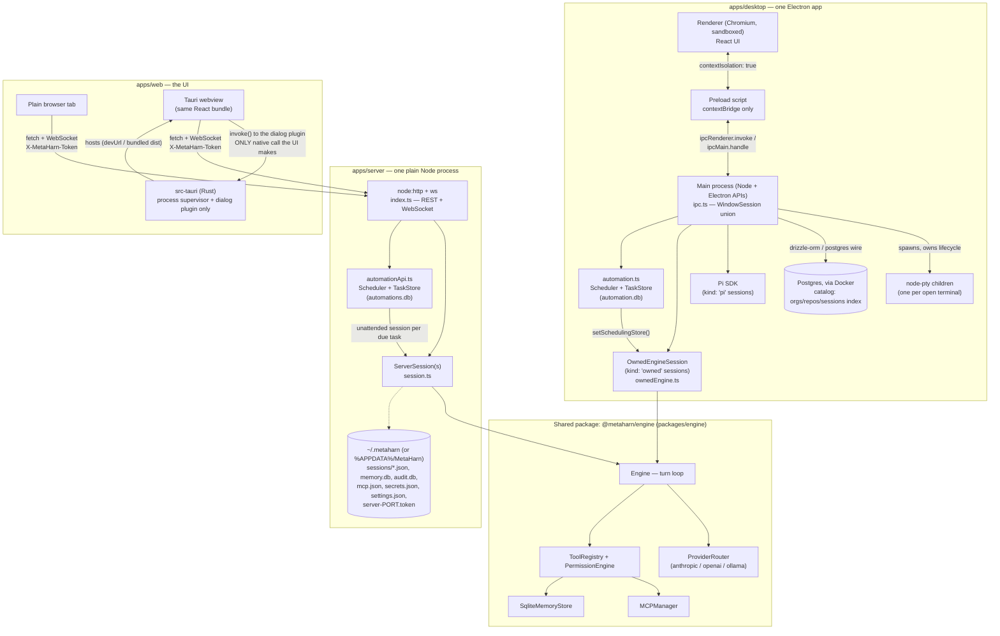
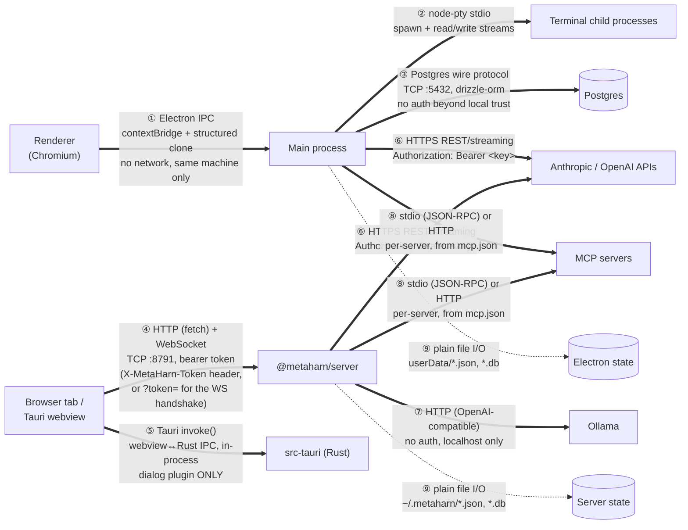

# System map

The other docs in this folder each zoom into one part of MetaHarn. This one is the single
picture that shows **all of it together** — every process that runs, every store that
persists, and exactly what protocol connects each pair — because no other doc puts the
Electron app and the newer server/web surface side by side. Start here if you're new to the
codebase; then follow the links into whichever doc covers the part you're changing.

## Two products sharing one engine

MetaHarn ships as two separate deliverables that share the same agent code:

1. **`apps/desktop`** — the Electron native app. Default chat backend is Pi
   (`@earendil-works/pi-coding-agent`); an alternate backend, `@metaharn/engine`
   ("the owned engine"), is selectable per session. See [`01-overview.md`](01-overview.md) and
   [`03-agent-runtime.md`](03-agent-runtime.md) for Pi; [`09-owned-engine.md`](09-owned-engine.md)
   for the owned engine.
2. **`apps/server` + `apps/web`** — a second, independent product surface built to mirror
   OpenWorker's own shape: one local Node server hosts `@metaharn/engine` exclusively (no Pi
   here at all), and a thin UI — a browser tab, or the same UI wrapped by a Tauri shell —
   never runs engine logic itself. See [`09-owned-engine.md`](09-owned-engine.md).

Both products import `@metaharn/engine` directly from source (`@metaharn/engine/src/*`,
never the package's barrel — see that doc for why); they do not talk to each other, do not
share a database, and a session created in one is invisible to the other.

## 1. Every process, and what it owns

**Reading this diagram:** the top-left subgraph (`apps/desktop`) and the two right-hand
subgraphs (`apps/server`, `apps/web`) are **separate OS processes that never talk to each
other** — the only thing they share is the `@metaharn/engine` source they each import and
instantiate independently. `DMain --> Pi` / `DMain --> Owned1` are in-process calls (same
Node process, same event loop — no wire protocol); everything crossing a subgraph boundary
above (`DPreload <-- --> DMain`, `Browser -- --> HTTPWS`, `TauriWebview -- --> TauriRust`) is
a real IPC/network hop, detailed next.

## 2. Communication, protocol by protocol

Every arrow that crosses a process boundary anywhere in this system, what actually goes over
it, and how it's authenticated:

| # | Link | Protocol | Auth | Notes |
|---|---|---|---|---|
| ① | Renderer ↔ Main | Electron `contextBridge` / `ipcRenderer.invoke` ↔ `ipcMain.handle` | Process-boundary trust only (no network) | Full channel list: [`06-ipc-contract.md`](06-ipc-contract.md) |
| ② | Main → pty children | `node-pty` spawn, raw stdin/stdout streams | OS process ownership | One child per open terminal session |
| ③ | Main → Postgres | Postgres wire protocol over TCP, via `drizzle-orm` | Local trust (dev-only credentials) | Electron/Pi catalog only — `apps/server` never touches this DB |
| ④ | Browser/Tauri webview ↔ `@metaharn/server` | HTTP (`fetch`) for commands, `WebSocket` for the event stream | `X-MetaHarn-Token` header (HTTP) / `?token=` query param (WS — browsers can't set custom headers on a WS handshake) | Random 24-byte token per server launch, written to `<state-dir>/server-<port>.token`; the dev UI reads it live via Vite's `/__metaharn-config` middleware, not a build-time constant (see `apps/web/vite.config.ts`) |
| ⑤ | Tauri webview → Rust shell | Tauri's `invoke()` IPC (in-process, not a network call) | Capability-gated (`capabilities/default.json`: `dialog:default`) | The **only** native command the frontend calls — everything else in the UI goes through ④ |
| ⑥ | Main (owned engine) / `@metaharn/server` → Anthropic, OpenAI | HTTPS, streaming | API key, resolved from `SecretStore` (or `.env`) first, env var fallback | Same provider clients (`@metaharn/engine/src/providers/*`), instantiated independently by each process |
| ⑦ | `@metaharn/server` → Ollama | HTTP, OpenAI-compatible wire shape | None — local-only server | `OpenAIProvider` with a `baseURL` override; no separate client code |
| ⑧ | Main / `@metaharn/server` → MCP servers | `stdio` (spawned child, JSON-RPC over stdin/stdout) or `http` (streamable-http) | Per-server, from `mcp.json`'s `env`/`headers` (`${VAR}` resolved from `SecretStore`/`.env`) | Config loaded fresh per session (`loadMcpServers`) — no long-lived shared connection pool |
| ⑨ | Main / `@metaharn/server` → local disk | Plain file I/O (JSON files, SQLite via `better-sqlite3`) | OS file permissions (`secrets.json` written `0600`) | Two **entirely separate** state trees — see below |

## 3. Two state trees, never merged

| | `apps/desktop` | `apps/server` |
|---|---|---|
| Root | `app.getPath("userData")` (OS-specific Electron app-data dir) | `~/.metaharn` (or `%APPDATA%/MetaHarn`) |
| Pi sessions | Pi's own on-disk format, indexed in Postgres | — (Pi never runs here) |
| Owned-engine sessions | `owned-sessions/<id>.json` | `sessions/<id>.json` |
| Memory | `memory.db` | `memory.db` (same schema, different file) |
| Automations | `automation.db` | `automations.db` |
| MCP config | `mcp.json` | `mcp.json` |
| Secrets / provider keys | `.env` only (no UI) | `secrets.json` (`SecretStore`) + `.env` fallback, editable via Settings > Models |

A task, memory, or session created through one surface is **not visible** to the other — this
is a disclosed design choice (no shared store exists between the two processes), not a sync
bug. See [`08-known-limitations.md`](08-known-limitations.md) for the specific gaps that fall
out of this split (automation permission-grant parity, no Electron Settings UI equivalent).
