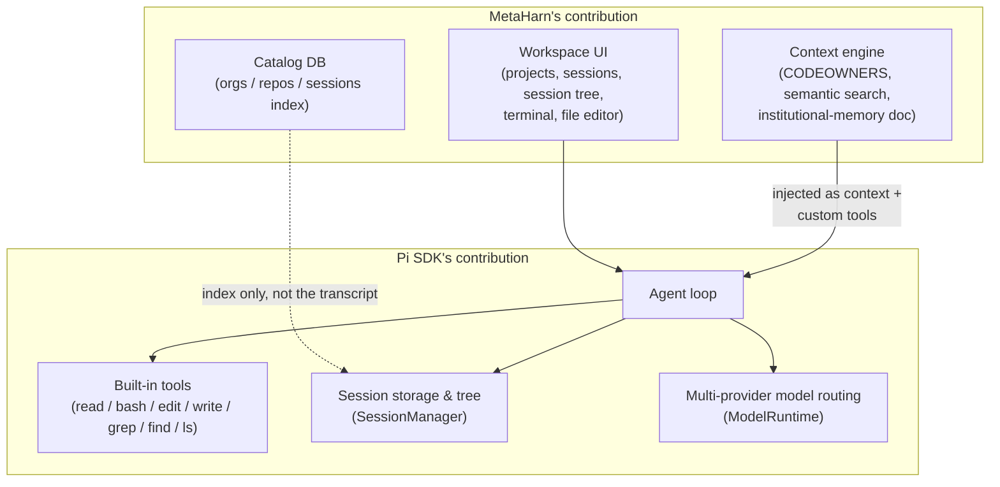

# Overview

## What MetaHarn is

MetaHarn is a native desktop app (Electron, macOS-first) that pairs an embedded coding agent with **institutional-memory context grounding**: an agent + a Workspace UI + a living-docs engine, all grounded in *how this specific system was actually built* rather than generic best practices.

The name for this shape is a **meta-harness**: MetaHarn does not build its own agent loop, tool-calling protocol, or model-provider routing. It embeds [Pi](https://pi.dev) (`@earendil-works/pi-coding-agent`), a general-purpose embeddable agent SDK, and spends its own engineering effort on the layer Pi doesn't provide — grounding the agent in real, project-specific context, and giving that a proper UI.

## Why this split

Three existing agent harnesses were surveyed before building anything (see [`docs/PLAN.md`](../PLAN.md) for the full comparison): Pi, Omnigent, and OpenChamber. The finding that shaped everything downstream: **none of them do institutional-memory grounding** — that's the actual differentiator, and it's whitespace, not something to reimplement from a harness. So the rule became: never rebuild tool-calling, provider-routing, or session persistence — Pi already does all three well. Spend effort only on the context/ownership/memory layer, and on the UI that makes it usable as a real desktop tool.

Pi specifically (over Omnigent/OpenChamber) because:
- It ships an embeddable Node/TypeScript SDK designed for exactly this ("adapt Pi to your workflows"), so it runs in-process in Electron's main process — no sidecar, no separate server.
- It has a **virtual context file injection point** (`agentsFilesOverride` on `DefaultResourceLoader`) — the exact hook institutional-memory grounding needs.
- It has multi-provider model routing built in (`ModelRuntime`), covering "model-agnostic" for free once that's prioritized.
- It already supports session tree navigation/branching/forking — a real feature MetaHarn was paying for but not exposing, until the Workspace UI's session tree view was built (see [`03-agent-runtime.md`](03-agent-runtime.md)).

## Goals

- **Grounded answers, not generic ones.** An agent working in a MetaHarn-managed repo should be able to answer "who owns this" and "how does X actually work here" using real project state, not plausible-sounding guesses.
- **A real desktop tool**, not a chat window. Projects, session history, a session tree, an integrated terminal, and a file editor — the parts of a Workspace UI that make an agent usable for actual day-to-day work, not just a demo.
- **Model-agnostic by construction.** Pi's `ModelRuntime` already routes across providers; MetaHarn's job is to not get in the way of that (see [`08-known-limitations.md`](08-known-limitations.md) for what's still hardcoded here).
- **Real grounding with near-zero setup cost.** Every session gets an institutional-memory document (README, CODEOWNERS, directory tree, recent history) automatically — no per-project indexing step, no configuration, before the agent's first turn — see [`04-context-engine.md`](04-context-engine.md).

## Explicit non-goals (for now)

These are deliberate scope cuts, not oversights — each is called out again in [`08-known-limitations.md`](08-known-limitations.md) with the reasoning:

- **Multi-tenancy / auth.** The schema is `org_id`-shaped from day one, but there's exactly one implicit "default" org and no auth UI. Single-user desktop app, v0.
- **Sandboxed tool execution.** Pi's `bash`/`edit`/`write` tools touch the real host filesystem directly. Fine for a single-user local desktop app; would need real isolation (container/microVM) before any multi-tenant or remote-execution use.
- **Packaged-build distribution.** Everything described here is verified in dev mode (`electron-forge start`). Packaging (`electron-forge make`) surfaces at least one real architectural conflict — see [`08-known-limitations.md`](08-known-limitations.md).
