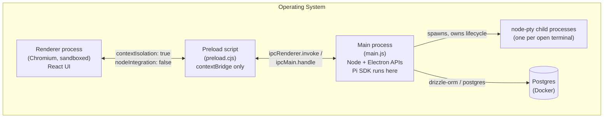

# Process model

MetaHarn is an Electron app with the usual three kinds of process, plus one more for terminal sessions:

## The two Vite build targets

Electron Forge's Vite plugin (`forge.config.ts`) builds two independent Node-side bundles, each with its own Vite config because each has different runtime constraints:

| Target | Entry | Config | Output |
|---|---|---|---|
| `main` | `src/main/main.ts` | `vite.main.config.ts` | `.vite/build/main.js` (real ESM) |
| `preload` | `src/preload/preload.ts` | `vite.preload.config.ts` | `.vite/build/preload.cjs` |

The renderer (`src/renderer/`) is a third, separate Vite build (`vite.renderer.config.ts`), driven by the plugin's `renderer` array rather than `build` — it's a normal Chromium web bundle, not a Node target.

All non-renderer output lands flat in `.vite/build/`, which is why `main.ts` computes its own `__dirname` via `path.dirname(fileURLToPath(import.meta.url))` (ESM has no `__dirname` global) and references sibling files (`preload.cjs`) as `path.join(__dirname, "...")`.

### Why `main.js` is real ESM, not CJS

`package.json` sets `"type": "module"` for the whole `apps/desktop` package. This is forced by `@earendil-works/pi-coding-agent` being pure ESM with no `require` export condition — a CJS main bundle can't `require()` it at all, and even marking it external wouldn't help (Node's CJS loader rejects pure-ESM packages outright: `ERR_PACKAGE_PATH_NOT_EXPORTED`). Real ESM `import` resolves it correctly.

### The `external` list gotcha: native/CJS packages must not be bundled

`vite.main.config.ts` marks certain dependencies `external` in `rollupOptions`, meaning Rollup leaves the `import` statement untouched instead of bundling that package's source in. This isn't a style choice — real, reproduced failures forced it:

1. **`node-pty`** — ships prebuilt `.node` binaries. Can't be bundled at all; must be `external` so Node's own loader finds the real native addon.
2. **`@earendil-works/pi-coding-agent`** — pure ESM, no CJS interop path (see above).

**The pattern to follow when adding a new native-binary or CJS-with-builtin-requires dependency:** add it to `vite.main.config.ts`'s `rollupOptions.external` array. If a "doesn't expose the `require` function" error shows up in a built bundle, this is almost certainly the cause — check with `grep -c "require(" .vite/build/main.js` on the built output.

> **A retired process, worth remembering why:** an earlier version of this app also forked a dedicated indexing-worker process (for a semantic-search/embeddings pipeline, removed — see [`04-context-engine.md`](04-context-engine.md) — after real usage data showed it wasn't earning its complexity). It had to run on a genuine **system** Node binary, not Electron's own: `onnxruntime-node`'s native addon reproducibly crashed on the *second* batch of inference calls under both `utilityProcess.fork()` and Electron's binary running as Node (`ELECTRON_RUN_AS_NODE=1`) — a real ABI/behavioral incompatibility with Electron's bundled Node/V8, not a sandboxing or logic bug. Worth knowing if a future feature needs to run blocking native-addon inference from the main process again: inline-in-main-process freezes every window for the duration, and Electron's own child-process primitives are not a safe substitute for a real system Node process for this class of native module.

## Per-window resource ownership

One Pi session per `BrowserWindow`, keyed by `webContents.id`:

- `sessionsByWindow: Map<number, WindowSession>` in `ipc.ts` — holds the live `AgentSession`, its `SessionManager`, and an unsubscribe function for its event stream. Torn down on window close (`main.ts`'s `mainWindow.on("closed", ...)` calls `disposeSessionFor`).

**Terminal ptys are NOT one-per-window** — see the next section; they're keyed by MetaHarn's own terminal-session id instead, deliberately, so multiple can be alive at once and survive switching between them.

### Terminal ptys: keyed by session, not by window, so switching never kills anything

`ptyBySessionId: Map<string, PtyEntry>` in `pty-ipc.ts`, keyed by MetaHarn's own terminal-session catalog id. This replaced an earlier one-pty-per-window design (`ptyByWindow`, keyed by `webContents.id`) that had a real, user-reported bug: opening a second terminal session, or even just navigating away and back, unconditionally killed whatever pty the window currently owned before spawning a new one — a long-running command in one terminal session died the moment you switched to another.

`metaharn:ptyCreate(cwd, terminalSessionId)` is now **attach-or-create**: if `terminalSessionId` already has a live entry, it's returned untouched — no kill, no respawn, regardless of which window/tab asks. A pty is only ever killed by an explicit `metaharn:ptyClose(terminalSessionId)` (the tab-strip's × — see [`07-frontend.md`](07-frontend.md)) or by its owning window closing (`disposeAllPtysFor(webContentsId)`, replacing the old single-entry `disposePtyFor`).

**Explicitly out of scope, not silently dropped**: surviving a full app quit/relaunch. Nothing here serializes a live session to disk or re-spawns it on next launch — see [`08-known-limitations.md`](08-known-limitations.md). This fixes *in-app* persistence (navigation and tab-switching within one running session of the app), not process durability across restarts.

Which real CLI agent (Claude Code / Codex / Gemini) gets typed into the shell is resolved from the terminal session's catalog row, not passed over IPC — see [`03-agent-runtime.md`](03-agent-runtime.md)'s agent-adapter section and [`05-data-model.md`](05-data-model.md)'s `sessions` table.

## External links open in the OS browser, not a new window

Electron's default behavior for any `window.open()` call from the renderer is to spawn a **new `BrowserWindow` running this same app**, not the system default browser. `main.ts` intercepts this via `mainWindow.webContents.setWindowOpenHandler`, but the interception has two cases, not one — both were needed, found by actually reproducing the bug rather than assuming one fix covered it:

- **A `window.open(url)` call that already has a real URL** (e.g. a plain link handler) — denied outright, `shell.openExternal(url)` called directly. No window is ever created.
- **A `window.open()` call with no URL yet, followed a moment later by `.location.href = url`** — this is xterm.js's own *built-in* OSC-8 hyperlink handler (independent of `@xterm/addon-web-links`; it fires for real terminal hyperlink escape sequences, which the Claude CLI prints for things like artifact links). Its default behavior is `confirm("...WARNING: this link could potentially be dangerous...")` → `window.open()` (blank) → set `.location.href` on the result. There's no URL to redirect to at the `window.open()` call itself, so denying it outright (the first fix attempted here) silently swallows the link — `newWindow` comes back `null`, and the subsequent `.location.href` assignment never runs. The real fix: `allow` this case as a hidden (`show: false`) throwaway window, then catch its `will-navigate` event (which fires for the `.location.href` assignment) on `mainWindow.webContents.on("did-create-window", ...)`, `preventDefault()` it, call `shell.openExternal` there instead, and close the throwaway window.

This is a single pair of app-wide handlers, not something each link-producing feature needs to opt into — any future `window.open()` call anywhere in the renderer, of either shape, is covered automatically.
