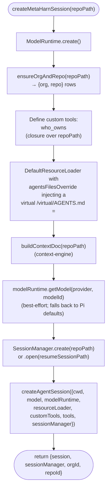
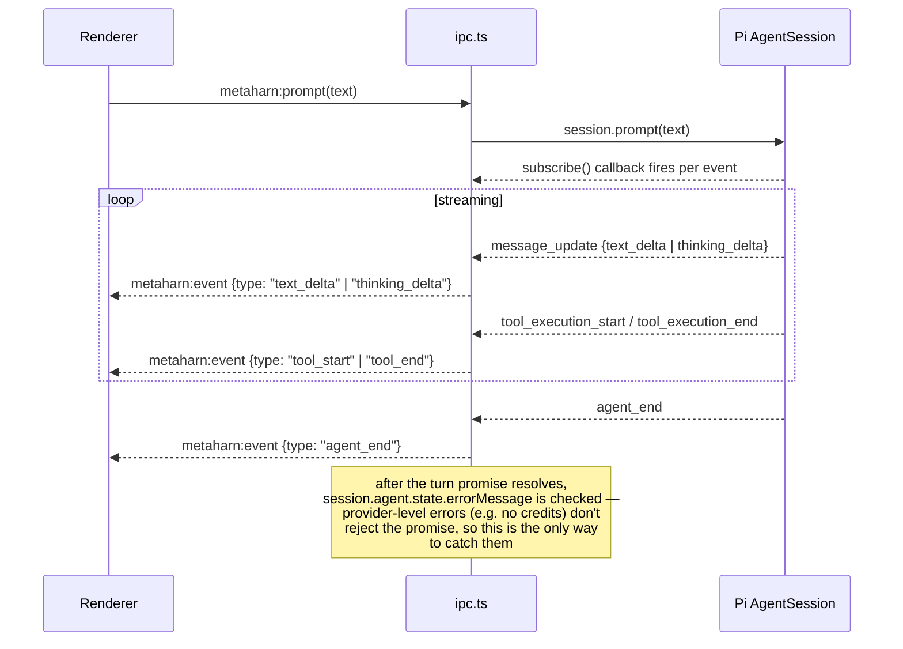
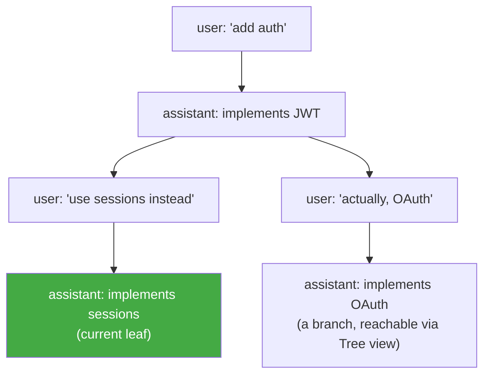

# Agent runtime

This is the "harness" half of the meta-harness: how MetaHarn embeds Pi (`@earendil-works/pi-coding-agent`) and wires it into the app. Everything here lives in `apps/desktop/src/main/agent.ts` and the session-related handlers in `apps/desktop/src/main/ipc.ts`.

## Session creation

`createMetaHarnSession(repoPath, options)` (`agent.ts`) is the single function that assembles a Pi session. It runs entirely in the main process:



Two things make this "the whole meta-harness idea in one function" (per the comment in `agent.ts`): the custom tools give the agent *actions* it wouldn't otherwise have (owner lookup), and the `agentsFilesOverride` gives it *context* it wouldn't otherwise have (the generated institutional-memory doc). Pi supplies everything else — the loop, the built-in tools, provider routing, session persistence.

### Custom tools

Defined with Pi's `defineTool()` (from `typebox` schemas), registered via `customTools` and enabled via the `tools` array passed to `createAgentSession`:

| Tool | Backed by | Purpose |
|---|---|---|
| `who_owns` | `whoOwns(repoPath, path)` — parses the repo's real `CODEOWNERS` file | "Who owns this file/directory" |

An ordinary closure over `repoPath` captured at session-creation time — no global registry, no dispatch table. Adding a new tool means adding another `defineTool()` call in `agent.ts` and appending its name to the `tools` array. (A second custom tool, `search_context`, backed a semantic-search feature that was removed for low usage — see [`04-context-engine.md`](04-context-engine.md).)

Built-in Pi tools enabled alongside them: `read`, `bash`, `edit`, `write`, `grep`, `find`, `ls`. These run directly against the host filesystem — see [`08-known-limitations.md`](08-known-limitations.md) on sandboxing.

### Model selection

`METAHARN_MODEL_PROVIDER` / `METAHARN_MODEL_ID` env vars (`.env`), defaulting to `anthropic` / `claude-opus-4-5`. Resolved via `modelRuntime.getModel(provider, modelId)`; if that returns nothing, Pi's own default resolution takes over (restored session model → settings default → first available). The Settings page displays this read-only (`getModelConfig()`) — there's no in-app UI to change it yet, by design for now (see [`08-known-limitations.md`](08-known-limitations.md)).

## The turn lifecycle and event streaming

One `AgentSession` per window (`sessionsByWindow` map in `ipc.ts`, keyed by `webContents.id`). A turn is driven by one of three IPC calls, all funneled through `runTurn()`:



- **`metaharn:prompt`** — normal user turn.
- **`metaharn:steer`** — inject a message mid-turn without waiting for the current one to finish.
- **`metaharn:followUp`** — queue a message for after the current turn completes.

All three share `runTurn()`, which looks up the window's session and awaits the given `session.<method>()` call, then checks `session.agent.state.errorMessage` — provider-level failures (e.g. insufficient credits) resolve the turn promise normally rather than rejecting it, so this check is the only way those surface to the UI.

`session.subscribe()` is set up once, at session-creation time in the `metaharn:init` handler, and stays attached for the session's lifetime, translating Pi's internal event shapes into the flat `MetaHarnEvent` union the renderer consumes (see [`06-ipc-contract.md`](06-ipc-contract.md) for the full event catalog).

## Session persistence: SessionManager vs. the catalog DB

This is a deliberate two-tier split, worth being explicit about:

- **Pi's `SessionManager`** owns the actual transcript — an append-only JSONL file per session, written to disk by Pi itself. `SessionManager.listAll()` is what powers "list every past session" in the sidebar.
- **MetaHarn's `sessions` table** (Postgres) is a thin **catalog index row** — `{id (= Pi's session id), orgId, repoId, title, timestamps}` — written via `recordSession()` after a turn completes. It exists so MetaHarn's own schema can eventually join session activity against org/repo/user data (multi-tenant reporting, etc.) without needing to parse every JSONL file. It is never the source of truth for a transcript's content.

See [`05-data-model.md`](05-data-model.md) for the full schema and rationale.

## Session tree: branching and forking

Pi's `SessionManager` models a session as a tree, not a linear log — every entry has a `parentId`, and `SessionManager.getTree()` returns the whole structure. MetaHarn exposes this directly rather than reimplementing it:



- **`metaharn:getSessionTree`** — a pure read. Calls `sessionManager.getTree()` directly (safe — `SessionManager` is owned by `ipc.ts`, held in the same `WindowSession` map entry as the `AgentSession`) and flattens it via `treeToDTO()` (`sessions.ts`) into a renderer-friendly shape: `{id, parentId, type, timestamp, label, preview, children}`. `preview` is a short human-readable summary derived per entry type (message text, compaction summary, model-change description, etc.) — this keeps the renderer fully decoupled from Pi's internal `SessionEntry` union, the same way `messagesToHistory()` decouples it from `AgentMessage`.
- **`metaharn:branchSession(entryId)`** — the mutation. Goes through **`session.navigateTree(entryId)`** (an `AgentSession` method), *not* `sessionManager.branch()` directly. This matters: `navigateTree` is Pi's own "move here and keep everything else consistent" entry point (the same one Pi's own `/tree` command uses internally) — it keeps `AgentSession`'s own cached state (`session.messages`, etc.) in sync with the manager's new leaf pointer. Calling `sessionManager.branch()` directly would move the leaf pointer but risk leaving `AgentSession`'s cached state stale. After navigating, the handler pushes a fresh `{type: "ready", history: messagesToHistory(session.messages)}` event so the renderer's transcript immediately reflects the new branch.

The renderer side (`SessionTreeView.tsx`) is deliberately a plain indented outline, not a graph layout — v0 keeps this simple; the tree data itself already supports a richer visualization later without any backend change.

## Agent adapters — one terminal session, three possible real CLIs

A terminal session (see [`05-data-model.md`](05-data-model.md)) runs one real CLI coding agent: Claude Code, Codex, or Gemini. `apps/desktop/src/main/agents/` holds one `AgentAdapter` implementation per CLI (`claude.ts`, `codex.ts`, `gemini.ts`), registered in `registry.ts`, so `pty.ts`/`pty-ipc.ts`/`terminal-stats.ts`/the fork handler in `ipc.ts` are all agent-agnostic — they resolve a session's `agentKind` from its catalog row and dispatch through `getAdapter(kind)` rather than branching on which CLI it is themselves.

```ts
interface AgentAdapter {
  kind: "claude" | "codex" | "gemini";
  displayName: string;
  binary: string;               // checked via `which` for install detection
  canForceSessionId: boolean;   // true only for Claude — see below
  buildLaunchCommand(opts): string;
  hasRecordedSession(cwd, externalId): boolean;
  discoverExternalSessionId?(opts): Promise<string | null>;
  forkSession(cwd, sourceExternalId, newExternalId): ForkResult;
  getStats(cwd, externalId): TerminalSessionStats | null;
}
```

**The one structural fork all three share**: Claude Code can be *told* its own session id up front (`--session-id <uuid>`), so MetaHarn's own catalog row id doubles directly as Claude's session id — `canForceSessionId: true`. Codex and Gemini generate their own id and only reveal it after the fact (confirmed for Codex via an open upstream feature request, openai/codex#13242, that this isn't implemented; Gemini's CLI has no equivalent flag either) — `canForceSessionId: false`. This is why the `sessions` table has a separate `externalSessionId` column distinct from its own `id` (see [`05-data-model.md`](05-data-model.md)): for Claude it's never actually needed (resolved on the fly instead), for Codex it's discovered and persisted after the first real exchange, for Gemini it's never populated at all in v0.

`agents/registry.ts`'s `resolveExternalSessionId()` is the one place that answers "what id do I pass to resume this session" — `session.externalSessionId` if set, else `session.id` if the adapter can force it, else `null` (nothing resumable yet). Every other call site (pty spawn, stats, fork) goes through this instead of re-deriving the logic.

**Verification honesty, per adapter** — neither Codex nor Gemini's CLI is installed on the machine this was built on, so only Claude's behavior is directly reproduced; the other two are built from official docs plus corroborating third-party sources, with every inference-dependent code path (Codex's rollout-filename id extraction, its transcript-fork self-check) designed to fail soft — return `null`/`{ok:false}` — rather than crash or write a broken file if a guess turns out wrong:

- **Claude** (`claude.ts`) — directly verified this session: `--session-id`/`--resume`, transcript at `~/.claude/projects/<cwd-dashed>/<id>.jsonl`, forking via global string-replace of the id, stats via the transcript's per-message `usage` blocks. Unchanged from before this adapter refactor.
- **Codex** (`codex.ts`) — `codex` (new) / `codex resume <id>` (existing), transcript at `~/.codex/sessions/YYYY/MM/DD/rollout-*-<uuid>.jsonl`. Since the id can't be forced, `discoverExternalSessionId` polls that day's directory for a few seconds after a fresh pty spawns, looking for exactly one new file; also retried on-demand from the stats/fork IPC handlers in `ipc.ts` in case the poll window wasn't long enough (e.g. a slow first prompt). Forking self-checks that the source id actually appears in the transcript content before writing a copy, rather than trusting the Claude-verified "id embedded throughout" assumption blindly. **Now directly verified against a real Codex 0.148.0 install** (it wasn't at first — session id discovery worked, but stats initially returned nothing because the real transcript schema turned out completely different from the docs-only guess it shipped with first): every line is `{timestamp, ordinal, type, payload}`, not the flatter `{role, usage}` shape assumed originally. Token usage lives at `type: "event_msg"`, `payload.type: "token_count"`, `payload.info` — which carries `total_token_usage` (cumulative), `last_token_usage` (latest turn), and, notably, a real `model_context_window` figure straight from the CLI (unlike Claude's adapter, no hardcoded per-model guess table needed for Codex). Messages are `type: "response_item"`, `payload.type: "message"` with a `role`; tool activity is `payload.type: "custom_tool_call"` / `"custom_tool_call_output"`; the active model is under `type: "world_state"`, `payload.state.collaboration_mode.model`.
- **Gemini** (`gemini.ts`) — deliberately minimal. Gemini CLI's session storage (`~/.gemini/tmp/<project_hash>/chats/`) has a genuinely undocumented `project_hash` algorithm — not found anywhere across official docs or third-party sources checked. Rather than guess a hash function, discovery/resume/fork/stats are simply not implemented: every Gemini terminal session launches fresh (`gemini`, no resume flag ever used), `forkSession` always returns `{ok:false}`, `getStats` always returns `null`. What still works, because the pty-persistence fix in `pty-ipc.ts` applies uniformly to every agent: a Gemini terminal session stays alive and switchable across tabs for the life of the running app — it just can't be resumed once its tab is closed or the app restarts.

## Context window usage and stats (chat sessions only)

`AgentSession.getSessionStats()` returns Pi's own `SessionStats` — verbatim from the SDK:

```ts
interface SessionStats {
  sessionFile: string | undefined;
  sessionId: string;
  userMessages: number;
  assistantMessages: number;
  toolCalls: number;
  toolResults: number;
  totalMessages: number;
  tokens: { input: number; output: number; cacheRead: number; cacheWrite: number; total: number };
  cost: number;
  contextUsage?: ContextUsage;  // { tokens: number | null; contextWindow: number; percent: number | null }
}
```

Two different questions live in one object, and the UI (`ContextWindowPanel.tsx`) shows both rather than picking one: `stats.tokens.*` is **cumulative** — Pi's own doc comment: "Aggregates over ALL session entries (including history that was compacted away), so token/cost totals reflect what was actually billed." `stats.contextUsage` is the **latest turn's** context payload size — how full the window is *right now*, which can be much smaller than the cumulative total once compaction has happened. `contextUsage.tokens`/`.percent` are `null` right after a compaction, before the next LLM response re-establishes a real count — the panel renders `—` for that case rather than a misleading `0%`.

`metaharn:getSessionStats` (`ipc.ts`) just calls this on the current window's session and returns it (or `null` if there's no session yet). The renderer refreshes it on `ready` (session opened/resumed) and `agent_end` (a turn just completed) — the only two points where the numbers can actually change — not on a poll.

This is `metaharn:getSessionStats`, for chat sessions. There's no equivalent *live API* for terminal sessions — the real `claude` CLI subprocess (see [`02-process-model.md`](02-process-model.md)) exposes no such thing — but the same `ContextWindowPanel` still works there via a different, file-based source, described next.

### Terminal session stats, from the transcript file

`terminal-stats.ts`'s `getTerminalSessionStats(cwd, agentKind, externalId)` is a thin dispatch shim now — `null` if `externalId` hasn't been resolved yet (see the agent-adapters section above), otherwise `getAdapter(agentKind).getStats(cwd, externalId)`. The actual parsing lives per-adapter in `agents/*.ts`; what follows describes Claude's (`agents/claude.ts`). Codex's (`agents/codex.ts`) is also now directly verified against a real transcript (see the agent-adapters section above for its schema) — Gemini's always returns `null` (see above).

Not from any live API — there isn't one — but from the same real transcript file the adapter already reads for `--resume`/fork. Every assistant message in a Claude Code transcript carries a `usage` block:

```json
"usage": {
  "input_tokens": 2,
  "cache_creation_input_tokens": 11185,
  "cache_read_input_tokens": 30248,
  "output_tokens": 150
}
```

confirmed present on 97/97 assistant entries in one real 255-line session — no gaps found. `getTerminalSessionStats` streams the file, sums these across every assistant message for the cumulative `tokens` total (matching chat's `SessionStats.tokens` semantic), and takes the **last** assistant message's `input_tokens + cache_read_input_tokens + cache_creation_input_tokens` as the latest-turn `contextUsage.tokens` (prompt-side only, matching Pi's own `ContextUsage.tokens` semantic — see above). `toolCalls`/`toolResults` come from counting `tool_use`/`tool_result` content blocks; `userMessages`/`assistantMessages` from the entries' own `type` field. The result is shaped identically to Pi's real `SessionStats` (an optional `model` field was added to that shared shape specifically for this — Pi's own object never has it, chat sessions get their model from `appInfo.modelId` instead), so `ContextWindowPanel` is reused unchanged for both session types; `App.tsx`'s `refreshSessionStats()` just picks the source based on `view.kind`.

One real, called-out approximation: **the context-window *size*** (e.g. 1,000,000 tokens for `claude-sonnet-5`) isn't in the transcript anywhere — there's no field for it. `terminal-stats.ts`'s `MODEL_CONTEXT_WINDOWS` is a small hardcoded table, not sourced from any API (none exists to query). The `claude-sonnet-5` figure is directly evidenced (matches a real external reference panel for the same model); other entries are best-guess defaults. This is the one place terminal-session numbers are approximate rather than exact — everything else in `TerminalSessionStats` is computed directly from real data, not estimated.

`cost` is always `0` for terminal-sourced stats (no per-token pricing table exists here, and a fabricated dollar figure would be worse than none) — harmless, since `ContextWindowPanel` never actually renders that field for either session type.

Refreshed on demand (when the badge is clicked), not on a timer — terminal sessions have no discrete "turn completed" event the way chat's `agent_end` gives one, so there's no natural refresh trigger; on-demand is honest about that rather than pretending to be live.

## Cross-agent handoff when swapping a terminal session's agent

Swapping a terminal session's agent (`AgentSwapMenu.tsx`, `metaharn:swapTerminalSessionAgent`) has no native way to transfer a real conversation between different CLI products — Claude Code, Codex, and Gemini each have their own incompatible transcript format, and none can import another's. "Seamless" here means: the *outgoing* agent, if it has a resumable session, is asked to summarize itself non-interactively, and that summary becomes the *incoming* agent's opening prompt — a primed fresh start, not a literal resume.

`agents/handoff.ts`'s `generateHandoffSummary(cwd, fromKind, externalId)` calls the outgoing adapter's optional `summarizeForHandoff(cwd, externalId)`, which shells out to that CLI's own non-interactive resume mode with a fixed `HANDOFF_PROMPT` (`types.ts` — a leaf module, deliberately, so adapters importing the prompt text don't create a cycle through `handoff.ts` → `registry.ts` → the adapters themselves):

- **Claude** (`claude.ts`) — `claude -p --resume <id> "<HANDOFF_PROMPT>"`. `-p/--print` is Claude's documented non-interactive one-shot mode; confirmed via `claude --help` against a real install, not live end-to-end tested with this exact flag combination (the only resumable Claude session on hand during development was mid-use in a live pty, and writing to its transcript concurrently felt too risky to test against).
- **Codex** (`codex.ts`) — `codex exec resume <id> -o <tmpfile> "<HANDOFF_PROMPT>"`, then reads and deletes `<tmpfile>`. **Live-tested successfully** against a real Codex session on this machine: produced a clean, accurate summary of real prior work in ~10s. `-o/--output-last-message` writes just the final response text, avoiding the JSONL/event noise plain stdout would interleave with it.
- **Gemini** — no `summarizeForHandoff` at all. It never has a resumable `externalSessionId` in this build (see the agent-adapters section above), so there's nothing to summarize *from* — Gemini can still be a handoff *target* (see below), just never a source.

Both real implementations run via `execFile` (never a shell string) with a generous timeout (45s, well above the ~10s the live Codex test took) and never throw — `generateHandoffSummary` returns `null` on any failure (timeout, CLI error, adapter doesn't support it, nothing resumable), and the swap proceeds exactly as it did before this feature: fresh, no context. Same "degrade gracefully, never guess into a crash" contract as `discoverExternalSessionId`'s "not found yet."

**Delivering the summary to the new agent.** `LaunchOpts` gained `seedPrompt?: string` — when a fresh launch (no recorded session for the resolved id) has one, each adapter's `buildLaunchCommand` types the new agent's launch command *with the summary as its positional prompt* instead of a bare launch (`claude --session-id <id> "<summary>"`, `codex "<summary>"`, `gemini "<summary>"` — the last one unverified, since Gemini isn't installed; if wrong, it just starts a plain fresh session and the seed text goes nowhere, not a crash). The summary text is shell-quoted (`agents/shell-quote.ts`'s `shellQuote()` — wraps in single quotes, escapes embedded ones) since it's typed as a real shell command, the same as every other launch command already is.

The seed prompt itself is deliberately **not** a database column — it's only ever relevant to the very next `metaharn:ptyCreate` call for that session id, so `pty-ipc.ts` holds it in a small in-memory `pendingSeedPrompts: Map<string, string>`, set by the swap IPC handler and read-and-deleted the moment the next pty actually spawns. `ipc.ts`'s `metaharn:swapTerminalSessionAgent` handler generates the summary *before* closing the old pty or touching the DB, so a slow/failed summarization never leaves the session in a half-swapped state.

**A real, known edge case, not a bug**: because Claude's `canForceSessionId` means MetaHarn's own catalog `id` doubles as Claude's session id, swapping a session *back* to Claude after it was Claude before will find that old transcript file still on disk and `--resume` it directly — genuinely resuming Claude's own original history, not seeding a summary. The file is real and untouched by whatever ran in between, so this is correct behavior; it just means "swap back" and "swap forward" aren't perfectly symmetric.

## Forking a session

Two independent mechanisms, one per session type, because chat and terminal sessions have entirely different storage models (see [`05-data-model.md`](05-data-model.md)):

- **Chat**: `metaharn:forkChatSession` calls `sessionManager.createBranchedSession(leafId)` — this is `SessionManager`'s own API for "write a new, independent session file containing just the root-to-leaf path" (`getLeafId()` first, `null` guarded). Pi's *other* fork/replacement APIs (`fork`, `resume`, `import`) live on `AgentSessionRuntime`, an object MetaHarn never adopted (`createAgentSession` is used directly instead — see above), so this lower-level `SessionManager` method is the one actually reachable here, and it does the same practical thing. The result is a real second session file the renderer opens immediately via the normal `metaharn:init(cwd, path)` path, indistinguishable from resuming any other past session.
- **Terminal**: no Pi/SessionManager involved at all — dispatches to the source session's own `AgentAdapter.forkSession()` (see the agent-adapters section above). Claude's is a verified file-copy + id string-replace; Codex's attempts the same technique with a self-check before writing; Gemini's always declines. `ipc.ts`'s `metaharn:forkTerminalSession` handler deletes the speculatively-created catalog row and surfaces the adapter's `reason` if forking fails for any reason — see [`05-data-model.md`](05-data-model.md)'s `sessions` table section for the file-copy mechanism's details.
