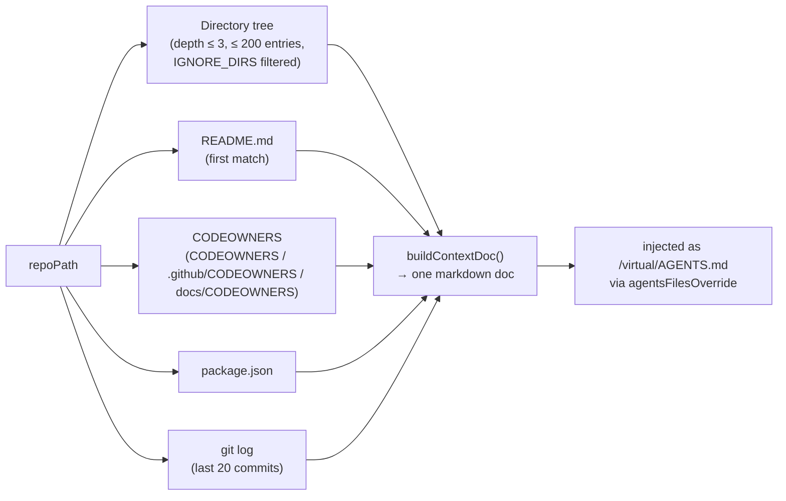

# Context engine

This is MetaHarn's actual differentiator (see [`01-overview.md`](01-overview.md)) — everything that grounds the agent in real, project-specific state instead of generic priors. It lives in `packages/context-engine`.

## The generated context document

`buildContextDoc(repoPath)` (`packages/context-engine/src/index.ts`) assembles one markdown document from static repo state, injected as a virtual `/virtual/AGENTS.md` via Pi's `agentsFilesOverride` (see [`03-agent-runtime.md`](03-agent-runtime.md)) — unconditionally, on every session, with no per-project opt-in or setup step.

### CODEOWNERS parsing

`parseCodeowners()` / `patternToRegex()` implement `.gitignore`-like glob semantics for CODEOWNERS patterns: `*` within a path segment, `**` across segments, a leading `/` anchors to repo root, last matching rule wins (matching GitHub's own CODEOWNERS semantics). `whoOwns(repoPath, filePath)` is the lookup used both by `buildContextDoc` indirectly and directly by the `who_owns` tool (see [`03-agent-runtime.md`](03-agent-runtime.md)).

> **Note for future editors:** this file previously had a real bug here — `**` was converted to a placeholder token via `.replace(/\*\*/g, " DOUBLESTAR ")`, but the bytes on disk had somehow become two literal null bytes surrounding the word `DOUBLESTAR` instead of spaces, invisible in normal editors/diffs, which meant the placeholder never matched back to `.*` on the next line and `**` patterns silently never worked. Found via a Postgres `invalid byte sequence for encoding "UTF8": 0x00` error triggered by the (since-removed) embeddings indexer trying to embed a chunk containing this exact text. Fixed at the byte level; covered by a manual `whoOwns()` glob-matching check at the time, not (yet) a committed automated test.

## What used to be here: embeddings + semantic search

This package briefly carried a second grounding mechanism alongside the document above: a pluggable-embeddings pipeline (`indexRepo`/`searchContext`, a `context_chunks` pgvector table, an opt-in "Index this project" action, a dedicated forked worker process to keep onnxruntime-node's blocking inference calls off the main process, and a `search_context` agent tool). It was removed after checking real usage against the always-on document above: across every project ever opened in MetaHarn, exactly one repo had ever been indexed, in a single run — next to a document every session gets automatically, with no user action and no per-project setup cost. The complexity (a second process, a second DB table, a provider-plugin system, a system-Node-binary dependency for local embeddings) wasn't earning its keep against that.

If semantic search over source becomes worth it again later, the honest framing is a fresh design, not a resurrection: `grep`/`find` (already available tools, see [`03-agent-runtime.md`](03-agent-runtime.md)) cover a surprising amount of "find the relevant file" ground for an agent that's willing to run a few searches, which is a meaningfully different starting point than v0 planning assumed.

## What "context is king" means architecturally here

The bet this layer makes: an agent's answer is only as good as what it's grounded in. `buildContextDoc` grounds every session in static repo facts (who owns what, what the README says, recent history) unconditionally and cheaply — no per-project setup, no ongoing cost, no separate process. That's the whole layer today.
