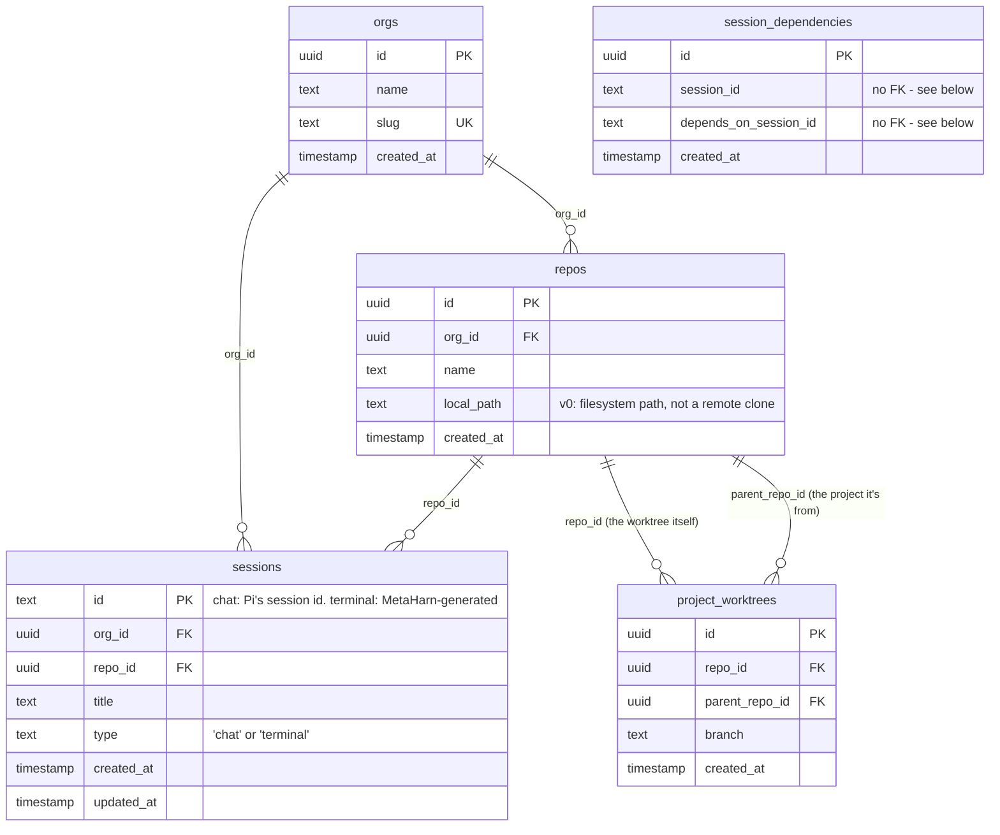

# Data model

MetaHarn's Postgres database (`packages/db`, Drizzle ORM + drizzle-kit migrations, `pgvector/pgvector:pg16` via `docker-compose.yml` — the `pgvector` image is a holdover from a since-removed embeddings feature, see [`04-context-engine.md`](04-context-engine.md); no table uses the `vector` extension today) is deliberately **not** where conversation transcripts live — see [Two storage systems](#two-storage-systems-not-one) below before assuming a table holds something it doesn't.

## Schema

Defined in `packages/db/src/schema.ts`. Migrations are generated with `npm run generate --workspace=packages/db` (drizzle-kit) and applied with `npm run db:migrate` (root script → `packages/db`'s `migrate.ts`).

### `orgs` / `repos`

`org_id` is threaded through every table from day one, even though v0 has exactly one implicit `"default"` org (`catalog.ts`'s `ensureOrgAndRepo()` — `DEFAULT_ORG_SLUG = "default"`, created lazily on first use). This is intentional: Phase 5 (multi-tenant hardening, see `docs/PLAN.md`) replaces the lookup with a real auth-derived org, not a schema migration.

`repos.localPath` is v0's only way to identify a repo — a filesystem path on the machine running MetaHarn. Phase 2 of the roadmap replaces this with a GitHub App installation + remote clone, at which point `localPath` becomes one of several source locators rather than the only one.

### `sessions` — a catalog index for chat, the entire record for terminal

Two session types share this table, distinguished by `type`, because they have fundamentally different relationships to persistence:

- **`type: "chat"`** — `id` mirrors the session id Pi's own `SessionManager` assigns. This row is a catalog/index row only; Pi owns the real transcript (see [Two storage systems](#two-storage-systems-not-one)). Written via `recordSession()` (`catalog.ts`), called from `ipc.ts`'s `metaharn:init` handler after a session is created, with an `onConflictDoUpdate` on `id` (bumps `updatedAt`).
- **`type: "terminal"`** — `id` is MetaHarn-generated (`crypto.randomUUID()`, in `createTerminalSession()`). A terminal session has no Pi transcript at all — this row **is** the entire record of it existing, which is what makes it show up in session history. Opening it doesn't replay any prior terminal output (there is none stored — see [`08-known-limitations.md`](08-known-limitations.md) for what "persistent" does and doesn't mean here); it spawns a `node-pty` process in the same `cwd` — or, if one's already live for this id, reattaches to it (see [`02-process-model.md`](02-process-model.md)) — running one of three possible real CLI coding agents as an interactive subprocess, each a completely separate product/session system from Pi's with its own on-disk storage.

  **`agentKind` and `externalSessionId`, and the adapter abstraction behind them.** `agentKind` ("claude" | "codex" | "gemini", default `"claude"`) records which real CLI this session runs, set at creation — and changeable in place afterward via `swapTerminalSessionAgent()` (`catalog.ts`), the header's `{agent} ⌄` dropdown (`AgentSwapMenu.tsx`). A swap sets `externalSessionId` back to `null` (a different CLI has no way to inherit another's session/context — it's a fresh start under the new agent, same catalog row/tab/title) and closes the live pty first (`ipc.ts`'s handler calls `closePty()` before the DB update, since `pty-ipc.ts`'s attach-or-create would otherwise just hand back the old agent's still-running process). The swap handler also tries to carry a handoff summary from the outgoing agent into the new one's opening prompt (see [`03-agent-runtime.md`](03-agent-runtime.md)) — that summary is deliberately **not** a column here: it's relevant only to the very next pty spawn for that id, so it lives in an in-memory map in `pty-ipc.ts`, not the database. `externalSessionId` is nullable and exists because not every CLI works the way Claude Code does: Claude can be *told* its own session id up front (`--session-id <uuid>`), so MetaHarn's own `id` doubles directly as Claude's — this column stays `null` for Claude rows, including every pre-existing row from before this column existed, and always will. Codex and Gemini generate their own session id and only reveal it after the fact (confirmed for Codex via an open upstream feature request that this isn't implemented; Gemini's CLI has no equivalent flag either) — for those, `externalSessionId` gets populated once discovered (Codex: polling `~/.codex/sessions/` for a new file after the first exchange; Gemini: never, in v0 — its session-storage format is undocumented, see [`03-agent-runtime.md`](03-agent-runtime.md)'s agent-adapters section). `agents/registry.ts`'s `resolveExternalSessionId()` is the single place that reconciles this: `externalSessionId` if set, else `id` if the adapter can force its own id, else `null`. `title` starts `null` and gets set once, from the first line the user types into a brand-new terminal session (`TerminalPane`'s `onFirstInput`) — the terminal equivalent of a chat session's title falling back to its first message.

  **`--session-id` vs `--resume`, and why it's decided on disk, not by a flag** (Claude specifically — Codex/Gemini have no forced-id option at all, see above). `claude --continue` (resume the CLI's own most-recent-for-cwd conversation) was tried first and dropped — ambiguous the moment a project has more than one terminal session, since it can't target a specific one. Forcing the id via `--session-id <id>` (brand-new) / `--resume <id>` (reopening) is deterministic instead — verified directly against the real CLI (a session started with `--session-id X` correctly recalled prior context when reopened with `--resume X`). The *choice* between those two isn't made by the renderer (there's no reliable "was this session ever actually used" signal there) — each adapter's `hasRecordedSession()` checks whether `<id>.jsonl` (or the adapter's equivalent) already exists on disk at spawn time and picks accordingly. This matters because **Claude Code CLI doesn't persist an interactive session until it's had a real exchange** (the same lazy-write philosophy Pi's own `SessionManager` follows) — a terminal session opened and closed without ever being chatted with has genuinely nothing to resume, and `claude --resume <id>` on such an id fails outright (`No conversation found with session ID: ...`, reproduced directly). Checking the actual file means the pty command can never drift out of sync with what the CLI can really resume.

  **Forking a terminal session** dispatches to the source session's adapter (`AgentAdapter.forkSession()`, see [`03-agent-runtime.md`](03-agent-runtime.md)). Claude's (verified): copy `<sourceId>.jsonl` to `<newId>.jsonl`, in the same project directory. The session id is embedded in nearly every line of a real transcript (confirmed: 249 of 255 lines in one), not just a header, so a plain file copy would leave the copy internally inconsistent with its own filename — the fix is a global string replace of the old UUID with the new one throughout the file content, safe because the id is always that exact literal string wherever it appears, never something requiring JSON-aware parsing. Verified end to end: a forked session, opened fresh under the new id via `--resume`, correctly recalled content from the original conversation. Codex's attempts the same technique but self-checks the id actually appears in the transcript before writing anything (that assumption is corroborated, not directly verified, for Codex's format). Gemini's always declines. Any of these returning "no history"/`{ok:false}` (`metaharn:forkTerminalSession`, `ipc.ts`) deletes the catalog row it had speculatively created rather than leaving an orphaned entry.

  **A related gotcha, worth knowing if MetaHarn is ever launched from inside a Claude Code session itself** (a plausible dev-workflow nesting, not just a testing artifact): Claude Code detects `CLAUDE_CODE_CHILD_SESSION`/other `CLAUDE*`-prefixed env vars in its environment and silently disables transcript saving to avoid runaway nested sessions — which breaks `--session-id`/`--resume` entirely, since nothing ever gets written for `hasRecordedSession()` to find. `pty.ts`'s `cleanShellEnv()` strips any `CLAUDE*`/`AI_AGENT` env var before spawning the shell regardless of which agent CLI is about to run, so the terminal MetaHarn gives you is always a normal, un-nested session regardless of what MetaHarn's own process happens to have inherited. Confirmed by reproduction: identical `spawnPty()` calls silently recorded nothing with these vars present, worked correctly with them stripped.

`sessions.ts`'s `listAllSessions()` is where these two sources get merged for the UI: chat sessions come from `SessionManager.listAll()` (disk, authoritative), terminal sessions come from a `sessions` ⋈ `repos` query filtered to `type = 'terminal'` (this table is the only source for them) — concatenated into one `SessionListItem[]` with a `type` discriminant, so the sidebar and Overview's session list render both uniformly.

### `session_dependencies` — a visual annotation, not a git relationship

Records "this session's work relates to that one" for the sidebar's minimap (`MinimapPanel.tsx`) — one row per directed edge, `sessionId` depends on `dependsOnSessionId`. This is deliberately the entire feature: setting one (`setSessionDependency()`, `catalog.ts`) never touches a branch, a rebase, or a PR base. For real stacked-branch management — rebasing a chain of branches in dependency order, keeping PR bases in sync — a dedicated tool (e.g. [Stackinator](https://github.com/javoire/stackinator)) is the right layer, not this table; nothing here precludes wiring one in later, but v0 doesn't attempt it.

No foreign key to `sessions.id` on either column, unlike every other relation in this schema — chat-session ids are Pi's own ids and only get a matching `sessions` catalog row once `metaharn:init` records one (see above); a hard FK would reject a dependency involving a session Pi knows about but MetaHarn's catalog hasn't seen yet. Consequently there's no cascade delete either: deleting a session leaves any edges naming its id in place. `MinimapPanel.tsx` handles this at render time — an edge is only shown if **both** endpoints still resolve against the current session list; a stale edge (deleted endpoint) is silently dropped from the view rather than shown broken. De-duplication is application-level too (`setSessionDependency()` checks-then-inserts) since this is a small, low-write table where a unique constraint wasn't worth the extra migration.

**Worktree child sessions** (`main/worktree.ts`'s `createWorktree()`) are a related but distinct feature that *does* touch git — real `git worktree add <sibling-path> -b <branch>`, run as a child process of the parent session's `cwd`, naming the new checkout `<repo>-worktree-<branch>` as a sibling directory (not nested inside the repo, avoiding gitignore/build-tool confusion). The branch name is auto-generated (`session-<6 hex chars>`), never prompted for, so creating a worktree child stays a single click from a session's hover actions (`Sidebar.tsx`). `metaharn:createWorktreeSession` (`ipc.ts`) resolves the parent's `cwd` via `getSessionCwd()`, creates the worktree, registers its checkout as a `repos` row (`ensureOrgAndRepo()` — still needed, see `project_worktrees` below for why), links it to the parent via `recordWorktree()`, and hands the new path back to the renderer, which creates a brand-new session there (chat or terminal, matching the parent's type) and — the one point where the two features meet — automatically records a `session_dependencies` edge from the new child back to the parent, since a worktree child is definitionally "this session's work relates to its parent's." A manually-drawn dependency (via the sidebar's link icon) uses the exact same table for any two sessions that aren't a worktree pair. `git worktree add` fails naturally on a dirty-enough parent state or a non-repo `cwd`; that error propagates to the renderer uncaught, same pattern as every other main-process git call (see `git.ts`'s `getCurrentBranch`).

### `project_worktrees` — a checkout is still a repo row, just not a project

A worktree checkout genuinely lives at a different filesystem path than its parent, and `sessions.cwd` is always resolved via `sessions.repoId -> repos.localPath` (see `sessions.ts`'s `listAllSessions()`) — there's no per-session cwd override column, so the checkout still needs its own `repos` row for that path to resolve at all. What `project_worktrees` changes is purely presentational: `metaharn:listProjects` (`ipc.ts`) excludes any `repoId` that appears in this table from the top-level project list, and `Sidebar.tsx` groups that repo's sessions into `parentRepoId`'s card list instead of giving them their own group (`effectiveCwd()`, resolved via `metaharn:getWorktreeLinks`). A session opened from a merged-in worktree card still opens at its own real cwd — only where it's *displayed* changes, never where it *runs*.

No cascade delete: `removeProject()` (`catalog.ts`) deletes `project_worktrees` rows on both `repoId` and `parentRepoId` before deleting a `repos` row, same manual-cascade discipline as every other deletion in this schema (there's no DB-level `ON DELETE CASCADE` anywhere here).

## Two storage systems, not one

This split is easy to get backwards, so it's worth stating plainly:

| | Owns | Storage | Source of truth for |
|---|---|---|---|
| **Pi's `SessionManager`** | The actual chat conversation | Append-only JSONL files on disk, one per session, in Pi's own session directory | Every message, tool call, branch, and label in a chat session |
| **MetaHarn's Postgres DB** | Catalog + terminal session records + session dependency edges + worktree links | Postgres (`orgs`, `repos`, `sessions`, `session_dependencies`, `project_worktrees`) | Which orgs/repos/chat-sessions exist as index rows, **and the entire record of every terminal session** (they have no other storage) |

Deleting a chat `sessions` row (`deleteSession()` in `sessions.ts`) trashes the actual JSONL file (`shell.trashItem()` — mirroring Pi's own `/resume` picker, which prefers `trash` over a permanent delete). Deleting a terminal `sessions` row (`deleteTerminalSession()` in `catalog.ts`) just deletes the DB row — there's no file to trash. Deleting a `repos` row (`removeProject()` in `catalog.ts`) un-registers a project from MetaHarn's catalog **and any terminal session rows for it**, but never touches the folder on disk or any of Pi's session files — a project "removed" from MetaHarn can be re-added later and its past chat sessions rediscovered (since `SessionManager.listAll()` reads from disk independent of the catalog DB), though its terminal session *records* are gone for good since those only ever lived in the DB.
