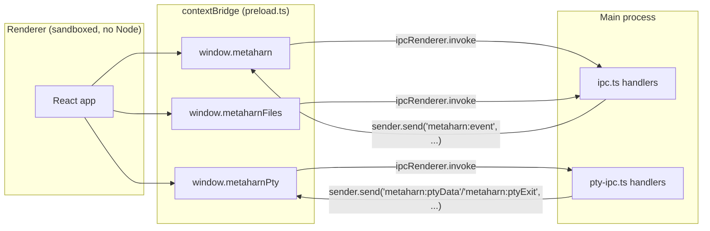

# IPC contract

The renderer never talks to Node or Electron APIs directly. `BrowserWindow` is created with `contextIsolation: true`, `nodeIntegration: false`, `sandbox: true` (`main.ts`) — the secure Electron default. The **only** surface the renderer has is three objects a preload script (`preload.ts`) exposes via `contextBridge.exposeInMainWorld`, each a thin wrapper around `ipcRenderer.invoke`/`ipcRenderer.on`.



## `window.metaharn` — agent sessions, projects, indexing

Registered in `ipc.ts`'s `registerIpcHandlers()`.

| Channel | Direction | Payload | Handler notes |
|---|---|---|---|
| `metaharn:init` | invoke | `(repoPath, resumeSessionPath?)` | Creates (or resumes) a session for this window; see [`03-agent-runtime.md`](03-agent-runtime.md) |
| `metaharn:prompt` | invoke | `(text)` | `session.prompt()` |
| `metaharn:steer` | invoke | `(text)` | `session.steer()` — inject mid-turn |
| `metaharn:followUp` | invoke | `(text)` | `session.followUp()` — queue for after current turn |
| `metaharn:abort` | invoke | — | `session.abort()` |
| `metaharn:listSessions` | invoke | — | Merged chat (`SessionManager.listAll()`) + terminal (catalog DB) sessions, see [`05-data-model.md`](05-data-model.md) |
| `metaharn:deleteSession` | invoke | `(sessionPath)` | Chat only — moves the JSONL file to trash |
| `metaharn:createTerminalSession` | invoke | `(cwd, agentKind)` → `{id}` | Creates a catalog-only row for a new terminal session running the given agent (see [`05-data-model.md`](05-data-model.md)); the renderer then mounts `TerminalPane`, which spawns the actual pty via `metaharnPty.create` |
| `metaharn:deleteTerminalSession` | invoke | `(id)` | Terminal only — closes any live pty for this id, then deletes the catalog row (no file to trash) |
| `metaharn:renameTerminalSession` | invoke | `(id, title)` | Sets a terminal session's title — called once, from `TerminalPane`'s first-input capture on a brand-new session |
| `metaharn:listAvailableAgents` | invoke | — | `{kind, displayName}[]` — which agent CLIs are actually on `PATH` (see [`03-agent-runtime.md`](03-agent-runtime.md)'s agent-adapters section), for gating the "+ New terminal session" picker |
| `metaharn:swapTerminalSessionAgent` | invoke | `(id, cwd, agentKind)` → `{ok, handedOffContext}` | First asks the outgoing agent to summarize itself for a handoff (best-effort, see [`03-agent-runtime.md`](03-agent-runtime.md) — `handedOffContext` reports whether that actually produced one), then closes the session's live pty and updates its catalog row to the new `agentKind` (clearing `externalSessionId`). The renderer forces a `TerminalPane` remount (a `generation` counter in its React key) so the next `metaharn:ptyCreate` spawns fresh under the new agent, seeded with the summary if one was generated — the header's `{agent} ⌄` dropdown, see [`07-frontend.md`](07-frontend.md) |
| `metaharn:getAgentStatuses` | invoke | — | `{kind, displayName, installed, version, latestVersion, updateAvailable}[]` — Settings → Agent CLIs. `version` from `<bin> --version`, `latestVersion` from the npm registry (5-minute cache), see [`03-agent-runtime.md`](03-agent-runtime.md) |
| `metaharn:installAgent` / `metaharn:uninstallAgent` / `metaharn:upgradeAgent` | invoke | `(agentKind)` | `{ok, output}` — `npm install/uninstall -g <package>`, except Claude's upgrade which runs its own `claude update` instead (works regardless of install method) |
| `metaharn:forkTerminalSession` | invoke | `(cwd, sourceId, sourceTitle?)` → `{id?, hasHistory, reason?}` | Dispatches to the source session's agent adapter to copy its transcript to a new id (see [`05-data-model.md`](05-data-model.md)) and creates its catalog row. `hasHistory: false` (and the row is deleted again) if the source was never recorded, or the adapter declines (e.g. Gemini, always) — `reason` carries why when the adapter attempted and failed |
| `metaharn:getSessionTree` | invoke | — | Current window's session tree, flattened via `treeToDTO()`. Chat sessions only — a terminal session has no Pi session tree |
| `metaharn:branchSession` | invoke | `(entryId)` | `session.navigateTree(entryId)`, then re-pushes a `ready` event |
| `metaharn:getSessionStats` | invoke | — | `SessionStats \| null` (Pi's `AgentSession.getSessionStats()`, verbatim) — cumulative token/cost totals plus the latest turn's `contextUsage`. Chat sessions only, see [`03-agent-runtime.md`](03-agent-runtime.md) |
| `metaharn:getTerminalSessionStats` | invoke | `(cwd, sessionId)` | `SessionStats \| null` — same shape as above, but computed by parsing the real Claude Code transcript file directly (no live API exists for this), see [`03-agent-runtime.md`](03-agent-runtime.md) |
| `metaharn:forkChatSession` | invoke | — | `{path} \| null` — `SessionManager.createBranchedSession(leafId)`, a new session file containing just the root-to-current-leaf path. `null` if the session has no leaf yet (nothing to fork) |
| `metaharn:registerProject` | invoke | `(cwd)` | `ensureOrgAndRepo()` — creates the catalog row if new |
| `metaharn:listProjects` | invoke | — | Catalogued repos, excluding any linked as a worktree of another (`project_worktrees`, see [`05-data-model.md`](05-data-model.md)) — those aren't projects in their own right |
| `metaharn:removeProject` | invoke | `(repoId)` | Un-registers from the catalog (see [`05-data-model.md`](05-data-model.md)) |
| `metaharn:pickDirectory` | invoke | — | Native OS folder picker |
| `metaharn:getAppInfo` | invoke | — | `{version, provider, modelId}` |
| `metaharn:createWorktreeSession` | invoke | `(parentSessionId)` → `{worktreePath, parentType, parentAgentKind}` | Resolves the parent's `cwd` (`getSessionCwd`), runs a real `git worktree add` (`main/worktree.ts`), registers the new checkout's own `repos` row, and links it to the parent's repo (`recordWorktree`, `project_worktrees` — excludes it from `metaharn:listProjects` and merges its sessions into the parent's Sidebar group). Does **not** create the child session itself — chat vs. terminal creation are different renderer-side flows, so the renderer does that next with the returned path, then calls `setSessionDependency` itself. Throws the real git error on failure (dirty parent state, non-repo `cwd`, ...) — not swallowed, see [`05-data-model.md`](05-data-model.md) |
| `metaharn:setSessionDependency` / `metaharn:removeSessionDependency` | invoke | `(sessionId, dependsOnSessionId)` | Visual-only minimap annotation — never touches git, see [`05-data-model.md`](05-data-model.md) |
| `metaharn:getSessionDependencies` | invoke | — | `{sessionId, dependsOnSessionId}[]` — every edge across every project; the renderer filters for display (`MinimapPanel.tsx`) |
| `metaharn:getWorktreeLinks` | invoke | — | `{cwd, parentCwd}[]` — every worktree-checkout-to-parent link, resolved to real filesystem paths; `Sidebar.tsx` uses this to merge a worktree's sessions into its parent's card list, see [`05-data-model.md`](05-data-model.md) |
| `metaharn:event` | **push** (`sender.send`, not invoke) | `MetaHarnEvent` union | See below |

### `metaharn:event` — the streaming event union

One channel, one discriminated union, subscribed via `window.metaharn.onEvent(callback)`. Any handler above that needs to stream something asynchronous (turn progress) pushes onto this same channel rather than inventing a new one per feature:

```ts
type MetaHarnEvent =
  | { type: "ready"; sessionId: string; history: HistoryMessage[] }
  | { type: "text_delta"; delta: string }
  | { type: "thinking_delta"; delta: string }
  | { type: "tool_start"; toolName: string }
  | { type: "tool_end"; toolName: string; isError: boolean }
  | { type: "agent_end" }
  | { type: "error"; message: string };
```

Multiple independent listeners can subscribe to the same channel — `ipcRenderer.on` supports this natively; `onEvent()` just wraps add/remove. (An earlier variant, `index_progress`, was a real example of this — a since-removed feature's own `ProjectOverview.tsx` subscription, filtered by `cwd`, running alongside `App.tsx`'s main one.)

## `window.metaharnPty` — terminal I/O

Registered in `pty-ipc.ts`. Ptys are keyed by MetaHarn's own terminal-session id, not by window — see [`02-process-model.md`](02-process-model.md) for why (multiple can be alive at once; switching never kills one).

| Channel | Direction | Payload |
|---|---|---|
| `metaharn:ptyCreate` | invoke | `(cwd, terminalSessionId)` → `{ptyId, scrollback}` — attach-or-create: if `terminalSessionId` already has a live pty, its existing `ptyId` is returned untouched, nothing is killed or respawned. Otherwise the session's `agentKind`/`externalSessionId` are resolved from its catalog row and a fresh pty is spawned running that agent's launch/resume command, see [`03-agent-runtime.md`](03-agent-runtime.md). `scrollback` is everything that pty has written since it spawned, capped at 200KB, kept in the main-process registry (`pty-ipc.ts`) and replayed into the caller's xterm instance before it's treated as live — without it, any *second* `TerminalPane` mounted for an already-running session (the grid view's own instance, or a reopened tab) started with a genuinely empty buffer and rendered nothing until new bytes happened to arrive, which read as "stuck" for a session that was really just idling at its own prompt |
| `metaharn:ptyWrite` | invoke | `(terminalSessionId, data)` — keystrokes from xterm.js |
| `metaharn:ptyResize` | invoke | `(terminalSessionId, cols, rows)` |
| `metaharn:ptyClose` | invoke | `(terminalSessionId)` — explicit close (tab-strip ×): kills the pty and removes it from the registry. Distinct from just navigating away, which must never kill anything |
| `metaharn:ptyData` | push | `{ptyId, terminalSessionId, data}` — shell output |
| `metaharn:ptyExit` | push | `{ptyId, terminalSessionId, exitCode, signal?}` |

Every open terminal tab's `TerminalPane` stays mounted at once (see [`07-frontend.md`](07-frontend.md)), so every instance's `onData`/`onExit` listener receives every session's push events on this shared channel — `terminalSessionId` is the real filter each instance applies to only render its own; `ptyId` remains a secondary guard against React StrictMode's dev-mode double-effect-invoke landing a stale pty's events on a listener that outlived it.

## `window.metaharnFiles` — project filesystem access

Also registered in `ipc.ts`, but bridged separately (`metaharnFiles`, not `metaharn`) to keep the "chat with the agent" surface and the "browse/edit files directly" surface conceptually distinct, even though both run through the same `ipcMain`/ `registerIpcHandlers()`.

| Channel | Direction | Payload |
|---|---|---|
| `metaharn:fsListTree` | invoke | `(root)` → `FileTreeNode[]` |
| `metaharn:fsReadFile` | invoke | `(root, relPath)` → `string` |
| `metaharn:fsWriteFile` | invoke | `(root, relPath, content)` |
| `metaharn:getGitBranch` | invoke | `(cwd)` → `string \| null` |

**Security note:** `fsReadFile`/`fsWriteFile` are real read/write filesystem access exposed over IPC, guarded by `resolveWithinRoot()` (`files.ts`) — resolves `relPath` against `root` and throws if the result would escape `root`. This matters even in a v0 single-user desktop app, since it's the one place MetaHarn accepts a path from the renderer and touches disk with it outside of Pi's own tool-execution sandbox (or lack thereof — see [`08-known-limitations.md`](08-known-limitations.md)).

## Adding a new IPC channel — where things go

1. Handler: `ipcMain.handle("metaharn:yourThing", ...)` in `ipc.ts` (or a new file, mirroring `files.ts`/`git.ts` if it's a distinct concern).
2. Bridge method: add to the relevant bridge object in `preload.ts` (`metaharnBridge`, `metaharnPtyBridge`, or `metaharnFilesBridge`), typed against the handler's real return shape.
3. Renderer type: the bridge's exported `type MetaHarnBridge = typeof metaharnBridge` (etc.) means renderer code gets the new method's types automatically — no separate type file to update.
4. If it needs to stream progress/events rather than a single request/response, push onto the existing `metaharn:event` channel with a new `MetaHarnEvent` variant rather than adding a new push channel, unless it's conceptually as distinct as PTY I/O is.
