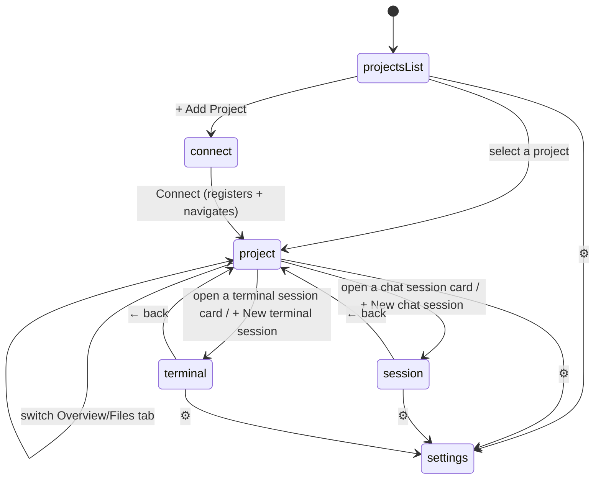
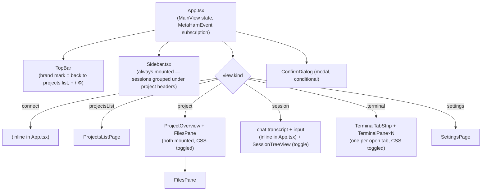

# Frontend

The renderer (`apps/desktop/src/renderer/`) is a single-page React 19 app with no router library — navigation is one discriminated union held in `App.tsx` state, and the whole component tree switches on it.

## Navigation model

```ts
type MainView =
  | { kind: "connect" }                                          // registering a new project
  | { kind: "projectsList" }                                     // browse-everything landing page
  | { kind: "project"; cwd: string; tab: "overview" | "files" }   // a project's Overview/Files
  | { kind: "session"; cwd: string; sessionPath?: string }        // a chat session (no path = brand-new)
  | { kind: "terminal"; cwd: string; terminalSessionId: string }  // a terminal session
  | { kind: "settings" };
```



Chat and terminal are two independent session **types**, chosen explicitly — Overview offers "+ New terminal session" and "+ New chat session" as two equal actions, not one generic "new session" that happens to always be chat. A chat session is Pi-backed (real transcript, resumable, has a session tree — see [`03-agent-runtime.md`](03-agent-runtime.md)); a terminal session is a MetaHarn-only bookkeeping record around an ordinary `node-pty` process running one of three real CLI coding agents (no transcript of MetaHarn's own, no tree — see [`05-data-model.md`](05-data-model.md) for why). Both are tracked and listed identically in the sidebar and in Overview's session list (`SessionListItem.type` discriminates them), and `Sidebar.tsx`/`ProjectOverview.tsx`'s session rows render a small `›_` marker on terminal rows to distinguish them at a glance.

A project's **Overview** and **Files** tabs are both mounted simultaneously once a project is opened, toggled with CSS `display` rather than conditional unmounting — switching tabs doesn't discard unsaved Monaco edits (`FilesPane`). Switching to a *different* project, or navigating into a chat session, does unmount both.

The underlying Pi agent session in the main process (see [`03-agent-runtime.md`](03-agent-runtime.md)) stays alive across pure navigation too — only opening a *different* session (or none yet) disposes it (`disposeSessionFor` on the main-process side is only triggered by a new `metaharn:init` call).

**Chat sessions don't yet have the same multi-tab persistence terminal sessions do** — there's exactly one `messages`/`ready` state slot in `App.tsx`, so opening a second chat session replaces the first rather than keeping both warm and tab-switchable the way `openTerminalTabs` already does for terminals. Giving chat sessions real parity would need a main-process rewrite on the same scale terminals already got (`ipc.ts`'s `sessionsByWindow` is one live Pi `AgentSession` per *window*, not per session — no session-keyed registry like `pty-ipc.ts`'s exists for it). Known gap, not silently unaddressed — see [`08-known-limitations.md`](08-known-limitations.md).

**Terminal sessions go further: every one you've opened stays mounted, not just the last one.** `App.tsx`'s `openTerminalTabs: {id, cwd}[]` state (separate from `view`, which just says which one is currently *visible*) is rendered as an unconditional `.map()` — each entry's `<TerminalPane>` is CSS-toggled (`display: isActive ? "block" : "none"`), the same co-mounted pattern as Overview/Files, but placed as a sibling *outside* the `{view.kind === "terminal" && ...}` block so it survives navigating away to Overview/Files/a different project entirely, not just switching between terminal tabs. This is what actually fixes a real bug: the pty registry in the main process now also survives navigation (see [`02-process-model.md`](02-process-model.md)), but without this renderer-side change the xterm.js instance itself — and its scrollback — would still be torn down and recreated on every switch, even though the underlying process kept running. A tab is only removed from `openTerminalTabs` (unmounting its `TerminalPane`, closing its real pty via `metaharnPty.close`) by an explicit close: the tab-strip's ×, deleting the session, or removing its project.

**The grid view (`TerminalGrid.tsx`) mounts a SECOND, independent `TerminalPane` instance** for each session it shows, separate from the single-tab view's own instance for the same id — real, deliberate trade-off, not an oversight: `metaharnPty.create` is attach-or-create (never spawns a second pty for the same session id) and `metaharnPty.onData`/`onExit` broadcast to every subscriber, so both instances render the same real output stream independently. It does mean each instance keeps its own client-side xterm.js scrollback buffer — moving a session in or out of the grid unmounts one instance and mounts a fresh one. This used to mean the fresh instance rendered nothing until new output happened to arrive (a session idling at its own prompt looked permanently blank/"stuck" — the bug report that led to this section existing); `metaharn:ptyCreate`'s `scrollback` reply (see [`06-ipc-contract.md`](06-ipc-contract.md)) now seeds every fresh instance with the pty's actual current buffer before it goes live, so a second instance shows the real current terminal state immediately, not just future output. A true single-shared-instance fix (a portal, so the same xterm DOM node/instance is reused rather than recreated) would remove the two-scrollback-buffers trade-off entirely but is a larger change than this warranted.

## Component map



Notable pieces:

- **`Sidebar.tsx`** — one persistent, always-mounted sidebar. Originally built as two independently-collapsible stacked sections (a separate "Projects" list above a separate "Sessions" list); rewritten again after a closer look at a fleet-view-style sidebar pattern showed a better fit — sessions grouped **directly** under their project as one collapsible header each (chevron to collapse, project name to navigate to its Overview, a persistent `+` to quick-launch a new session), no separate project-browsing surface competing with the session list for space. Scoping ("this project" / "all projects", top-right of the sidebar) controls how many groups render — one (the active project) vs up to 8 most-recent — rather than which of two sections is expanded. Each session renders as a real card (`SessionCard`): bordered, rounded, elevated above the sidebar background, a bold full-contrast title over a secondary status/time line over a muted agent/message-count line — a real three-tier text hierarchy, not one weight throughout. The active session gets an accent border, a left accent bar, and a soft accent-tinted background, not just a border color change. A project whose sessions still exist but whose catalog row was removed gets a synthesized, non-clickable "unregistered" group (`projectLabel(cwd)` as a fallback name) rather than silently dropping those sessions. The brand mark in `TopBar.tsx` (a real `<button>`, not a static wordmark) remains the one reliable way to the full projects-list page; the sidebar also keeps a "Browse all projects →" link for the same destination.

  `SessionCard`'s border/background/radius are real CSS (`.metaharn-session-card` in `theme.css`), not inline React styles, on purpose: an inline `style` property always wins the CSS cascade over any stylesheet rule for that same property — `:hover` included — with no exception short of `!important`. The card used to set `border`/`background` inline, which meant `.metaharn-card-row:hover`'s border/background shift could never actually apply to it: the rule matched, and visually did nothing, on every card built that way. Selection state is now a modifier class (`.metaharn-session-card-active`) instead of an inline color for the same reason, so `:hover` and "is this the active session" can coexist without one silently blocking the other.

  Sessions within one project group can be dragged into a different order via a small grip handle (`GripIcon`, hover-revealed at the card's left edge) — plain HTML5 drag-and-drop, the same `draggable`/`onDragStart`/`onDragOver`/`onDrop` technique `TerminalGrid.tsx` already uses for its own pane reordering, not a drag library. The dragged-item state lives in `ProjectGroup`'s own local component state, which is what actually keeps a drag confined to its own project group when "all projects" mode renders several groups at once — a drag started in one group's state is invisible to another group's separately-mounted state, so dropping across groups is a harmless no-op rather than something requiring an explicit guard. The resulting order persists to `localStorage` (`metaharn:sessionOrder:<cwd>`, an array of `session.path` in order) — local-machine-only, matching `App.tsx`'s sidebar-width key, not a DB-synced concept like archiving or dependencies. A session absent from a saved order (created, or un-archived, after the last manual reorder) sorts ahead of the manually-placed ones, in the normal most-recent-first order, so new sessions surface at the top instead of sinking below a stale arrangement; a project with no saved order at all renders identically to before this feature existed.

  **Live status** (`SessionCard`'s status line, replacing a plain relative-time-only line) is intentionally honest, not fabricated: a session only gets a status at all if `App.tsx` has a *real* live signal for it (`sessionStatuses: Map<path, status>`, built fresh each render from `ready`/`streaming`/`openTerminalTabs`/a terminal-activity heuristic — see below) — anything else falls back to plain relative time, never a guessed "idle." Chat sessions get real signal only while they're the one window-wide live session: `streaming` → **Working**, `ready && !streaming` → **Waiting for input**, matching the pulsing-dot/clock-icon/plain-text conventions in `StatusLine`. Terminal sessions get a real *background* signal (the pty registry survives navigation, unlike chat) but no true 3-way state exists in raw pty bytes — parsing terminal output for prompt patterns would be fragile and CLI-specific, so this is deliberately a 2-state heuristic: **Active** if the session produced pty output within the last 2 seconds, else **Idle**, plus the already-tracked **Exited** state. Implemented renderer-side only, no new IPC: a *second*, App.tsx-level subscription to `metaharnPty.onData` (every `TerminalPane` already has its own; broadcast events support multiple listeners) writes timestamps into a `Map` ref — never triggering a re-render itself, since output floods constantly — and a light interval (only running while a terminal tab is open) re-derives the "active" id set from that ref roughly twice a second.

  **Hover actions** (`SessionCard`'s icon cluster, top-right corner, revealed via the `.metaharn-hover-actions`/`.metaharn-session-card:hover` CSS pair in `theme.css` rather than a `:hover`-driven inline style, since inline styles can't express `:hover`): Fork (only shown for a chat session when it's the currently-open one — see the next paragraph for why — always shown for terminal sessions), a real git-worktree child session, and "Set dependency" (opens `DependencyMenu.tsx`). Delete moved into this same cluster for visual consistency, replacing a permanent × button.

  **Worktree child sessions** (`WorktreeIcon`, "New child worktree session") create a real `git worktree` (`main/worktree.ts`, `metaharn:createWorktreeSession`) — a second, independent checkout with its own auto-named branch, as a sibling directory of the parent's `cwd` — then a brand-new session (chat or terminal, matching the parent's type) rooted there. `App.tsx`'s `createWorktreeSession()` handles the two creation paths' different shapes: a terminal session's real id is known synchronously from `createTerminalSession`'s return value, but a chat session's real id is only known once Pi's own `"ready"` event reports one — bridged via a `pendingWorktreeParentRef`, read and cleared in the `onEvent` subscription's `"ready"` case. Either path finishes by recording a dependency edge from the new child back to its parent automatically, since that relationship is definitionally true for a worktree child; this is the one point where the worktree feature and the dependency feature meet, and the only place a dependency edge is ever recorded automatically rather than by the user picking one in `DependencyMenu.tsx`. See [`05-data-model.md`](05-data-model.md) for why this is a real git operation while "Set dependency" deliberately isn't.

  The checkout itself does **not** show up as its own project group — `Sidebar.tsx` fetches `metaharn:getWorktreeLinks()` and resolves every session's `cwd` through it (`effectiveCwd()`) before grouping, so a worktree session renders merged into its *parent's* card list instead of forming a disconnected group of its own; a small `WorktreeIcon` badge on the card (tooltip: "Runs in a separate worktree checkout") is the only visible sign its real `cwd` differs from the group it's shown under — it still opens, resumes, and spawns its pty at that real path, only where it's *displayed* changes.

  **`DependencyMenu.tsx`** / **`MinimapPanel.tsx`** — two small popovers for the visual-only session-dependency feature (see [`05-data-model.md`](05-data-model.md)'s `session_dependencies` section for the full "not a git relationship" scoping). Both use `position: fixed`, anchored off a measured `getBoundingClientRect()` from their trigger, rather than `AgentSwapMenu.tsx`'s `position: absolute`-off-a-relative-parent pattern — their triggers live inside the sidebar's `overflowY: auto` scrolling group list, which would otherwise clip a popover taller or wider than the scroll container. `DependencyMenu` lists every other session as a candidate to depend on; `MinimapPanel` renders every recorded edge as a simple indented list grouped by source session — deliberately not a canvas-drawn graph, the same "simple list over a visual graph" call `SessionTreeView.tsx` already made for v0 session trees — silently dropping any edge whose endpoint no longer resolves to a known session (there's no cascade-delete on session removal, so this is where that gets cleaned up visually).
- **`ui.tsx`** — a small shared spacing/type/radius token scale (`SPACE`/`TEXT`/`RADIUS`) plus a few primitives (`Section`, `Row`, `ValueRow`, `Eyebrow`, `SegmentedControl`, `MetaChip`) extracted after an audit found concrete, verified drift from every screen hand-writing its own inline styles: two independently-defined components both named `Row` for different shapes (`SettingsPage.tsx`'s label+control vs `ContextWindowPanel.tsx`'s label+value, now `Row` and `ValueRow` respectively), the same "small uppercase label" role at two different font sizes in one file, no shared number behind any padding/border-radius value. Applied where the drift was concretely found (`SettingsPage.tsx`, `ContextWindowPanel.tsx`) and in `Sidebar.tsx` since it's new — **not** a retrofit of every existing screen, which would be a much larger, separate effort than what the audit's evidence actually called for.
- **`ProjectOverview.tsx`** — project header (name, path, branch, index status/action), the unified session list (active/recent, chat + terminal), and the two creation buttons ("+ New terminal session" / "+ New chat session"). No longer embeds a `TerminalPane` directly — that moved to being its own session view, mounted only when a specific terminal session is open (`{kind: "terminal"}` in `App.tsx`). "+ New terminal session" skips straight to creating a Claude session when that's the only agent installed (`installedAgents`, from `metaharn:listAvailableAgents`); with more than one installed it opens `AgentPickerMenu.tsx`, a small anchored popover to choose which CLI.
- **`TerminalTabStrip.tsx`** — the live-switcher for every currently-open terminal session, rendered above the terminal header whenever `view.kind === "terminal"`. Deliberately global, not scoped to the currently-viewed project, so a Claude terminal in one repo and a Codex terminal in another both stay one click away. Each chip is a plain text title + agent label (no new icon glyphs — `icons.tsx`'s curated set isn't extended here) + a × that explicitly closes the tab (`metaharnPty.close`), distinct from clicking the chip itself, which only switches which tab is visible and never touches the underlying pty.
- **`AgentSwapMenu.tsx`** — swaps which real CLI agent is running in the *current* terminal session, in place, via a `{agent} ⌄` dropdown button in the terminal header. Lists all three known agent kinds, not just installed ones — the current one (disabled, labeled "(current)"), installed-but-not-current ones ("Swap to X"), and not-installed ones greyed out with an "Install" link that navigates to Settings. Swapping goes through `App.tsx`'s existing `pendingConfirm`/`ConfirmDialog` (same destructive-action pattern as delete/remove) since it ends whatever the current agent's live conversation was in that tab — a different CLI has no way to inherit another one's context. The actual remount mechanism: `openTerminalTabs` entries carry a `generation` counter, bumped on swap and folded into `TerminalPane`'s React `key` (`` `${id}:${generation}` ``) — changing the key forces React to fully unmount/remount the pane, which is what makes it call `metaharnPty.create()` again and spawn a fresh pty rather than reattaching to the (already-closed, by the IPC handler) old one.
- **`FilesPane.tsx`** — file tree (left) + Monaco editor (right). One editor instance persists across file switches; Monaco *models* are cached per opened file (`Map<path, ITextModel>`) so switching between already-opened files doesn't lose undo history. ⌘/Ctrl+S saves via `metaharnFiles.writeFile`.
- **`SessionTreeView.tsx`** — the branch/fork outline described in [`03-agent-runtime.md`](03-agent-runtime.md), rendered as an absolutely-positioned popover under the session header's "⎇ Tree" button.
- **`ConfirmDialog.tsx`** — a custom modal used for every destructive action (delete session, remove project) instead of native `window.confirm()`, specifically because Chromium's native confirm can be permanently suppressed by the user after repeated triggers ("prevent this page from creating additional dialogs") — a real risk here since delete/remove are used often during dev.
- **`ContextWindowPanel.tsx`** — shared by both session types (see [`03-agent-runtime.md`](03-agent-runtime.md) for how terminal sessions get real stats with no live API to ask), an absolutely-positioned popover matching `SessionTreeView`'s pattern, toggled by a `🗄 <percent>%` badge button in the session header. Mutually exclusive with the Tree popover in the chat header (opening one closes the other — both anchor to the same `top: 44, right: 0` spot). Session and terminal headers also both got a Fork button (`ForkIcon`) this same pass — disabled with an explanatory tooltip on the terminal header when `currentTerminalSession.agentKind === "gemini"`, since forking isn't implemented for that adapter (see [`03-agent-runtime.md`](03-agent-runtime.md)); the terminal header additionally shows the session's real title (`sessionTitle()`, falling back to "New terminal session" only in the brief window before `sessions` state has loaded it) instead of a static "Terminal session" label, plus a compact age badge (`formatAge()` in `format.ts` — "7d", not "7 days ago"). `App.tsx`'s `refreshSessionStats()` is the single fetch point for both — it branches on `viewRef.current.kind` (a ref, not `view` directly, since it's also called from an event-subscription effect set up once on mount) to call `getSessionStats()` or `getTerminalSessionStats()`.
- **`icons.tsx`** — small inline outline SVG icon components (Feather/Lucide-style: 16×16 viewBox, `currentColor` stroke, no fill), used in place of emoji glyphs for things like the projects list's folder/clock/branch/session icons. Emoji render inconsistently across platforms/fonts; these are consistent and themeable via `currentColor`. Add new icons here rather than inlining SVG markup per-component.

## App icon

`apps/desktop/assets/icon.svg` is the source artwork: five concentric rings (`#FCEEE0` → `#FFD9A8` → `#FFB35C` → `#F2823F` → `#E0630F` → `#A83D0C`, outer to center — the `#E0630F` ring is exactly the app's own light-theme `--color-accent`) on a macOS Big Sur–style continuous-corner squircle background (`rx="224"` on a 1024×1024 canvas). Deliberately abstract rather than a literal illustration of a metaharn (橙, bitter-orange citrus) fruit — the icon reads instead as tree rings / growth, tying to the actual etymology (metaharn is a pun on 代々, "generation to generation") rather than drawing the fruit itself. `TopBar.tsx`'s wordmark uses the same mark at 18px (`icons.tsx`'s `AppMark`, a hand-scaled 16×16-viewBox copy of the same rings/colors) instead of the 🍊 emoji it originally used, so the in-app brand and the dock icon match.

**How this was decided:** a first attempt (a detailed fruit illustration — gloss highlight, leaf, fine segment lines) was rejected as too fussy at small size. Rather than re-guess, five distinct directions were sketched side by side in a comparison artifact — rings, a bold flat citrus cross-section, a plain letterform monogram, a flattened version of the original fruit, and an abstract knowledge-graph node cluster — each rendered at both 128px and 32px to judge dock-icon legibility directly. Rings was picked for reading cleanly at every size and for the stronger conceptual tie to what "metaharn" actually means. The review artifact itself is the design record: <https://claude.ai/code/artifact/e839bdff-647e-4528-9981-35f620e4a380> (private to the project owner's account, not public).

`assets/icon.iconset/*.png` (all required macOS sizes) and `assets/icon.icns` are generated from the source SVG via `sharp` rendering each size, then `iconutil -c icns` (a macOS system tool) assembling the iconset into the final `.icns` — regenerate both by re-running that pipeline if the artwork changes; there's no build-time step that does this automatically. `sharp` isn't a real dependency of any package here (see [`08-known-limitations.md`](08-known-limitations.md)) — install it manually first if regenerating. `forge.config.ts`'s `packagerConfig.icon` points at it for packaged builds; `main.ts` additionally calls `app.dock?.setIcon()` at startup (macOS only) so **dev mode** (`electron-forge start`, which never runs the packager) shows the real icon too, not Electron's generic one.

## Theming

Two independent axes, both persisted to `localStorage` (`SettingsContext.tsx`, key `metaharn:settings`):

1. **Mode** — `light` / `dark` / `system` (resolved against `prefers-color-scheme` when `system`).
2. **Named theme per mode** — `darkThemeId` / `lightThemeId`, chosen independently (e.g. "Tokyo Night Storm" for dark, "Catppuccin Latte" for light), so switching OS mode doesn't lose your per-mode preference.

`themes.ts` defines each theme as CSS custom-property values (`vars`) applied to `document.documentElement.style` on change — the whole app's styling is inline `style={{...}}` objects referencing `var(--color-*)`, not a CSS-in-JS library or Tailwind.

**xterm.js is the one exception** that needs special handling: it renders to a `<canvas>`, not the DOM, so CSS custom properties never reach it. Every theme in `themes.ts` also carries a full explicit ANSI 16-color `terminal` palette; `TerminalPane.tsx` looks this up directly (`getTheme(activeThemeId)?.terminal`) and applies it both at creation and live via a `useEffect` keyed on theme/font-size changes, rather than relying on any CSS inheritance.

Monaco similarly can't consume CSS variables for its syntax-highlighting theme — `FilesPane.tsx` maps MetaHarn's light/dark *mode* (not the specific named theme) to Monaco's built-in `vs` / `vs-dark` themes. A named-theme-aware Monaco theme (matching the exact accent/syntax colors of, say, Dracula) is a gap, not yet built — see [`08-known-limitations.md`](08-known-limitations.md).
