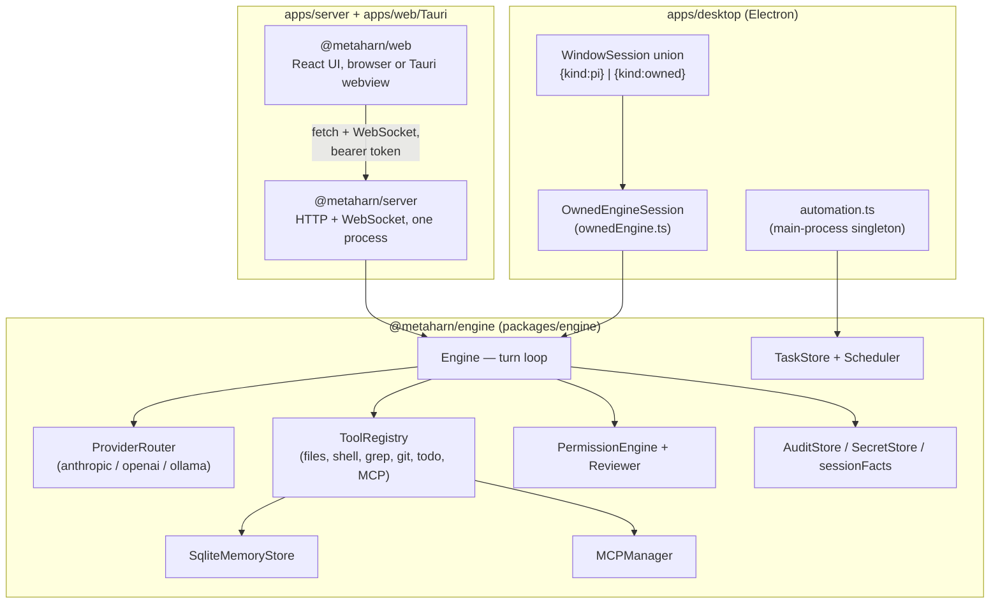
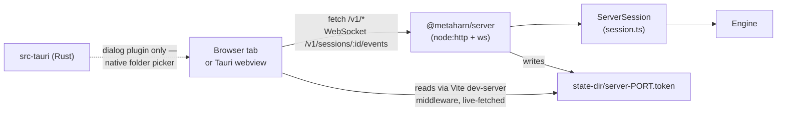

# The owned engine (`@metaharn/engine`) and its two surfaces

This doc covers the second chat backend built alongside Pi: a MetaHarn-owned agent loop
(provider routing, tools, permissions, MCP, memory, automation, review) shipped as its own
package, plus the two UI surfaces that host it — Pi remains the default in `apps/desktop`;
the owned engine is additive, not a replacement (see [`03-agent-runtime.md`](03-agent-runtime.md)
for Pi's own integration).

Design rationale lives in `docs/research/openworker-integration.md` ("Owning the Loop") and
`docs/research/openworker-feature-catalog.md` ("The Parts Bin") — this doc covers what's
actually built, not the research.

## Why a second backend

Pi is a general-purpose embeddable harness; OpenWorker's own harness (studied in the research
docs above) does several things Pi doesn't expose a seam for — a router-shaped provider
abstraction, MCP tool loading, durable cross-session memory, standing scheduled automations,
and an LLM-judged auto-approve reviewer. Rather than fork Pi, `packages/engine` re-implements
this shape as a standalone TypeScript package MetaHarn controls end to end, selectable per
session via `METAHARN_CHAT_ENGINE=owned` (Electron) or simply used exclusively (the
`apps/server` surface, which has no Pi dependency at all).

## `packages/engine` module map

| Area | Files | Owns |
|---|---|---|
| Core loop | `engine.ts`, `types.ts` | `Engine` — the turn loop as an async generator; every shared contract (`ChatMessage`, `EngineEvent`, `PermissionDecision`, etc.) |
| Providers | `providers/{base,router,anthropic,openai}.ts` | `ProviderClient` interface, `ProviderRouter` (`provider:model` string dispatch), Anthropic + OpenAI clients. `OpenAIProvider` takes an optional `baseURL` — the same Chat Completions wire shape Ollama and most "OpenAI-compatible" servers speak, so it doubles as the Ollama client with no separate implementation. |
| Tools | `tools/{registry,files,shell,search,git,todo,ask,directories,toolreq,plan,subagent,websearch}.ts` | `ToolRegistry`, and every built-in tool |
| Permissions | `permissions/{engine,risk,roots,shellAllowlist,readonlyClassifier}.ts` | `PermissionEngine` — modes `discuss`/`plan`/`interactive`/`bypass-approvals`/`auto-approve`/`custom`; deferred-execution and self-protection floors no mode can bypass |
| Trust | `trust/{sessionFacts,provenance,workspaceTrust,auditStore,secretStore}.ts` | `AuditStore` (every tool call, permission decision), `SecretStore` (file-backed, `${VAR}`-resolving credential store — see below), workspace trust gating |
| MCP | `mcp/{config,client,tools}.ts` | `loadMcpServers` (layered global+workspace `mcpServers` JSON), `MCPManager`, tool adaptation |
| Memory | `memory/{types,sqliteStore,tools}.ts` | `MemoryStore` contract, SQLite adapter, `remember`/`memory_update`/`memory_forget` tools, the size-bounded injected memory block |
| Automation | `automation/{models,store,scheduler,tools,selfwake}.ts` | `ScheduledTask`/`TaskRun` model, `TaskStore` (SQLite), `Scheduler` (run-once-catch-up, skip-on-overlap), self-wake |
| Reviewer | `reviewer.ts` | LLM-judged auto-approve reviewer, consulted by `Engine.handleToolCalls` before a would-be approval reaches a human |

### Auto-compaction — wired into both surfaces, and a real bug found doing it

`compaction.ts` (`createCompactionHook()`, a `CompactionHook` per `types.ts`) existed in the
package since the original build but was **never actually passed to either surface's
`Engine` constructor** — a long owned-engine conversation had no safety net at all and would
just run straight into a hard context-overflow error from the provider. Both `session.ts` and
`ownedEngine.ts` now construct one: `createCompactionHook({provider, model, contextWindow})`,
where `contextWindow` comes from a small per-provider table (`anthropic: 200_000`,
`openai: 128_000`; every other catalog entry falls back to the hook's own conservative
128k default rather than a guessed figure for a model this codebase doesn't have a verified
number for).

**Wiring this up surfaced a real, previously-latent bug in `engine.ts` itself** — worth
recording in detail since it was found by testing, not assumed away, and it's the kind of bug
that only shows up once a `CompactionHook` is actually attached (which, until this pass,
nothing had ever done). `compaction.ts`'s documented contract: a no-op decision signals
"nothing changed" by returning the exact same array reference it was given. `engine.ts`'s
`loop()` consumed that result with `this.messages.length = 0; this.messages.push(...compacted)`
— an in-place truncate-then-refill, chosen because `Engine.messages` is a `readonly` property
(mutable contents, non-reassignable reference). Those two facts are incompatible: when
`compacted === this.messages` (the documented no-op case), `.length = 0` truncates the only
array that exists — `compacted` and `this.messages` are the same object — so `compacted` is
already empty by the time `.push(...compacted)` runs. The very first no-op compaction check
(i.e. every session, since nothing had ever exercised this path before) silently wiped the
entire conversation down to zero messages.

This was **not a theoretical bug** — it reproduced immediately on the very first prompt sent
to a real session after wiring compaction in: the provider received zero convertible messages
and threw `"no convertible messages for the Anthropic Messages API"`, and the session file
persisted afterward contained only that one error notice, with the original system and user
messages gone. Traced with a small isolated repro script (`createCompactionHook()` called
directly, confirming `result === input` for the no-op path) before touching any code. Fixed
in `engine.ts`, not `compaction.ts` — the aliasing contract compaction.ts documents is
reasonable on its own; the bug was `engine.ts` assuming any `CompactionHook`'s return value is
always safe to alias-truncate, which isn't true for a same-reference no-op and wouldn't be
true for any *other* hook built the same way in the future either. The fix: skip the
truncate-and-refill entirely when `compacted !== this.messages`. Verified twice — the exact
aliasing failure reproduced and then fixed in isolation, and separately end-to-end against the
real running server (a real prompt, checked that all three messages — system/user/assistant —
survived where before only the error notice did).

**Not yet verified**: the actual over-threshold compaction path (build a real summary and
splice it in) has been checked with the real trigger-decision functions (`shouldCompact`,
`triggerTokens`) against this repo's real context doc and confirmed the trigger math is sound,
but firing a *real* summarization call requires an actual conversation large enough to cross
the threshold (160k tokens for Anthropic's window here), which wasn't practical to generate
live in this pass. The no-op path (the common case, exercised on every single turn) is now
solid; the rarer over-threshold path is unverified beyond the trigger math.

`src/index.ts` is a barrel export for `tsc`/testing only — **no app imports it**. Both
`apps/desktop/src/main/ownedEngine.ts` and `apps/server/src/session.ts` import specific
submodule paths (`@metaharn/engine/src/engine.js`, etc.) instead, because the barrel
transitively pulls in `@modelcontextprotocol/sdk` and `better-sqlite3`, both of which call
`require()` on Node builtins internally — fatal once bundled into Electron's forced-ESM main
process (see [`08-known-limitations.md`](08-known-limitations.md) and
`vite.main.config.ts`'s `external` list). `apps/server` is plain Node with no bundler in the
loop, so this constraint doesn't strictly apply there, but the narrow-import convention was
kept anyway for consistency between the two call sites.

## Surface 1: `apps/desktop` (Electron)

`ownedEngine.ts`'s `OwnedEngineSession` is a peer to Pi's `createMetaHarnSession` — selected
per session, not globally: `ipc.ts`'s init handler computes
`useOwnedEngine = resumeSessionPath ? isOwnedSessionPath(resumeSessionPath) : ownedEngineEnabled()`,
so **resuming** a session is decided by which backend actually wrote that transcript file, not
by the current value of `METAHARN_CHAT_ENGINE`. `WindowSession` is a discriminated union
(`{kind:"pi",...} | {kind:"owned",...}`) so every existing Pi call site in `ipc.ts` (session
tree, branching, stats, fork) got a `kind !== "pi"` early-return instead of a rewrite.

`automation.ts` is a main-process singleton, started in `app.whenReady()`: its own
`TaskStore` (`automation.db` in Electron's `userData`) and `Scheduler`, whose runner spins up
an **unattended** `OwnedEngineSession` per due task
(`{unattended: true, taskRules: standingRules(task)}`) — `taskRules` are the task's own
target-scoped standing grants (`alwaysAllowedTools` entries like `"read_file src/**"`), a
richer grant shape than a bare tool-name allowlist. `setSchedulingStore()` (called by
`automation.ts`, read by `ownedEngine.ts`) avoids a circular import between the two files —
every *interactive* chat session's tool registry also gets the scheduling tools
(create/list/update/delete a task) wired to this same store.

Persistence: `<userData>/owned-sessions/<id>.json`, written after every turn. Auto-Approve mode
(`METAHARN_AUTO_APPROVE=1`, or the Settings toggle below) enables the `Reviewer` and
`PermissionEngine`'s `auto-approve` mode together.

**Token-usage stats reuse Pi's existing panel, not a new one.** The web surface shows a live
token-count pill in its chat header (`apps/web/src/App.tsx`'s `.usage-pill`), fed by a
`"usage"` WebSocket event. Electron already has an equivalent, more detailed display for Pi
sessions — `ContextWindowPanel.tsx`, fed by `metaharn:getSessionStats` — so rather than bolt
on a second, parallel "usage" event here too, `OwnedEngineSession.getSessionStats()` computes
the same `SessionStats` shape from `Engine.usage` and `Engine.messages` (message/tool-call
counts derived from role/`toolCalls` fields; `cost` is always `0` — no per-provider pricing
table exists here the way Pi's does, and `0` is honest where a guessed number wouldn't be;
`contextUsage`, the *latest turn's* context size specifically, is left undefined since
`Engine.usage` is a running session total, a different question). `ipc.ts`'s
`metaharn:getSessionStats` handler now calls it for `kind: "owned"` sessions instead of
returning `null`; the panel picks it up automatically since it refreshes on the same
`"ready"`/`"agent_end"` events for both backends. Verified live (Chrome DevTools Protocol
driving the real running app): connected an owned-engine session, sent a real prompt, and
confirmed `getSessionStats()` returned real, non-zero token counts.

**Settings parity with the web surface**: `ownedProviders.ts`, `ownedMemoryApi.ts`, and
`ownedMcpApi.ts` are Electron's mirrors of `apps/server`'s `providers.ts`/`memoryApi.ts`/
`mcpApi.ts` — same `SecretStore`-backed provider/key layering, same `settings.json` shape for
the default model and Auto-Approve, same `mcp.json`/`memory.db` read/write logic — just reached
over IPC (`metaharn:owned:*` channels in `ipc.ts`, bridged in `preload.ts`) instead of HTTP, and
pointed at `app.getPath("userData")` instead of `~/.metaharn`. `automation.ts` grew CRUD
exports (`listAutomationTasks`/`createAutomationTask`/`updateAutomationTask`/
`deleteAutomationTask`/`runAutomationTaskNow`) reading the SAME `TaskStore` the scheduler
already runs against, rather than a second store.

The renderer surface is `renderer/OwnedEngineSettings.tsx`, mounted inside `SettingsPage.tsx`
as one more `<Section title="Owned Engine">` card, right after Pi's own read-only "Model"
section. Deliberately **one card with an internal tab bar** (General / Models / Memory / MCP
servers / Automations, via `ui.tsx`'s `SegmentedControl`) rather than five separate `<Section>`
cards — grouped the same way `apps/web/src/Settings.tsx` groups its tabs, just using this app's
own horizontal-segmented-control idiom (already established for Theme mode / default terminal
agent) instead of copying the web surface's vertical sidebar-rail layout verbatim, since a
vertical rail doesn't fit `SettingsPage.tsx`'s single-column page shape. Model/provider config
here is real now, not the `.env`-only placeholder the "Model" section above still is for Pi
(see [`08-known-limitations.md`](08-known-limitations.md) — that gap is Pi-specific).

## Surface 2: `apps/server` + `apps/web`/Tauri (the OpenWorker-shaped surface)

Built to deliberately mirror OpenWorker's own architecture rather than Electron's: **one local
server process hosts the whole engine**; a webview (Tauri) or a plain browser tab is a thin
client that never runs engine logic itself — matching `docs/PLAN.md`'s original Electron-over-Tauri
reasoning (`@metaharn/engine`, like Pi before it, needs to run in-process, not inside a
webview's sandbox).

**`apps/server`** (`@metaharn/server`) is a **deliberate, disclosed duplication** of
`ownedEngine.ts`'s wiring, not an import of it — `ownedEngine.ts` hardcodes
`app.getPath("userData")`, and this process is plain Node with no Electron involved at all.
Its own state dir (`~/.metaharn`, or `%APPDATA%/MetaHarn`) is `state.ts`'s `stateDir()`/
`statePath()`, shared by every module in this package (`session.ts`, `providers.ts`,
`memoryApi.ts`, `mcpApi.ts`, `automationApi.ts`) instead of each re-deriving it.

- **`session.ts`** — `ServerSession`/`createSession()`, the same Engine/tools/permissions/
  memory/MCP/audit wiring as `ownedEngine.ts`. `createSession(repoPath, resumeSessionPath?, {unattended?, autoAllowTools?, taskRules?})`
  — the `unattended` flag is what automation runs use (below).
- **`providers.ts`** — provider catalog (`anthropic`, `openai`, `ollama`) backed by
  `@metaharn/engine`'s `SecretStore` (`secrets.json`, `0600`, atomic writes) instead of
  `.env` only. A key saved through Settings > Models takes priority over the matching env var
  at read time, so existing `.env`-based setups keep working untouched. `getDefaultModel()`/
  `setDefaultModel()` persist the default `provider:model` pair to `settings.json`, read fresh
  by every new `ServerSession` — the first owned-engine surface where this is actually
  editable from the UI (Electron's is still `.env`-only, see above).
- **`memoryApi.ts`** / **`mcpApi.ts`** — thin wrappers exposing the same `SqliteMemoryStore`
  and `mcp.json` config a session already reads, as direct list/add/edit/delete operations for
  a Settings page, independent of any live chat.
- **`automationApi.ts`** — its **own** `TaskStore`/`Scheduler` (`automations.db`), separate
  storage from Electron's by the same "no shared store between processes" reasoning as the
  Postgres catalog gap below. The runner builds an **unattended** session via
  `createSession(task.workspace, undefined, {unattended: true, autoAllowTools: [...nameAllowedTools(task)], taskRules: standingRules(task)})`
  — `PermissionEngine` mode `"custom"`, with both the task's bare-name grants (`autoAllowTools`)
  and its target-scoped standing rules (`taskRules`, e.g. `read_file` → `src/**`) honored —
  `PermissionEngine.evaluate()` checks `taskRules` ahead of `autoAllowTools`, regardless of
  mode, so this is exactly the same grant mechanism `automation.ts` uses in Electron, not a
  narrowed one. The `approver` is `async () => "deny"` (no human is present to answer a
  prompt, so anything not pre-approved by either mechanism is denied immediately rather than
  hanging forever).
- **`index.ts`** — plain `node:http` + `ws`. Bearer-token auth (`X-MetaHarn-Token` header, or
  a `token` query param for the WebSocket handshake, which can't set custom headers), a
  random per-launch token written to `<state-dir>/server-<port>.token`. Every `/v1/*` route
  used by the web UI (sessions, providers, memory, MCP, automations) lives here as a plain
  regex-matched if-chain — see the file itself for the full route list. Default port is
  **8791**, deliberately not OpenWorker's own 8765 default — the two are meant to be run side
  by side for comparison, and a same-port collision is real, not hypothetical: reproduced live
  (a genuine OpenWorker install grabbed 8765 first, and this server's client then received
  OpenWorker's own similarly-worded auth-error JSON back, which reads exactly like an
  unrelated bug until you check what's actually listening on the port). Also hardened against
  a second, unrelated port race: `tsx watch` restarting this process on every source save can
  hit a brief window where the OS hasn't released the OLD process's socket yet — an unhandled
  `EADDRINUSE` used to crash the whole dev server over a timing issue that resolves itself in
  well under a second; `server.on("error", ...)` now retries with backoff instead.

**`apps/web`** (`@metaharn/web`) is the React client, run standalone (`npm run dev`) or
wrapped by the Tauri shell in `src-tauri/` (`npm run tauri dev`) — same UI code either way.

- **`client.ts`** — fetches `/__metaharn-config` (a Vite dev-server middleware endpoint, not a
  build-time constant) for the token/server URL, with retry/backoff — a build-time `define`
  raced the server's own concurrent startup and could permanently bake in an empty token; see
  the file's module doc for the full incident.
- **`folderPicker.ts`** — native OS folder picker via `@tauri-apps/plugin-dialog`, feature-detected
  (`"__TAURI_INTERNALS__" in window`) so a plain browser tab — which cannot expose a real
  absolute filesystem path for security reasons — falls back to the manual path text field
  instead of showing a picker that can't work there.
- **Shell** (`App.tsx`, `index.css`, `shell.css`) — a persistent dark sidebar (New session,
  search, Automations/Settings nav, recent-sessions list) beside a light main pane that swaps
  between the landing/connect screen, the chat screen, and Settings — deliberately modeled on
  OpenWorker's own sidebar shape, not Electron's. Typography: Outfit (display/UI) + Manrope
  (body) + JetBrains Mono (paths/args), loaded from Google Fonts. One committed light-mode
  look, no dark/light toggle (a deliberate scope cut, not an oversight). The chat header shows
  a live token-usage pill, fed by a new `EngineEvent` (`{type:"usage", usage, total}`) —
  `Engine` now accumulates a running `TokenUsage` total per session (`engine.usage`, mutated in
  place like `messages`) and yields it once per completed model round-trip; `ServerSession`
  forwards just the running `total` over the WebSocket. Not persisted across a resumed session
  in a new process — it's a live "this run" counter, not a lifetime one.
- **List-row actions and provider logos** (`Connectors.tsx`/`Settings.tsx`/`shell.css` on web;
  `OwnedEngineSettings.tsx`/`theme.css` on Electron) — a settings list used to show a permanent
  status badge plus one full-text button per action (Enable/Disable, Remove, Run now, ...) on
  every row; now a single toggle switch (state, always visible) plus icon-only buttons that stay
  at `opacity: 0` until the row is hovered (`.list-card-icon-btn`/`.list-card:hover` on web,
  `.metaharn-list-row-icon-btn`/`.metaharn-list-row:hover` on Electron — parallel CSS, not
  shared, since the two renderers don't share code), so a long list doesn't repeat the same
  label down the page. The Models tab similarly used two-letter initials in a colored square for
  each provider (Electron's had no icon at all); those are now each provider's real SVG mark, via
  `@lobehub/icons-static-svg` (MIT — built specifically for AI model providers by the LobeChat
  project), installed as a direct dependency of both `apps/web` and `apps/desktop`. `simple-icons`
  was tried first and rejected on actual coverage, not assumption: its own data file has no entry
  at all for OpenAI, Groq, xAI, Fireworks, or Together AI, five of this app's ten providers. SVG
  rather than a downloaded PNG per company site is what "proper at any resolution" actually
  means — a vector has no resolution to be wrong at. `-color` variants (the vendor's real
  multi-color rendering) are used where the package has one; the rest (OpenAI, Groq, Ollama,
  xAI/Grok) render their own monochrome mark via `currentColor` — genuinely how those brands are
  marked, not a fallback. Verified live in both a headless-Chrome session (web, including a real
  `Input.dispatchMouseEvent` hover to confirm the CSS reveal, not just that the markup exists)
  and the actual running Electron app over CDP. One disclosed gap found doing the Electron pass:
  its Connectors panel has no enable/disable toggle at all (every connector saves as
  `enabled: true`, unlike web's, which now has one) — left as-is rather than silently adding a
  capability beyond what was asked; only the existing Remove action was converted to the new
  icon-button pattern.
- **Dedicated provider pages and a curated model catalog** (`Settings.tsx`) — the Models tab was
  one flat grid of cards, each with its own inline key form and a free-text "type the model id"
  field. Modeled after OpenWorker's own Settings > Models: an "All providers" grid → a dedicated
  per-provider page, breadcrumbed back, with a curated "Included models" checklist (each model
  clickable via a "Set as default" button, same underlying `setDefaultModel()` the free-text
  field used before). `ModelsTab` now holds a `selected` provider name in state and renders
  either the grid or a `ProviderDetailPage`, no routing needed since Settings already owns this
  whole pane. `PROVIDER_MODELS` is a new curated catalog (2-4 real, current model ids per
  provider, not a full vendor catalog — this is "models worth running an agent on," matching
  OpenWorker's own "curated, agent-capable" framing) that replaces the old single-entry
  `MODEL_PLACEHOLDER` (kept, now derived from the catalog's first entry, since a couple of call
  sites still just want one example id).
- **The composer's picker — built, verified live, then rolled back on request** — a further
  layer on top of the above: a persisted "enabled models" list distinct from the single default
  (`providers.ts`'s `listEnabledModels()`/`setModelEnabled()`), a checkbox per model on the
  detail page, an "in the composer's picker" section on the overview grid, and a live model
  switcher in the chat header calling a new `POST /v1/sessions/:id/model` — which needed no new
  engine work at all, since `Engine.switchModel(model)` already existed with zero callers on
  either surface (the same "scaffolding built ahead of its UI" shape as compaction/self-wake/the
  Inbox/session grants earlier in this doc). Verified working end to end — a live session
  genuinely switched models mid-chat and a real reply came from the new one, the enabled-list and
  default-pill round-tripped correctly through the UI — then explicitly asked to be removed
  ("remove the composer pick for now"). Reverted in full: the enabled-models storage
  (`providers.ts`), both REST routes, `ServerSession`'s `model` getter/`switchModel()`
  passthrough, `/v1/init`'s `model` field, and the client/UI code in `client.ts`/`App.tsx`/
  `Settings.tsx` — no orphaned dead code left behind. `Engine.switchModel()` itself is untouched
  in `packages/engine` (it was never MetaHarn's own code to remove) and is available again
  whenever this comes back. Electron's own Models/Connectors/Automations panels were never
  touched by any of this — the whole arc (build, verify, revert) was scoped to web, matching the
  reference screenshots, which were themselves web-style UI.
- **`Markdown.tsx`** — real markdown rendering (`react-markdown` + `remark-gfm` for
  tables/strikethrough/autolinks + `rehype-highlight` for fenced-code syntax highlighting), used
  for every assistant/user message and for a tool call's expanded args/result — chat text was
  previously rendered as a raw string, so `**bold**`/fenced code showed up literally. Custom
  `pre`/`code`/`img`/`a` component overrides add a header (language tag, copy button, and an
  "Open in Canvas" button once a code block exceeds 8 lines) to every fenced block, and give
  markdown images a real ``. The one non-obvious piece: `rehype-highlight` has already
  wrapped code tokens in `` elements by the time these overrides see
  `children`, so a plain `String(children)` (for the copy/Canvas actions) would stringify React
  elements instead of source text — `extractText()` recursively walks the rendered children
  tree pulling out just the text leaves, the standard fix for this react-markdown +
  rehype-highlight combination. Syntax colors are a small self-authored token palette (not an
  imported theme) tuned against this app's own accent, applied to a dark code-block ground even
  though the rest of the page is light — deliberate, consistent with the dark sidebar rather
  than a stray color choice.
- **`CanvasPanel.tsx`** — a fixed right-side panel (`Markdown.tsx`'s "Open in Canvas" button, or
  a tool call's expanded result, can open it) for viewing one code block or tool result full
  height instead of scrolling a cramped inline block. Read-only in this pass — reuses
  `Markdown.tsx` itself (wraps the content back into a fenced block and renders that), so there
  is no second syntax-highlighting code path to keep in sync.
- **Tool calls are expandable** — clicking a tool chip (previously just a name + status dot,
  with no way to see what it actually did) reveals its arguments and result, each rendered
  through `Markdown.tsx` (a JSON result pretty-prints as a fenced `json` block; a string result
  — e.g. a file's contents — renders as-is, so an agent reading a `.md` file shows real
  formatted markdown, not a wall of raw text).
- **`Settings.tsx`** — four tabs, each backed by the `apps/server` endpoints above:
  **General** (the default `provider:model` for new sessions, and an Auto-Approve mode
  toggle — `providers.ts`'s `getAutoApprove()`/`setAutoApprove()`, layered the same way as
  provider keys: a UI-set value wins, otherwise `METAHARN_AUTO_APPROVE` is the fallback),
  **Models** (provider cards, inline key entry, and a per-provider "set as default" model-id
  field — no guessed/hardcoded model ids), **Memory** (list/add/delete), **Automations**
  (list/create/pause/run-now/delete, showing each task's human-readable schedule and recent
  runs). MCP server management moved out to its own top-level surface — see **Connectors**
  below.
- **`Connectors.tsx`** — a dedicated sidebar page (own nav item, not a Settings tab),
  modeled on OpenWorker's own Connectors page: a list of configured MCP servers plus an
  **"+ Add custom connector"** modal with **Remote URL** and **JSON** tabs. "Add & test"
  means exactly that — `POST /v1/mcp/test` (`mcpApi.ts`'s `testMcpServer()`) opens a
  throwaway `MCPManager` connection, lists the server's real tools, and closes it again
  *before* anything is saved; a failed test shows the real error and offers "Save anyway"
  rather than silently pretending success. The JSON tab accepts a full
  `{"mcpServers": {"name": {...}}}` block (the same shape most MCP server docs publish) and
  tests+saves every entry in it, reporting a per-entry pass/fail summary. Verified live
  against a real reference MCP server (`@modelcontextprotocol/server-everything`) — not just
  type-checked. **Deliberately does not ship a pre-built provider catalog** (OpenWorker's own
  Connectors page lists ~40, most one-click via their hosted OAuth broker) — that requires
  infrastructure (registered OAuth apps per provider, a token-exchange backend) this project
  doesn't have, and a catalog of "Connect" buttons that don't actually work would be worse
  than no catalog. One candidate entry was concretely checked and rejected on this basis:
  the official `@modelcontextprotocol/server-github` npm package still runs, but is marked
  "no longer supported" by its own maintainers as of this pass — confirmed by actually
  running it, not assumed.
  Electron mirrors this as `OwnedEngineSettings.tsx`'s **Connectors** tab (renamed from "MCP
  servers"), same "Add & test" modal (Remote URL / Command / JSON), backed by
  `ownedMcpApi.ts`'s `testMcpServer()` and a new `metaharn:owned:testMcpServer` IPC channel —
  kept as a Settings tab rather than a new top-level sidebar item, since Electron's sidebar is
  organized around projects/sessions, not a flat global-page model the way the web surface's
  is. Also verified live (Chrome DevTools Protocol driving the actual running app, not just
  type-checked): opened the modal, filled in a real command, clicked "Add & test", and
  confirmed the connector actually connected and was saved.

**Forking reuses each surface's existing fork UI, not a new one.** Electron already has a
"Fork" button (`forkChatSession`) that was previously Pi-only — `entry.kind !== "pi"` made it
silently return `null` for an owned-engine session. `OwnedEngineSession.fork()` fills that in:
it writes a new, independent session file (`owned-sessions/<new-id>.json`) containing a
`structuredClone` of the current messages, and the existing renderer code (unchanged) then
calls `metaharn:init` on that new path exactly the way it already does for a Pi fork. The web
surface gained the equivalent from scratch: `POST /v1/sessions/:id/fork` (`ServerSession.fork()`,
same duplicate-into-a-new-file logic) and a "Fork" button in the chat header. At the time this was
built, both were **whole-session duplication only** — Pi's other capability, branching from an
earlier point mid-conversation, needed a bigger, separate piece of work (the owned engine's
messages are a flat array, not a tree of nodes); see "Message-level tree branching" below for
where `fork()` ended up as the boundary case of that more general capability.
One real bug caught by testing rather than assumed away: the first version of `fork()` on both
surfaces checked `messages.length === 0` for "nothing to fork yet" — but `Engine`'s constructor
always seeds `messages[0]` with a system prompt, so that array is *never* actually empty, and
forking a brand-new, message-free session silently "succeeded" with a fork containing just the
system prompt. Fixed to check for an actual user message instead, confirmed on both surfaces
by forking before and after a real turn and checking the result each time.

A fork also records `parentId` (the session it was duplicated from) on the new session's
record — `SessionListItem`/`OwnedSessionListItem` carry it through `listSessions()`/
`listOwnedSessions()`. The web sidebar shows it ("↳ forked from &lt;name&gt;", resolved
against the already-loaded session list). Electron's preload `SessionListItem` type carries
`parentId` too (so the data isn't silently dropped), but its own, more complex
project-grouped sidebar component doesn't render it yet — a disclosed scope cut, not an
oversight; see [`08-known-limitations.md`](08-known-limitations.md).

### Message-level tree branching — the general form of forking

Fork (above) was always a special case of a bigger feature: forking duplicates the whole
conversation, but Pi's own tree UI lets you rewind to *any earlier point* mid-conversation and
branch from there. The owned engine's `messages` is a flat array with no tree structure, so this
needed a real design, not just wiring up an existing thing (unlike compaction/self-wake/Inbox,
which were already built in `@metaharn/engine` and only needed connecting).

**The model:** each branch is still its own independent session file — a flat array can't hold
two branches at once — but `SessionRecord`/`OwnedSessionRecord` now carry both `parentId` *and*
a new `branchPointIndex`: the index into the parent's messages the branch split from.
`fork()` becomes the boundary case of a more general `branchFrom(messageIndex)`
(`ServerSession`/`OwnedEngineSession`): forking is branching from the last message; branching
from an earlier index is the new capability. `branchFrom` slices `messages.slice(0,
messageIndex + 1)` into a new session file rather than cloning everything. A second, disk-based
`branchSessionAt(sessionId, messageIndex)` (`branchOwnedSessionAt` on Electron) handles branching
from a session that ISN'T the one currently loaded in memory — e.g. picking an older node from
the tree view — by reading the target's persisted record straight off disk instead of requiring
it to be the active session first.

**Reconstructing the tree:** `getSessionTree(sessionId)` / `getOwnedSessionTree(sessionId)`
walk up `parentId` links to find the lineage's root, then back down through every branch
(`listSessions()`'s flat `parentId` graph, not a real tree on disk), grafting each branch's own
*new* messages (`branchPointIndex + 1` onward — the shared prefix is a literal copy, not shown
twice) onto the exact node it split from. One node per `ChatMessage`, node id
`${sessionId}:${messageIndex}` — the same convention the branch endpoint/IPC handler parses back
out of whichever node the user picks. The DTO shape (`id`/`parentId`/`type`/`timestamp`/
`label`/`preview`/`children`) deliberately matches Pi's own `SessionTreeNodeDTO`
(`sessions.ts`'s `treeToDTO`) field-for-field, so **Electron reuses `SessionTreeView.tsx`
completely unmodified** for owned-engine sessions — only `ipc.ts`'s `getSessionTree`/
`branchSession` handlers needed to branch on `entry.kind`. Web had no tree UI at all before this
(Pi never existed there); it got a new `SessionTree.tsx` panel built to the same DTO contract,
so both surfaces' tree views work off the identical data shape even though the web component is
new code.

**Two real bugs found building this, both by testing, not assumed away:**

1. **A branch silently lost its own lineage the moment it was resumed and persisted again.**
   `fork()`'s original `persist()` never wrote `parentId` back out — it was only ever set on the
   *initial* fork snapshot. Constructing a session from a resumed record never threaded
   `record.parentId`/`record.branchPointIndex` into the constructor, and the constructor never
   stored them as fields for `persist()` to re-include. Caught before it could ship silently
   broken: resumed a hand-built branch, sent one more turn (forcing a `persist()`), and confirmed
   `parentId` had reverted to `undefined` in the pre-fix version. Fixed by storing both as
   `readonly` fields set once at construction and including them in every `persist()` call, on
   both surfaces.

2. **A branch-of-a-branch could graft onto the wrong node.** The first version of the tree walk
   assumed a child's graft parent was always `${directParentId}:${branchPointIndex}` — true only
   when the branch point falls within the parent's *own* unique range. If a grandchild branches
   from an index that's still part of the parent's *inherited* prefix (e.g. branch B off A at
   index 2, branch C off B at index 3 — B's only unique index — then branch D off C at index 3
   too, which is still shared content from B, since C's own unique range only starts at 4), the
   naive graft target `C:3` was never actually built as a node (C's own loop only ever builds
   `C:4` onward), so D silently became a false top-level root instead of nesting under `B:3`.
   Reproduced concretely: hand-built exactly this 4-session tree via the REST API, appended a
   simulated continuation message to D, and confirmed it rendered as a stray root sibling of the
   true root. Fixed with `resolveNodeId(sid, index)`, which walks the parent chain until it finds
   whichever session actually *owns* a given message index (its own unique range starts at or
   before that index) instead of assuming the direct parent always does — re-verified against the
   same hand-built tree afterward, this time nesting correctly under `B:3`.

**Tested live on both surfaces**, not just type-checked: on the server, hand-crafted a real
4-session branch tree (`A → B → C`, plus `D` branched off `C`) directly on disk, confirmed
`GET /v1/sessions/:id/tree` reconstructs an *identical* tree regardless of which of the four
session ids is queried, exercised the disk-fallback branch endpoint (`POST
/v1/sessions/:id/branch` against `C`, which wasn't the active session), and confirmed the
resulting new session's messages were correctly truncated with `parentId`/`branchPointIndex` set.
Separately confirmed the lineage-persistence fix by resuming a branched session and forcing a
real `persist()` (a `/prompt` call — `persist()` runs in `drive()`'s `finally` block regardless of
whether the turn itself succeeds), then re-reading the file. On Electron, drove the actual running
app via Chrome DevTools Protocol with `METAHARN_CHAT_ENGINE=owned`: created a real session, sent a
real prompt, fetched the tree over the real `metaharn:getSessionTree` IPC channel, branched from
the user's message via the real `metaharn:branchSession` channel, and confirmed the new session
file was correctly truncated to `[system, user]` with the right `parentId` and appeared correctly
in `listSessions()`. All test sessions, database rows, and the test project directory were
deleted afterward.

### Inline "branch from here" — indices threaded through the live event stream

The Tree panel (above) was the first branch-point picker; the natural next one is a button
right on the chat message itself. That turned out to need a real design decision, not a quick
add: the chat UI's *rendered* message list and the server's *raw* `ChatMessage[]` are not in a
stable 1:1 correspondence — the seeded system message is never shown, an empty
tool-call-only assistant message renders as nothing, and streaming appends deltas onto the last
assistant bubble rather than creating new array entries per chunk. A rendered bubble's position
in the UI array is not reliably its position in the raw array a branch needs to index into.

**Fixed at the source, in `@metaharn/engine` itself**, so both surfaces get one true answer
instead of two independent guesses: `EngineEvent` gained a `user_message` event (fired at both
places a user message is ever pushed — the initial prompt in `run()`, and a mid-turn steer in
`loop()`) and `assistant_message` gained an `index` field — both fired at the exact moment
`this.messages.push(...)` happens, carrying `this.messages.length - 1`, so there's no
timing assumption about when the event reaches its listener relative to the push. `ServerSession`/
`OwnedEngineSession` forward both as one unified `{ type: "message_index", role, index }`
`SessionEvent`/`OwnedSessionEvent`. For history loaded on resume (not live), `messagesToHistory()`
/`ownedMessagesToHistory()` (both surfaces) now thread the *true* source index through
`HistoryMessage.index`/`OwnedHistoryMessage.index` — `messages.forEach((msg, index) => ...)`
instead of a plain loop, so the skip-empty-messages filtering doesn't disconnect a kept item from
its real position.

The chat UI's own local `ChatMessage` type gained a matching `index?: number` (deliberately named
to match `HistoryMessage.index` on web/`ChatMessage.index` on Electron, so
`setMessages(data.history)` passes it through with no per-field remapping). A `message_index`
event always targets the *last* message of that role in the local array — safe because a new
bubble of a given role is always appended before the round-trip that reports its index arrives,
and turns/steers within one session are never concurrent. Once a bubble has an `index`, a small
"⎇" button appears on it (Electron: always visible, low-opacity — this file's rows don't
otherwise track hover state; web: a real CSS `:hover`-revealed button, `.msg-branch` in
`shell.css`) and calls straight into the *existing* branch machinery — Electron's new
`branchCurrentSession(index)` IPC channel (always targets the active session, so unlike
`branchSession` it needs no session id from the renderer at all) and web's `branchTo()`
(the same function the Tree panel already uses, called with `` `${sessionId}:${index}` ``).

Verified live: over a real WebSocket connection to the server, prompted a session and confirmed
`message_index` events arrived in the right order (`user` at index 1, `assistant` at index 2)
and that a resumed session's history carried the same indices. Branched from the live index via
the real REST endpoint and confirmed the new session was correctly truncated. On Electron —
where the earlier tree/Inbox tests only ever drove the IPC bridge directly, not real DOM
rendering — this was the first test that clicked through the *actual UI*: sent a real prompt,
confirmed exactly two ⎇ buttons rendered (one per qualifying message) with the right tooltip,
clicked the one on the user message, and confirmed the window switched to a new, correctly
truncated session (`[system, user]`, no assistant answer) with the right `parentId` — a real
click on the real DOM, not a bridge call standing in for one.

### Self-wake — wired into both surfaces, sharing the automation Scheduler's tick

`automation/selfwake.ts` (`WakeStore`, `sleep_until`/`wake_on`/`wake_on_event`) was, like
compaction before it, built into the package but never connected to either app. Now wired: a
new `selfWakeApi.ts` (`apps/server`) / `ownedSelfWake.ts` (`apps/desktop`) owns a `WakeStore`
(`selfwake.json` in each surface's own state dir) and registers its tools on every session.
**Only `sleep_until` is exposed**, not `wake_on`/`wake_on_event` — both need something external
to call `WakeStore.completeJob()`/`fireEvent()` (a background-job runner, a webhook receiver),
and neither exists in this codebase; offering a tool the agent could call but that can never
actually resolve would be worse than not offering it at all.

Resuming a due wake piggybacks on the **same** `Scheduler` already ticking every 30s for
automations, via its `extraTick` hook — `resumeDueWakes()` lives in `automationApi.ts` /
`automation.ts` (not in the self-wake module itself), specifically to avoid a circular import:
that file already imports `session.ts`/`ownedEngine.ts` for session construction, and
`session.ts`/`ownedEngine.ts` need to import the self-wake module to register the tool on
every session — putting the resume logic in the self-wake module too would create a cycle
between the two. On each due wake: resolve the session's file path from its bare id
(`findSessionPath`/`findOwnedSessionPath`, new — mirrors the existing pattern exactly),
resume it **unattended** (same reasoning as an automation run: nobody is necessarily watching
when a wake fires), inject a synthetic user-role message describing what the session was
waiting for, run a turn, and mark the wake fired. Best-effort per wake, matching
`runTask`/`runScheduledTask`'s existing error handling — one wake failing to resume must not
stop the others.

**A second real bug, found by the same "wire it up and see" process that caught compaction's
aliasing bug**: the first live test of `sleep_until` hung on a permission prompt nobody could
answer — `{"type":"permission_required", "reason":"cannot determine the write path to scope"}`.
`selfwake.ts`'s own tool metadata declared `risk: "write_local"` (routes through
`PermissionEngine`'s write-path scoping, which fails closed when a tool has no path-shaped
argument to scope against) **and** `requiresApproval: false` on the same object — but
`permissions/risk.ts`'s `classify()` precedence puts a tool's own declared `risk` *above*
`requiresApproval` (the latter is only a fallback for tools that set nothing else), so the
`false` never got consulted at all. Directly contradicted the module's own docstring ("Not
gated — a session suspending itself has no external side effect at call time"). Fixed by
changing the metadata to `risk: "read"` — the classification that actually matches reality
(`sleep_until` only ever touches the local `WakeStore`'s own bookkeeping, never the workspace,
network, or a shell) and the one every *other* `requiresApproval: false` tool in the package
already uses (confirmed by auditing all of them after finding this one — `selfwake.ts` was the
only tool pairing `requiresApproval: false` with a non-`"read"` risk).

Verified live, start to finish, on `apps/server`: prompted a real session to call
`sleep_until` with a ~10-second wake time, confirmed the tool call completed (no permission
hang) and the wake was recorded in `selfwake.json`, waited past the next scheduler tick, and
confirmed the wake flipped to `"fired"`, the session was resumed with the injected message,
and the model produced a real, coherent response acknowledging it.

### The HITL Inbox — wired into both surfaces, closing the "wire up the catalog" arc

`hitl/inbox.ts` (`InboxStore`, the durable Tier-6 approval queue — see the catalog's own
framing: "works whether or not a human is watching right now") was, like compaction and
self-wake before it, built into the package but never connected. Now wired via a new
`inboxApi.ts` (`apps/server`) / `ownedInbox.ts` (`apps/desktop`), each owning one shared
`InboxStore` (`inbox.db` in the surface's state dir — one store for the whole process, not one
per session, since the entire point is that it outlives any single session).

**What changed, concretely**: the interactive approver used to be a bare
`Map<toolCallId, resolve>` — a pending approval was pure in-memory state, so closing the
session (or the app) auto-denied it (`dispose()` used to drain the map calling `resolve("deny")`
on everything left in it). It's now `inboxApprover(store, sessionId)`, the engine's own
drop-in `Approver`: a pending approval becomes a durable SQLite row instead, and `dispose()`
no longer touches it at all — the row is meant to survive. `resolvePermission()` now resolves
the Inbox row (`store.resolve()`) instead of firing an in-memory callback. A new
`resumePending()` method (`void this.drive(this.engine.resume())`, called once per session
load in `createSession()`/`createOwnedEngineSession()`) is what actually picks a durable
approval back up — `Engine.resume()` was itself already built but never called anywhere in
either app before this; it's a safe no-op when there's nothing dangling, so calling it
unconditionally on every load costs nothing for the common case.

**A second bug found by the same "wire it up and see" process, this time caught before
declaring the feature done, not after**: the first live restart test showed the Inbox row
surviving correctly, but the *session it belonged to* came back with only its seed system
message — the durable approval pointed at conversational content that no longer existed.
Root cause: `persist()` only ever ran from `drive()`'s `finally`, i.e. once a whole turn
*completes*. A turn that's suspended waiting on a human approval hasn't completed — it's
paused mid-`handleToolCalls`, so nothing had persisted the user's message or the assistant's
tool-call message yet. Killing the process at that point lost them for good, even though the
Inbox row itself (a separate write, made synchronously when the approver is first called)
survived intact. Fixed by persisting eagerly, right when `"permission_required"` is forwarded
— `Engine` has already pushed both the user and the tool-call assistant message onto
`this.messages` by that point (before `handleToolCalls` ever runs), so this is exactly the
state a later `resumePending()` needs.

Verified with a real, from-scratch restart (not `tsx watch`'s auto-restart — the whole server
process killed and relaunched fresh, the same way closing and reopening the app would behave):
prompted a session to write a file (triggers a real approval), confirmed the conversation was
already on disk *before* resolving anything, killed the process, restarted it, reloaded the
session (`resumePending()` re-raised the exact same durable row — confirmed still `resolved:
0`), resolved it through the normal `resolvePermission` call, and confirmed the file was
actually created and the session's final persisted history shows the complete exchange
(user request → tool call → tool result → the assistant's closing message) — not a stub, the
real turn continuing exactly where it left off.

**Discoverability closed this pass too**: both surfaces now have a real Inbox page listing
every still-pending item across every session, not just the one open right now.
`listPendingInbox()` already existed (built ahead of any consumer, on purpose); what it needed
was a way to *resolve* an item without its session being the active one — `resolvePermission()`
requires a live `sessionId` + `toolCallId` pair scoped to one session's own approver, which
doesn't fit a cross-session list. A new `resolveInboxItem(itemId, outcome)` (both
`inboxApi.ts`/`ownedInbox.ts`) resolves by the item's own id alone, going straight through the
shared `InboxStore` — it works identically whether the owning session happens to be loaded (an
in-process waiter fires immediately, same as `resolvePermission()`) or not (the durable
`resolved` flag is what `resumePending()` picks up next time that session loads, same mechanism
proven above). `GET /v1/inbox` / `POST /v1/inbox/:id/resolve` (`apps/server`) and
`metaharn:owned:listPendingInbox` / `metaharn:owned:resolveInboxItem` (`apps/desktop`) expose
it. The web sidebar and Electron's `TopBar` both gained a bell icon with a live pending-count
badge (a 20s poll — this is discoverability, not a live queue) opening a full Inbox page
(`InboxPage.tsx`, new on both surfaces) that lists every pending item with its tool name,
arguments, the reason it's blocked, which session it belongs to (click through to open it), and
Allow/Deny buttons.

Verified live on both surfaces with a real blocked tool call (a `remember` call inside a
directory with no git remote, the same "cannot determine the write path to scope" case used
above): confirmed the item appeared over the real `GET /v1/inbox` REST call and the real
`metaharn:owned:listPendingInbox` IPC channel, resolved it through the new
`POST /v1/inbox/:id/resolve` / `metaharn:owned:resolveInboxItem` entry points while the owning
session was still live in-process, and confirmed on both surfaces that the suspended turn woke
up and the model produced a coherent closing message referencing the denial — not just that the
row flipped to resolved in the database.

### "Always Allow" — a session grant that existed in the engine but nothing ever triggered

The permission prompt only ever offered Deny/Allow (`ApprovalOutcome`'s `"deny"`/`"once"`), even
though the type has always included `"always_tool"`/`"always_command"`/`"always_domain"`/
`"readonly_session"` — and `PermissionEngine` already fully implements the read side of all
four (`sessionAllowTools` etc., consulted on every `evaluate()` call) via public setters
(`allowToolForSession()` and its three siblings). Nothing ever called the setters: `Engine`'s
`handleToolCalls` only ever branched on `outcome === "deny"`, silently discarding every richer
outcome an approver returned. Same shape as compaction/self-wake/the Inbox before this
session — package-level scaffolding built ahead of any UI that could reach it.

**Fixed by wiring the missing half**: `handleToolCalls` now also branches on
`"always_tool"`/`"always_command"`/`"always_domain"`/`"readonly_session"` and calls the matching
`PermissionEngine` setter before clearing the call. `PermissionEvaluator` (the interface `Engine`
actually depends on, not the concrete class) gained the four setters as part of its contract, so
`Engine` can call them without a runtime cast to `PermissionEngine`; `tools/subagent.ts`'s
`ALWAYS_ALLOW` stub — the only other implementer — got no-op versions (its `evaluate()` always
returns `allowed: true`, so the branch that would call these never runs for it in practice).
Both surfaces' permission prompt gained a third button, **Always Allow**, sending
`"always_tool"` — the one outcome of the four that survives the Inbox's approver round-trip
intact (`toInboxResolution()` maps it to a durable `"always"` string, and `inboxApprover()` maps
that back to `"always_tool"` on the other side; the other three richer outcomes still collapse
to `"deny"` through that path today, so only `"always_tool"` was wired into either UI — adding a
button for one of the other three would silently misbehave until `toInboxResolution` also
learns it, which nothing needs yet).

One real finding along the way, not a bug in this feature but worth recording: `evaluate()`'s
session-grant check excludes `metadata?.category === "connector"` from the tool grant — except
nothing in the codebase ever sets a tool's category to `"connector"` (MCP tools use `"mcp"`).
That exclusion is dead code, not an active safety boundary; if it were ever intended to keep
"Always Allow" from applying to third-party MCP tools specifically, it doesn't currently do
that. Left as-is (not this feature's scope to change), but flagged here since it directly
affects what "Always Allow" actually covers.

Verified live end to end, twice — the first attempt looked like a failure (a second prompt still
appeared) until isolating `PermissionEngine` in a standalone script proved the grant mechanism
itself was correct, which pointed at a race in the *test*, not the feature: a redone, careful
sequence (one WebSocket, one prompt, waited for MCP tools to finish loading first) showed the
real behavior — called a real MCP tool (`mcp__everything__echo`) requiring approval, resolved it
with Always Allow, confirmed the call completed, then prompted the same tool again and confirmed
it ran straight through with no `permission_required` event at all, the real echoed result
appearing in the transcript.

### Session panel — Progress checklist, multi-folder Access, and a collapsed step trace

Three more OpenWorker reference-screenshot features, all requested together, all web-only (see
[`08-known-limitations.md`](08-known-limitations.md)). Same recurring shape as the rest of this
workstream: two of the three surfaced engine capabilities that already existed with zero UI
caller (`TodoList`/`todo_write`, and `PermissionEngine.roots`'s already-public, already-mutable
root array); only the collapsed step trace was new client-side logic end to end.

**Progress** — `ServerSession` already ran a `TodoList` instance per session (`todo_write`'s tool
implementation), but nothing ever read `.items` back out. `ServerSession.todos` getter exposes it;
`POST /v1/init`'s response and the WebSocket's `tool_end` event (specifically watching for
`toolName === "todo_write"`, reading `result.todos`) are the two places the client picks it up —
`todo_write` replaces its whole list on every call, so the event's own result already carries the
authoritative current state, no separate fetch needed. Rendered as a plain checklist
(`SessionPanel.tsx`'s `TodoRow`: ☑/◉/☐ per status, in-progress item bolded and accented, done
items struck through).

**Access** — multi-root file access turned out to need zero file-tool changes: `resolveInWorkspace`
(`tools/files.ts`) already only consults `workspace` for relative-path resolution and leaves
absolute paths outside it alone, so the entire feature is permission-engine root management, not
filesystem plumbing. `PermissionEngine.roots` is a plain mutable array by design (its own module
doc: push/splice in place, every holder sees the change on its next `evaluate()` call) — so
`ServerSession.addRoot()`/`removeRoot()` just mutate it directly, no new engine API. Every session
now starts with two roots that can't be revoked from the UI (index 0/1, enforced by
`removeRoot`'s loop starting at `i = 2`): the real workspace, and a per-session scratch directory
(`~/.metaharn/scratch/<sessionId>`, created in `ServerSession`'s constructor) that exists so the
agent has a writable location even in a read-only-granted workspace. `POST/GET/DELETE
/v1/sessions/:id/roots` expose grant/revoke over REST; the panel's own form (path + a read-write
checkbox) calls the grant endpoint directly — there's no folder-picker integration here, same
free-text-path limitation as the landing page's connect flow.

Also folded into "Access" rather than a separate feature: a **Sources** toggle for `web_search`
itself (`getWebSearchEnabled()`/`setWebSearchEnabled()` in `apps/server/src/providers.ts`,
persisted alongside the other general settings) — `ServerSession`'s constructor now only registers
the tool at all when the setting is on, so turning it off actually removes the tool from that
session's next turn rather than leaving it registered-but-denied.

**Collapsed step trace** — genuinely new logic, not a wiring gap: `App.tsx`'s `renderItems` groups
the flat `messages` array into per-turn runs (split on user messages), then — critically — pops
the trailing non-empty assistant text message out of each run as `final` before deciding whether
there's anything left to collapse. A run that reduces to nothing but that final answer renders
plainly, exactly like before this feature; a run with real tool calls ahead of it renders those
under a "Ran N steps" (or, live, "Running N steps…") toggle, with the final answer still rendered
normally, outside and after the box. Getting the pop-the-final-answer-out step right mattered: the
first version put every non-user message into one opaque group indiscriminately, which visibly
swallowed real answers behind a collapsed "Ran 1 step" — caught immediately by the user from a
screenshot of a real repo-overview answer that had gone missing into the box. `groupOverrides`
(a `Record<startIndex, boolean>` of user-toggled open/closed state, independent of the
live/finished default) lets a still-streaming group default to expanded and a finished one default
to collapsed, without losing a manual toggle on either.

**A structural permission-engine bug found and fixed enabling this**: `web_search` requested
approval on every call despite declaring `requiresApproval: false`, because
`permissions/engine.ts`'s `evaluate()` only knew how to resolve the `"egress"` risk tier by
checking a `url` argument on the call — `web_search` (a query string, no URL argument at all)
fell through to "always ask." `EGRESS_TOOL_NAMES` forces any listed tool's risk to `"egress"`
by name regardless of its own metadata, so this wasn't specific to `web_search`; any future
no-URL egress-risk tool would hit the same wall. Fixed by adding an explicit fallback: no `url`
argument present *and* the tool's own metadata says `requiresApproval: false` now allows
outright, instead of the branch having no path to "allow" at all in that shape. Found via the
Inbox, not a guess — the tool call visibly hung (`tool_start` with no `tool_end`), raw `curl`
against both DuckDuckGo and the model API ruled out a network problem, and `GET /v1/inbox` showed
a real pending approval item sitting there. Verified live twice: once reproducing the hang with
the bug in place, once confirming a fresh session runs `web_search` straight through with zero
approval prompt after the fix, real DuckDuckGo results in the transcript.

All three pieces verified live via headless Chrome/CDP against a real running server, not just
type-checked: a real `todo_write` call updating the Progress panel live (checked against the
actual rendered checklist text, in-progress item correctly styled); a real folder grant through
the Access form's UI (typed path, clicked "+ Give access", confirmed the new row and its
Read-only/Read-write pill appeared) followed by a real revoke through its × button (confirmed the
row disappeared and the folder count updated); the step trace's "Ran 1 step" collapsing correctly
around a real `web_search` call with the true final answer rendered outside it, then expanding on
click to reveal the tool call still inside.

### Inbox card redesign, and human-readable step summaries

Two follow-on polish passes on top of the Session panel work above, both prompted by a live
screenshot of the previous design looking rough in practice rather than a fresh feature ask.

**Inbox card**: the original `InboxPage.tsx` reused `.list-card`/`.list-card-sub` — a class built
for short single-line metadata rows elsewhere in Settings — for a multi-paragraph approval card,
which produced two real problems, not just a dated look: the item's `body` (the permission
engine's actual reason string, e.g. `"this outlives the session — approval required"`) rendered
in `.list-card-sub`'s accent-styled sibling button color by visual coincidence, reading as an
urgent warning when it's just explanatory text; and the raw args rendered in a plain `<pre>`
instead of the same `.code-block` component (dark, syntax-highlighted, with Copy) already used
for tool-call detail elsewhere in the transcript. Rebuilt as a dedicated `.inbox-card` — a pulsing
"waiting on you" status line, the tool name as a real `<code>` chip instead of literal backticks
in plain text, the reason as properly muted prose, args through the same `<Markdown>`-rendered
`.code-block` as the chat transcript, and the session/time metadata demoted to a small neutral
footer link instead of looking like the loudest thing on the card. `apps/web/src/InboxPage.tsx`,
new CSS in `shell.css` (`.inbox-*`, plus `.btn-sm.outline`/`.btn-sm.accent` button variants reused
for Deny/Allow).

**Human-readable step summaries**: the transcript's per-tool-call chip previously showed just the
bare tool name (`web_search`), which reads fine for one call but not as a scanning aid across a
"Ran N steps" trace. OpenWorker's own reference UI (`surfaces/gui/src/humanize.ts`) solves this
with a per-tool-name template that synthesizes an English one-liner from the call's actual
arguments — `apps/web/src/humanize.ts` is a direct port, scoped to `@metaharn/engine`'s actual
tool set (confirmed name-for-name against `packages/engine/src/tools/*.ts`,
`memory/tools.ts`, `automation/tools.ts`, `web/fetch.ts` — most tool names are identical between
the two engines since MetaHarn's tool surface was built to overlap OpenWorker's; a handful
OpenWorker has that MetaHarn doesn't, like `send_message`/`apply_patch`, were left out rather than
speculatively templated). Falls back to `Used <tool> — <key=value ...>` for anything untemplated,
with a special case unpacking `mcp__<server>__<tool>` into `<tool> (via <server>)` since that's a
MetaHarn-specific naming convention OpenWorker's own version doesn't need to handle. `.tool-chip`
changed from an inline pill sized for a bare tool name to a full-width row (`.tool-chip-line`,
`.tool-chip-pre`/`-obj`/`-post` matching `humanizeTool`'s three-segment `HumanLine` shape) — the
pill shape is what turned into an oval blob under a long synthesized sentence during testing, the
same failure mode a raw JSON dump made even worse before this pass. Click-to-expand behavior
(args/result in `.code-block`) is unchanged, just relabeled.

Both verified live via CDP: a real pending `run_shell` approval rendered through the new Inbox
card end to end (status line, code chip, reason, syntax-highlighted args, session link, Deny
resolving it); a real three-tool turn (`todo_write` → `web_search` → `list_files`) rendered as
"Updated the plan — 2 items" / "Searched the web — "current UTC time"" / "Used list_files —
path=." with correct status-colored dots, then expanded on click to confirm the underlying
args/result code blocks still render correctly under the new row layout.

### Provider parity: Gemini, AWS Bedrock, and five OpenAI-compatible vendors

Requested directly — "add all the missing providers from OpenWorker," with AWS Bedrock called
out by name — against the gap `08-known-limitations.md` already had on record (10 of
OpenWorker's ~20). `coworker/providers/registry.py` (OpenWorker's own definitive provider list)
was read in full to scope this precisely rather than guess at what "missing" covered; see that
doc's updated entry for exactly which three are still deliberately not built and why
(`openai-codex`'s OAuth needs credentials this environment doesn't have; `vertex` and
`ark`/`ark-agent-plan-cn` are flagged rather than guessed at).

**Five new OpenAI-compatible vendors** — Z AI (GLM), Kimi (Moonshot AI), MiniMax, Qwen
(Alibaba), Meta (Muse Spark) — needed zero new client code: `providers.ts`'s `PROVIDER_CATALOG`
gained five more entries routed through the same `OpenAIProvider(apiKey, {baseURL})` construction
Ollama already proved out, endpoints taken from OpenWorker's own `_compat()` descriptor calls
(not guessed).

**Gemini** (`packages/engine/src/providers/gemini.ts`) is a direct port of OpenWorker's own
`coworker/providers/gemini_provider.py` against `@google/genai` (Google's official SDK — already
a transitive dependency of `apps/desktop` via Pi's `@earendil-works/pi-ai`, promoted to a real
`@metaharn/engine` dependency here) — function-for-function, not a reinterpretation, since the
edge cases it handles (function calls carry no wire id and are matched back to their result by
name via a synthesized-id map; tool schemas need OpenAPI-subset sanitization or the API 400s;
Gemini 3's thought signatures must be echoed back verbatim on later requests or multi-turn tool
loops break) were each hard-won in that reference implementation, not obvious from the API docs
alone. Ported faithfully rather than taking the simpler-looking shortcut of routing through
Gemini's own OpenAI-compatible endpoint — that shortcut would have skipped exactly the thought-
signature and schema-sanitization handling that reference implementation exists to get right.

**AWS Bedrock** (`packages/engine/src/providers/bedrock.ts`) reuses `AnthropicProvider`'s
converters entirely rather than reimplementing them — `AnthropicBedrock` (from
`@anthropic-ai/bedrock-sdk`, Anthropic's own drop-in Bedrock client) speaks the identical
Messages API wire shape as the direct `Anthropic` client, so `BedrockProvider extends
AnthropicProvider`, injecting only a differently-authenticated client. Getting the injection
point right needed a small but real refactor: `AnthropicProvider`'s constructor originally
always built its own `Anthropic` client from an API key; it now also accepts a pre-built client
directly, typed as `Anthropic | AnthropicBedrock` (a plain `Pick<Anthropic, "messages">`
structural type doesn't work — `AnthropicBedrock`'s `.messages` resource is a narrower type
missing `batches`/`countTokens`, neither ever called here, but enough to fail structural
assignability). All three of OpenWorker's own Bedrock auth methods are supported identically:
a Bedrock API key (bearer token — the "Easiest" option in OpenWorker's own form), a named AWS
profile (resolved via `@aws-sdk/credential-providers`' `fromIni`, injected through
`AnthropicBedrock`'s `providerChainResolver` rather than mutating the process's `AWS_PROFILE`
env var, so one session's profile choice can't leak into another's ambient credential
resolution), or IAM access/secret keys (+ optional STS session token) — all falling through to
the SDK's own default AWS credential chain when every field is left blank, same as OpenWorker's
form. Scoped to Claude models only, not OpenWorker's full Converse-API reach — see
`08-known-limitations.md` for why.

**Server-side wiring**: `providers.ts`'s `ProviderCatalogEntry` gained an optional `kind:
"gemini" | "bedrock"` dispatch hint (`anthropic` stays a plain name check, unchanged);
`session.ts`'s `buildProviderClient()` branches on it. Bedrock doesn't fit the single
`{apiKey, baseUrl}` profile shape every other provider uses, so `setProvider`'s input type (and
the underlying SecretStore profile type) widened to a plain string-keyed bag — a real
generalization, not a Bedrock-specific special case, so any future multi-field provider gets it
for free. `apps/server/src/index.ts`'s `PUT /v1/providers/:name` now forwards the whole request
body through that bag instead of picking out just `apiKey`/`baseUrl` by name.
`resolveBedrockCredential()`/`bedrockConfigured()` read the three-method profile the same way
OpenWorker's own `descriptor_configured()` does — a blank "profile" method still counts as
configured, since its credentials are legitimately ambient and unverifiable without a live AWS
call.

**Web UI**: `Settings.tsx` gained real brand icons for all seven (`@lobehub/icons-static-svg`
already had entries for gemini, bedrock, zhipu (Z AI's icon — Zhipu AI is Z AI's parent brand),
kimi, minimax, qwen, and meta — no new icon package needed), curated model ids taken from
OpenWorker's own `coworker/providers/matrix.py` rather than invented, descriptions, and a new
`BedrockFields` component: Bedrock's provider detail page renders its own three-method form
(region, a "Connect with" method selector, then only the fields that method needs) instead of
the generic apiKey-input-plus-Test-button every other provider's card shows — the first provider
card on either surface that needed more than one credential field.

Verified as far as this environment allows without real cloud credentials, honestly reported
rather than overclaimed: the full Settings > Models grid renders all 17 provider cards with
correct icons live (CDP screenshot, all icons resolved, none falling back to the two-letter
initial placeholder); Bedrock's detail page correctly swaps its rendered fields across all three
auth methods; a real save round-trip through the REST API and SecretStore was confirmed (saved
an AWS-profile-method Bedrock config, `GET /v1/providers` correctly reported `configured: true`,
deleted it, confirmed it reverted to `false`). Most importantly, both new native providers were
exercised against their REAL endpoints end-to-end, not just type-checked: a session configured
for `bedrock:anthropic.claude-sonnet-4-6-v1:0` with a nonexistent AWS profile name produced a
real `AWS SDK` credential-chain-resolution failure surfaced cleanly as a chat `error` event (not
a crash — the server stayed up and served the next request normally); a session configured for
`gemini:gemini-2.5-flash` with a syntactically-plausible-but-fake API key produced a real HTTP
400 from `generativelanguage.googleapis.com` with Google's own `API_KEY_INVALID` error body,
proving the request actually reached Gemini's real API correctly formed. Neither has been
exercised to a *successful* completion — no real AWS or Google credentials were available in
this environment — so treat both as "plumbing verified, not production-verified" until tried
against a real account.

### Browser-based folder picker, session rename/delete, and sidebar grouping by project

Three small sidebar/landing-page requests, one bug fix, done together.

**Real native folder picker, even in a plain browser tab**: `folderPicker.ts`'s picker only
works inside Tauri (`__TAURI_INTERNALS__` gates it) — a plain browser tab was previously left
with only a manual path text field. The first version of this fix built a custom in-app HTML
folder-browsing dialog backed by a server-side directory-listing endpoint; checking OpenWorker's
own reference implementation (`coworker/server/manager.py`'s `pick_native_folder()`) before
shipping that showed a materially better answer already proven out there, so the custom dialog
was thrown away in favor of it: the LOCAL SERVER shells out to the platform's real OS folder
dialog — `osascript`'s `choose folder` on macOS, a WinForms `FolderBrowserDialog` via PowerShell
on Windows, `zenity --file-selection --directory` on Linux — and hands the chosen path back over
HTTP. Since the server runs on the same machine as the browser (this whole app's premise), it
can pop a genuine OS-native dialog even though the browser tab itself can't; the browser never
sees anything but the resulting path. `pickNativeFolder()` (`apps/server/src/index.ts`) blocks
up to 5 minutes waiting for the user to pick or cancel — a non-zero exit with empty stdout is
the OS dialog's own cancel signal (matching the Python reference's `returncode != 0 or not
path` check exactly), and a missing binary (`ENOENT`) is reported as "no native folder picker
available" rather than treated as a cancel, so the two failure modes stay distinguishable.
`POST /v1/fs/pick` exposes it; `App.tsx`'s `browse()` calls it whenever the Tauri native picker
isn't available, and now always shows the "Browse" button (previously gated on `nativePicker`
alone) rather than falling back to manual path entry as the only option. This is the correct
read of the constraint `folderPicker.ts` itself documents (a browser's File System Access API
only returns a sandboxed handle, never a real absolute path) — the fix isn't working around the
browser sandbox from inside the browser, it's not needing to, since the server was never
sandboxed in the first place.

**Session rename/delete**: `session.ts` gained `renameSessionRecord()`/`deleteSessionRecord()`
(disk-level, same "not necessarily the live one" shape as `branchSessionAt()` — a sidebar
session is usually not the one currently open) plus `ServerSession.rename()` for keeping a
*live* session's in-memory title in sync so its own next `persist()` doesn't clobber a rename
with the auto-derived title. `DELETE /v1/sessions/:id` disposes the live session first (if any)
before deleting its file and scratch directory — deleting a session no longer live still cleans
up correctly since `deleteSessionRecord()` derives the scratch path from the id directly, not
from a `ServerSession` instance. Sidebar UI: double-click a session's name (or the pencil icon)
to rename inline; a trash icon (revealed on row hover) deletes with a native `confirm()` — if
the deleted session is the one currently open, the view falls back to the landing page rather
than showing a dead chat.

**Sidebar grouping by project**: sessions were a flat, unlabeled list; now grouped by `cwd`
(`groupedSessions` in `App.tsx`), one header per workspace, group order following
`filteredSessions`' existing recency sort — so "most recently active project" floats to the top
for free, no separate sort needed. Freed up the per-card meta line (previously repeating the
same folder name the new group header already shows) to show something actually useful instead:
relative time + message count.

**Bug fixed along the way**: the delete confirmation flow surfaced a real gap in how far this
session's earlier work was tested — building it required temporarily creating and deleting
several real sessions across two synthetic project folders, and cleanup confirmed
`deleteSessionRecord()`'s scratch-directory removal actually works (verified 1:1 — as many
scratch directories on disk as session files, no orphans left after a real app-driven delete,
not just a manual `rm -rf`).

Verified live via CDP for rename/delete/grouping: three real sessions created across two
workspace folders rendered as two correctly-labeled, correctly-ordered sidebar groups;
double-click-to-rename produced a focused inline input, committed on Enter, and persisted (name
updated in the list); delete removed the card immediately and left no orphaned session file or
scratch directory behind. The native folder picker is NOT verified end to end — `osascript`
being present and functional in this environment was confirmed directly (a no-UI script ran
successfully), and the `choose folder` invocation is an unmodified port of OpenWorker's own
already-shipping command, but the actual dialog pop-up and pick/cancel flow needs a human to
click through it: CDP can drive the browser DOM, not a native OS dialog outside the browser
entirely, and triggering one unprompted would leave a real, blocking system dialog on the
user's screen with no programmatic way to dismiss it. Left for the user to try.

### Telemetry — Laminar tracing, self-hosted by default

Requested directly ("add Laminar for the existing providers; mention unsupported ones in
Settings"), then narrowed to self-hosted-by-default with cloud/custom as switchable options.
[Laminar](https://laminar.sh) is an OpenTelemetry-native observability platform for AI
agents — its own `@lmnr-ai/lmnr` TS SDK auto-instruments the LLM provider SDKs a process
imports, by monkey-patching each one's prototype at `Laminar.initialize()` time.

**Why this needed almost no provider-side code**: `packages/engine/src/providers/anthropic.ts`,
`openai.ts`, and `gemini.ts` already import `@anthropic-ai/sdk`, `openai`, and `@google/genai`
directly — the exact three SDKs Laminar ships first-class instrumentation for. Patching happens
once, at the module level, in a new `packages/engine/src/telemetry.ts`; every provider built on
one of those three SDKs is traced automatically the moment telemetry turns on, with zero changes
to any provider file.

**Getting `instrumentModules`'s shape right needed reading Laminar's actual compiled output, not
its docs** — the docs' own top-level example (`anthropic: Anthropic`, the bare class) doesn't
match what `@traceloop/instrumentation-anthropic`'s `manuallyInstrument()` actually reads
(`module.Anthropic.Messages.prototype` — the whole module NAMESPACE, since the bare class has no
`.Anthropic` property of its own). Verified directly in Node before writing any code: `import *
as AnthropicModule from "@anthropic-ai/sdk"` is what actually has `.Anthropic.Messages.prototype`
populated; the class alone doesn't. OpenAI's case is the opposite — the class itself already
carries `.Chat.Completions` as a static property, so the docs' `{ OpenAI }` form is correct there.
Gemini needed the same verification treatment: reading `@lmnr-ai/lmnr`'s bundled source directly
turned up `instrumentModules.google_genai` (snake_case, undocumented in what was fetched) wired
to a real `GoogleGenAiInstrumentation` that patches `GoogleGenAI.prototype.models` — meaning
Gemini IS coverable, contrary to the first-pass assumption that only OpenAI/Anthropic were.

**AWS Bedrock genuinely isn't coverable, and this was checked, not assumed**: Laminar does ship
`@traceloop/instrumentation-bedrock`, but reading its source confirmed it patches
`@aws-sdk/client-bedrock-runtime`'s own client class — `providers/bedrock.ts` uses
`@anthropic-ai/bedrock-sdk`'s `AnthropicBedrock` instead (Anthropic's own native-Bedrock client,
chosen when Bedrock support was built, for the same converters-reuse reason documented in that
provider's own module doc), which never touches the AWS SDK class Laminar's instrumentation
targets. `ProviderStatus.telemetryCovered` (`apps/server/src/providers.ts`) is computed as `kind
!== "bedrock"` — a real predicate over the actual catalog, not a hardcoded list that could drift
from it — and the Settings page's Telemetry card surfaces exactly which provider(s) that
excludes, by name, rather than a blanket disclaimer.

**Self-hosted by default**: rather than defaulting to Laminar Cloud, `getTelemetryEndpoint()`
defaults to `http://localhost` with ports `8000`/`8001` — `@lmnr-ai/lmnr`'s own self-hosted
convention (`docker compose up -d` from `github.com/lmnr-ai/lmnr`; verified against that repo's
real `docker-compose.yml`, which exposes `8000`/`8001` for HTTP/gRPC ingestion and a *separate*
`5667` for its web dashboard — a real, easy mistake to make is pointing the SDK at the dashboard
port instead of the ingestion one). A self-hosted instance was actually cloned and started in
this environment (`opensource/lmnr`, `docker compose up -d`) to verify the setup is real, not
just documented — all 5 containers (postgres, clickhouse, quickwit, app-server, frontend) came up
healthy, and the dashboard answered on `:5667` with a real `/sign-in` redirect. Settings still
offers Laminar Cloud and a fully custom endpoint (`TelemetryEndpoint`'s three raw fields —
`baseUrl`/`httpPort`/`grpcPort` — the actual SDK parameters, not a derived/parsed single URL, to
avoid guessing wrong for a nonstandard self-hosted setup) as one-click presets or free-form entry.

**Server-side**: `providers.ts` gained the settings.json + SecretStore-backed
`getTelemetryEnabled`/`getTelemetryApiKey`/`getTelemetryEndpoint` trio (same layering as every
other setting in this file — saved value first, `LMNR_PROJECT_API_KEY` env var fallback for the
key) and `setTelemetryEnabled()`, which applies live: `Laminar.initialize()`/`Laminar.shutdown()`
immediately, no server restart needed to toggle tracing on or off mid-session — confirmed
against Laminar's own TS lifecycle docs that unlike its Python SDK, initialize → shutdown →
initialize is a supported cycle. `initTelemetryFromSettings()` re-applies a previously-enabled
setting at server boot, before any provider can be constructed. `PUT /v1/settings/telemetry`
accepts any subset of `{enabled, apiKey, baseUrl, httpPort, grpcPort}` in one call.

**Web UI**: a dedicated `TelemetryCard` (`Settings.tsx`, General tab) — a status pill, the
endpoint as three preset tabs (Self-hosted/Laminar Cloud/Custom, reusing the `.method-tabs`
component built for Bedrock's auth-method picker) with a live "Open dashboard" link per preset,
the API key field, and the not-traced-providers note as its own callout rather than folded into
a paragraph. Replaced an initial version that crammed all of this into the same generic
`.toggle-row` every other boolean setting on the page uses — that pattern doesn't scale to a
setting with an endpoint choice and a credential, so this one earned its own card instead.

Verified live via CDP: toggling with no key configured produces the exact thrown error ("No
Laminar API key configured…"); saving a key and re-toggling succeeds and is reflected correctly
on a fresh page load (not just optimistic client state); all three endpoint tabs switch correctly
with the right resolved URL and dashboard link each; `Laminar.shutdown()` completes without error
when disabling.

**The self-hosted instance was actually stood up and used, not just plumbed** —
`opensource/lmnr` was cloned and started with `docker compose up -d` in this environment (all 5
containers healthy, dashboard answering on `:5667`); the docker-compose.yml also gained
`restart: unless-stopped` on every service (absent by default — the stack would otherwise not
survive a reboot or a Docker Desktop restart, which came up as a real follow-up question, not a
speculative concern). A real project was created through that dashboard, a real API key saved
into MetaHarn's Settings, and a real prompt sent through the chat.

**That real test surfaced a genuine bug this whole feature had shipped with**: one prompt that
triggered a `web_search` tool-use round-trip (two sequential LLM calls — one that emits the tool
call, one that consumes its result) produced *three* separate, unrelated top-level traces in
Laminar's dashboard instead of one. Root cause: `instrumentModules`'s auto-instrumentation traces
each individual LLM call correctly, but nothing established a shared parent span across the
calls one turn makes — OpenTelemetry has no way to know three sequential calls belong together
without one. Fixed with `telemetry.ts`'s new `traceTurn(sessionId, fn)`, wrapping
`ServerSession`'s `drive()` — the method that fully consumes one turn's event generator,
including every LLM call and tool round-trip inside it — in a single `observe({name:
"agent_turn", sessionId}, fn)` call. This also directly answers a real question asked while
building it ("should the session id be stored too?"): yes, exactly what `sessionId` does here —
every turn in one MetaHarn chat now groups under one Laminar session, not just one trace per
turn. Re-verified after the fix with the identical prompt (real session, real self-hosted
instance, no errors in the server log across the full run) — the fix path itself was exercised
live; confirming the trace count actually dropped to one in the dashboard is the one piece left
for the user to eyeball, since that's Laminar's own UI, not something this environment queries.

### Packaging telemetry: merged into MetaHarn's own docker-compose.yml, opt-in, auto-started

Requested directly ("I don't want to start the app every time I start MetaHarn — what are my
options?"), presented as a short menu, then narrowed to two of them explicitly ("do 2 and 3"):
merge Laminar's services into this repo's own `docker-compose.yml` behind an opt-in profile, and
have `apps/server` bring that profile up itself whenever telemetry is enabled and pointed at a
local endpoint — so a standalone `opensource/lmnr` clone plus a manual `docker compose up -d`
before every dev session is no longer the only path.

**The merge, not a fresh stack**: the standalone clone already had a real project and real traces
in it by this point (created verifying the `traceTurn` fix above), so this was a data migration,
not a green-field compose file. The five `lmnr-*` services moved into this repo's root
`docker-compose.yml` under `profiles: ["telemetry"]` (invisible to a plain `docker compose up -d`;
only `--profile telemetry` touches them), each service's volumes pointed at the *exact* named
volumes the standalone clone's project (`lmnr_postgres-data`, `lmnr_clickhouse-data`,
`lmnr_clickhouse-logs`, `lmnr_quickwit-data`) had already created, declared `external: true` so
this repo's compose project attaches to that existing data instead of creating its own empty
volumes. Postgres/ClickHouse bake their auth into the data directory at first init, so the
migrated services also had to reuse the exact credentials already living in that data — pulled
from the running containers (`docker exec <container> env`) and the clone's own `.env`, not
invented fresh, since a mismatched password wouldn't re-apply, it would just fail to authenticate
against data that already expects the old one. The two ClickHouse config bind-mounts
(`clickhouse-profiles-config.xml`, `clickhouse-server-config.xml` — real config: log-retention
TTLs, several ClickHouse-internal telemetry logs disabled, a date-parsing profile setting) were
carried over into this repo's root rather than dropped, since they're not cosmetic. One
intentional deviation from the upstream compose file: every migrated port binds to `127.0.0.1`
explicitly (the original bound `0.0.0.0`) — a self-hosted setup chosen specifically to keep trace
data local shouldn't then expose its ingestion ports to the whole network by default.

Cutover verified live, not just by inspection: the standalone clone's stack was brought down
(`docker compose down`, deliberately without `-v`, preserving the named volumes), the new merged
stack brought up in its place (`docker compose --profile telemetry up -d` from this repo), and the
frontend's own boot log confirmed it recognized the *existing* data rather than initializing fresh
(`relation "__drizzle_migrations" already exists, skipping`) — then a direct query against the
migrated Postgres volume confirmed the original project row was intact byte-for-byte (same UUID,
same name) under the new compose project.

**Auto-start — `apps/server/src/telemetryDocker.ts`**: `ensureTelemetryStackRunning()` spawns
`docker compose --profile telemetry up -d` (detached, fire-and-forget — callers never await it)
scoped to the five `lmnr-*` services by name, not the whole `--profile telemetry` set. That
distinction matters on this exact machine: the profile-less `postgres` service in the same compose
file (MetaHarn's own, unrelated to telemetry) is "always on" by Compose's own rules, and this
machine already had a *different* project's Postgres container bound to host port 5432 — bringing
that service up as a side effect of enabling telemetry would fail (or at best print a scary
warning) over something telemetry has nothing to do with, so the auto-start intentionally never
touches it. `isSelfHostedEndpoint(baseUrl)` gates every call site (hostname is
`localhost`/`127.0.0.1`/`::1`) — Laminar Cloud or a custom remote endpoint never triggers a local
Docker spawn, since this repo's compose file has nothing to do with reaching those. Wired into both
places telemetry can turn on: `initTelemetryFromSettings()` (server boot, restoring a
previously-enabled setting) and the success path of `setTelemetryEnabled(true)` (the Settings UI
toggle). Fully tolerant of Docker being absent or not running — a caught `spawn` error just logs a
warning and tracing calls fail to reach a collector, exactly as before this existed; nothing else
in the app depends on it.

Verified live end-to-end, including the failure mode it's meant to prevent: with the stack
manually stopped (`docker compose --profile telemetry stop ...`), restarting the dev server (which
runs `initTelemetryFromSettings()` at boot) brought all five containers back up with no manual
`docker compose` invocation — confirmed by watching container state transition from absent to
`Up ... (healthy)` within seconds of the restart, then re-confirming the dashboard and the original
project row were still reachable afterward.

The standalone `opensource/lmnr` clone still exists on disk but its own compose project is fully
stopped — its four named volumes are now owned by this repo's compose project via the
`external: true` references above, so bringing the standalone project back up again would double-
attach to the same data from two different compose projects at once and isn't something to do
casually. Kept around for reference (it's the actual upstream source for the merged service
definitions) rather than deleted, since removing someone's cloned repo isn't this workstream's call
to make unprompted.

### ChatGPT-subscription provider — OAuth sign-in instead of an API key

Requested directly from a screenshot of OpenWorker's own "ChatGPT subscription" settings page
("Sign in with your ChatGPT plan... no API key"). Ported from OpenWorker's actual working
implementation (`coworker/providers/{codex_auth,codex_provider,openai_responses}.py`) rather
than reconstructed from OpenAI's public docs — this flow isn't documented publicly at all; it's
Codex CLI's own mechanism, and the client id, endpoints, and header set only exist as verified
working code, not as something safe to guess at.

**The auth flow (`@metaharn/engine/src/providers/codexAuth.ts`)**: standard OAuth 2.0 + PKCE
against `auth.openai.com`, using Codex CLI's own public subscription client id (not a secret —
ships in every copy of that tool) and its registered loopback redirect, `localhost:1455/auth/
callback` — the port is fixed; the redirect-uri check is server-side and any other port fails
it. `signIn()` binds that port with a plain `node:http` server, opens the user's browser
(best-effort per-platform spawn — `open`/`start`/`xdg-open`, matching `pickNativeFolder()`'s own
approach in index.ts), and resolves once the redirect lands with a matching `state` (constant-
time compared, same loopback-gate reasoning as any local OAuth callback). Tokens land in the
SecretStore profile `provider:openai-codex` — the same `provider:${name}` convention every
other provider's saved credential uses, so `listProviders()`'s existing profile-lookup plumbing
picks this provider up for free; it just checks `tokens` instead of `apiKey`. `accessToken()`
refreshes proactively near the JWT's own `exp` claim (decoded without verification — only used
for routing, the backend verifies the signature) and clears the profile to a clean signed-out
state if a refresh token is ever rejected, rather than looping.

**Wire format — a second provider, not a variant of the first**: the ChatGPT-subscription
backend (`chatgpt.com/backend-api/codex`) only speaks OpenAI's Responses API, which
`openai.ts` (Chat Completions) doesn't touch at all. `openaiResponses.ts` is a full second
provider ported from `openai_responses.py` — its own message/tool converters, its own
streaming-event handling, its own reasoning-continuity sidecar (`_openaiResponses` on the
canonical assistant message, via `AssistantTurn.extras` — the same mechanism gemini.ts already
uses for Gemini 3's thought signatures, just a different sidecar key). `codex.ts`'s
`CodexProvider` subclasses it and overrides exactly one seam — `ensureClient()` — to fetch a
live bearer per call and rebuild the SDK client when the token has rotated; everything else
(request shaping, response parsing, streaming) is inherited untouched. Two behaviors this
backend needs that stock Responses doesn't: it 400s on `max_output_tokens`/`temperature`/
`top_p` (stripped in `CodexProvider.requestKwargs()`) and it only ever serves streamed
responses, so `complete()` is overridden to drain `stream()` rather than calling the
non-streaming path at all.

**Verified against the real backend, not just type-checked**: `POST /v1/providers/openai-codex/
signin` was exercised live — the server bound `127.0.0.1:1455`, and `GET .../status` correctly
returned `authorizing: true` with a real, correctly-formed `auth.openai.com` authorize URL
(right client id, PKCE challenge, state, `codex_cli_simplified_flow=true`, `originator=
metaharn`). Completing the flow needs a real ChatGPT login, which is the user's own credential
to provide — not something to simulate here.

**Telemetry coverage, checked rather than assumed** (same bar this app's telemetry integration
was held to for Bedrock): Laminar's OpenAI instrumentation DOES patch `Responses.prototype.
create` (confirmed directly in `@traceloop/instrumentation-openai`'s compiled output), so
`telemetryCovered` is `true` for this provider — but that same source shows streamed Responses
calls only get a request-attributes span, not the response/usage a non-streaming call would
capture, and this provider streams exclusively. Traces exist and group correctly; they just
carry less than a Chat Completions trace would. Documented in `codex.ts`'s own module doc so
this doesn't need rediscovering later.

**Settings UI**: the provider catalog's `auth: "oauth"` field (new; every other provider is
implicitly `"key"`) switches `ProviderDetailPage` from the ordinary API-key form to
`CodexSignInFields` — a "Sign in with ChatGPT" button, a spinner state with a manual "click
here" fallback link (`authorizeUrl` from status, for when the auto-opened tab gets lost, same
affordance OpenWorker's own GUI offers), and once signed in, the green "✓ Signed in as
{email}" bar with Sign out from the reference screenshot. Reuses the Models tab's existing
"Included models" list (`PROVIDER_MODELS["openai-codex"]`) rather than building the reference
screenshot's separate tick-box/default-badge picker — that's a different, provider-wide UI
pattern MetaHarn doesn't have for ANY provider yet (see the composer model-picker work below),
and duplicating it for just this one provider would leave every other provider's page
inconsistent with it. Model ids ported verbatim from OpenWorker's own curated list
(`coworker/providers/matrix.py`) — Sol/Terra/Luna 5.6 tiers, 5.2/5.2-codex, 5.1-codex/mini.

### Composer model picker and a proper multi-line chat box

Requested directly: pick a model per chat from the composer itself, filtered to only the
providers actually configured, plus a general "revamp the chat box" pass on the composer's UI.

**The engine already had the seam this needed** — `Engine.switchModel(model)` (packages/engine/
src/engine.ts) existed already ("rebind the model mid-conversation... history is canonical and
provider-agnostic") but nothing in either server surface called it; every session was pinned to
the global default model for its whole life. `ProviderRouter` (providers/router.ts) already
dispatches per-request by a model string's `provider:` prefix too — none of the actual routing
machinery was new, only wiring a live control up to it.

**Server-side**: `SessionRecord` gained an optional `model` field (`provider:modelId`, the
exact string `Engine.model`/`switchModel()` already use) — absent means "still on whatever the
global default was at creation," unchanged behavior. `ServerSession` gained `currentModel`
(getter, split back into `{provider, modelId}`) and `setModel(provider, modelId)`, which calls
`engine.switchModel()` AND persists immediately, so a mid-chat switch survives a reconnect
rather than reverting to the global default. The session constructor's context-window lookup
(`CONTEXT_WINDOW_BY_PROVIDER[...]`) now keys off the session's OWN active provider, not always
the global default — a real bug this would otherwise have reintroduced the moment a resumed
session's saved model came from a different provider than whatever the global default currently
is. New route: `PUT /v1/sessions/:id/model`; `POST /v1/init`'s response gained `model` so the
composer knows what's selected the moment a session connects, no separate fetch.

**Composer UI**: the single-line `<input>` became an auto-growing `<textarea>` (Enter sends,
Shift+Enter for a newline — the standard chat convention this app didn't have before), with a
toolbar row underneath holding the new `ModelPicker` and the existing Send/Stop controls,
instead of everything crammed into one row. `ModelPicker` calls `listProviders()` — re-fetched
on every open, not just on mount, so adding a key in Settings and coming straight back to the
composer shows it immediately — and filters to `configured` providers only, grouped by
provider with each one's `PROVIDER_MODELS` curated list underneath, the current selection
highlighted. Picking a model calls the new `PUT .../model` route with an optimistic update
(rolled back on error).

**One reusable extraction, not a duplicated catalog**: `PROVIDER_MODELS`/`PROVIDER_DESCRIPTIONS`/
`ProviderIcon`/the vendor SVG imports moved out of Settings.tsx into a new `providerCatalog.tsx`
— both Settings' provider detail pages and the composer's picker now read the exact same
curated model list and render the exact same icons, rather than the composer growing its own
copy that would drift from Settings' the first time either one changed.

**Verified live via CDP**, not just type-checked: connected a session, opened the picker and
confirmed it listed exactly the configured providers (Claude, ChatGPT subscription — see the
OAuth section above; a real account was signed in during this same session — and Ollama, always
configured) grouped with icons and the active model highlighted; typed a multi-line message and
confirmed the textarea grows and caps correctly; picked "Claude Sonnet 5" from a session that
started on a different provider's model and confirmed both the picker's own label AND the
on-disk session record (`model: "anthropic:claude-sonnet-5"`) updated — the full path from click
to persisted state, not just the UI layer.

### Three-tier memory — episodic and procedural, closing the gap flagged in the Moat Map research

Directly requested off the back of the "MetaHarn Runtime" research artifact's memory section,
which scored this codebase "behind" on memory specifically: one tier only (explicit,
user-saved facts in `SqliteMemoryStore`), nothing auto-derived, no decay or conflict
resolution. This implements the other two tiers of the CoALA taxonomy that research grounded
the gap in — episodic (what happened) and procedural (how this workspace actually operates) —
each with a real write policy, retrieval strategy, and decay mechanism, deliberately scoped to
what's honestly implementable rather than a claim to have solved memory conflict resolution in
general (that research explicitly names as still-unsolved field-wide).

**Episodic memory (`packages/engine/src/memory/episodicStore.ts`)** — one row per PAST session
in a workspace, a 2-3 sentence model-written summary of that session's task and outcome.
*Write policy*: a session graduates into episodic memory once it's no longer the live one —
`ServerSession.summarizeUnsummarizedSessions()` runs fire-and-forget whenever a NEW session
opens in the same workspace, catching up on whichever recent prior sessions (capped at 2 per
call, to bound cost on a workspace with a long backlog) don't have a row yet, using that
session's own already-resolved provider/model — no separate client to configure. *Retrieval*:
`listRecent()`, rendered by a new `renderEpisodicBlock()` (memory/types.ts) into its own
system-prompt section — "Recent sessions in this workspace" — deliberately separate from the
semantic memories block, since "what happened before" and "what's known to be true" are
different kinds of context and keeping them visually distinct in the prompt matters, not just
in the code. *Decay*: `pruneOlderThan()`, a recency-bounded retention sweep (180 days), run
once at server boot — episodic memory doesn't need contradiction resolution the way a fact
does (a later session doesn't "contradict" an earlier one, it supersedes it in relevance), so
age-bounding is the honest policy here, not a dodge.

**Procedural memory (`packages/engine/src/memory/proceduralStore.ts`)** — formalizes standing
rule state `PermissionEngine` already tracked (`sessionAllowTools`/`sessionAllowCommands`/
`sessionAllowDomains`/`sessionReadonly`) but only ever kept in an in-memory `Set` that
evaporated the moment a session ended. *Write policy, deliberately conservative*: a single
"always allow" click still only populates the existing session-scoped Sets — this store merely
**observes** it (`observe()`, called from the same `allow*ForSession` methods a click already
triggers). A rule only becomes something `evaluate()` will actually honor once it's been
observed across 3 DISTINCT past sessions — a real repeated habit, not a one-off click, which is
what makes silently honoring it later defensible rather than a silent escalation-through-
repetition risk. This mirrors the security posture already established elsewhere in this
package (the self-protection floor, persistent-authority tools needing a human) — a promoted
rule is subject to the exact same `honorSessionGrants` gate a live session grant is, so it
never bypasses the reviewer in auto-approve mode either. *Retrieval*: `listPromoted()`,
consulted by `evaluate()` at the same tier as the in-memory session grants — additive, never
ahead of the mode/allowlist checks that already run first. *Decay*: `pruneStale()` — a
promoted rule not actually used in 90 days is retired; conflict resolution for this tier is
naturally simpler than prose facts (an additive allow-list over a small discrete space has no
contradictions to resolve, only staleness and explicit revocation via the new Settings UI).

**Fixed a dead-code gap found while wiring this in**: `memory/settings.ts`'s
`MemorySettingsStore` and `formatUserRules()` already existed — a full "memory on/off" toggle
and a user-rules text field — but nothing in `apps/server` ever constructed or read them;
`session.ts` hardcoded `savingEnabled: () => true` and never injected user rules at all. Now
wired for real: memory tools are registered (and the semantic/episodic blocks rendered) only
when `memorySettings.enabled`, matching that module's own doc ("off means no memory tools, no
memories block, no memory guidance") exactly rather than only refusing writes; `formatUserRules`
is injected into `instructions` whenever the field is non-empty.

**Server + UI**: new routes (`GET /v1/memory/episodic`, `GET`/`DELETE /v1/memory/procedural`,
`GET`/`PUT /v1/memory/settings`), a `pruneStaleMemory()` sweep called once at server boot
alongside the existing telemetry re-init, and the Settings ▸ Memory tab gained four new
sections above the existing facts list: the enabled toggle, a user-rules editor, "Recent
sessions" (episodic, read-only), and "Standing rules" (procedural, revocable, showing
not-yet-promoted rules too — e.g. "observed in 2/3 sessions" — so a forming pattern is visible
rather than silently invisible until it crosses the threshold).

**Verified live, not just type-checked**: the promotion mechanism was checked directly —
three separate `PermissionEngine` instances (simulating three distinct real sessions) each
calling `allowToolForSession()`, then a FOURTH brand-new session (which never itself granted
anything) correctly auto-allowed the same tool via the durable rule; a parallel check confirmed
auto-approve mode correctly refuses to honor a promoted rule silently, falling through to the
reviewer exactly like a live session grant would. Episodic memory was verified end-to-end
through the real running app via CDP: a real session, a real exchange, a second session opened
in the same workspace, and a genuine model-written summary ("The task was to calculate 7 × 6
and respond with only the numerical answer...") appeared via the API and rendered correctly in
the Settings UI.

## Known gaps specific to this workstream

See [`08-known-limitations.md`](08-known-limitations.md) for the full, itemized list (provider
parity vs. OpenWorker's ~19 providers, no packaged Tauri build with a real server sidecar, no
Windows/Linux distribution, no multi-session chat tabs, and more) — added there rather than
duplicated here so there's one place gaps get checked off.
