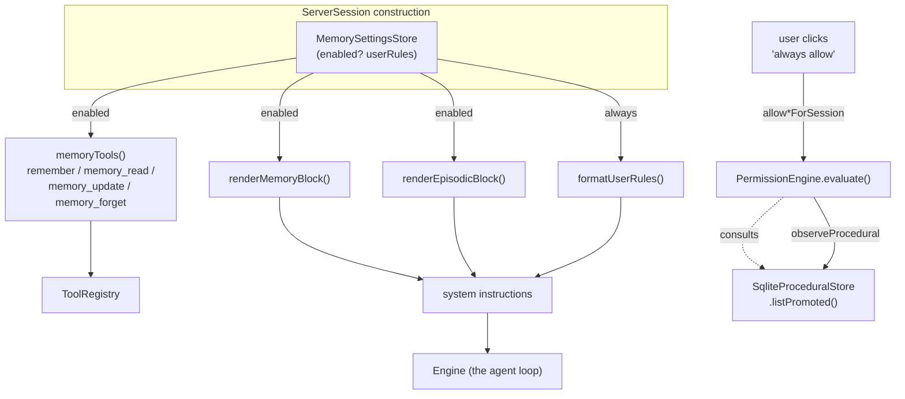
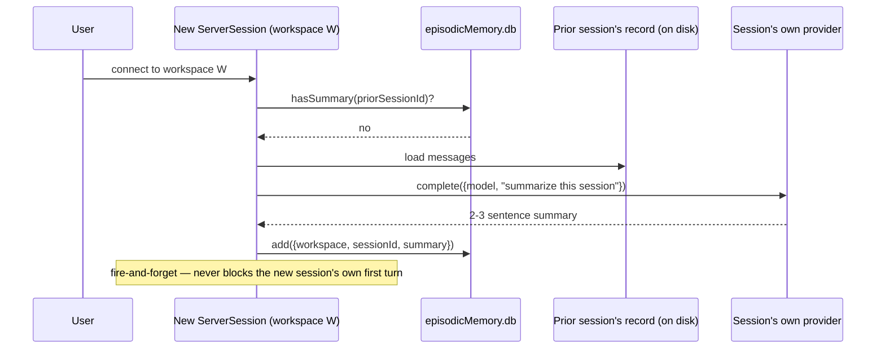
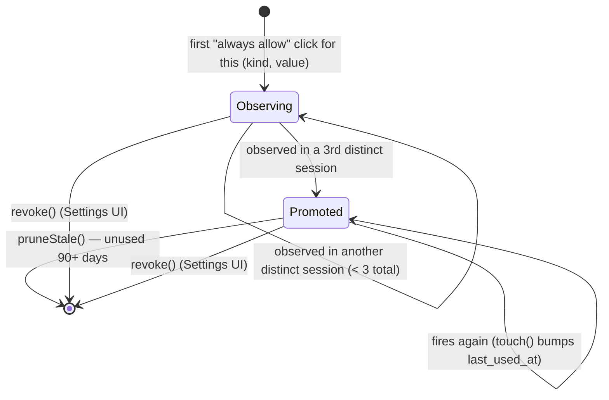

# Memory

`@metaharn/engine`'s memory layer — everything a session recalls across time that isn't just
"what's in the current context window." Lives under `packages/engine/src/memory/`, wired into
sessions by `apps/server/src/session.ts` (the OpenWorker-shaped surface; `apps/desktop`'s
`ownedEngine.ts` has its own, currently-unextended wiring — see
[Known gaps](#known-gaps-and-deliberate-non-goals)).

This is a different thing from [`04-context-engine.md`](04-context-engine.md), which grounds a
session in *static repo facts* (README, CODEOWNERS, git log) via the original Pi-based surface.
This document covers the *owned engine*'s memory: durable state that accumulates from actually
using the agent, not from reading the repository once at session start.

## Three tiers, not one

The field's own vocabulary for this (the CoALA framework) splits agent memory into working,
episodic, semantic, and procedural. MetaHarn's owned engine implements three of the four —
working memory is just the live context window, which needs no store of its own:

| Tier | Answers | Store | Written by | Decay policy |
|---|---|---|---|---|
| **Semantic** | "What's true?" | `SqliteMemoryStore` (`memory/sqliteStore.ts`) | The model, via explicit tool calls, or the user directly in Settings | None — update/forget only, model-driven |
| **Episodic** | "What happened?" | `SqliteEpisodicStore` (`memory/episodicStore.ts`) | The engine, automatically, once a session ends | Age-bounded (180 days) |
| **Procedural** | "How does this workspace operate?" | `SqliteProceduralStore` (`memory/proceduralStore.ts`) | `PermissionEngine`, from repeated user approvals | Usage-bounded (90 days unused) |

Each tier has a real write policy, a retrieval strategy, and a decay mechanism — not just a
table. None of them attempt semantic contradiction resolution (detecting that a new fact
disagrees with an old one and reconciling them): that's an open field-wide research problem,
not something this pass claims to have solved. Where a tier needs *some* answer to "what happens
when memory goes stale," the honest, implementable one used here is recency- or usage-bounded
retention — see each tier's own section for why that's the right-shaped answer for what that
tier actually stores.

## Semantic memory — explicit facts

The original tier (predates the episodic/procedural work; see `memory/sqliteStore.ts` and
`memory/tools.ts`). One row per fact, scoped `"global"` (about the user, applies everywhere) or
`"workspace"` (about this project only).

**Write policy**: entirely model- or user-driven, never automatic. The `remember` tool's own
description tells the model to check the existing list first and prefer `memory_update` over a
near-duplicate — the model is expected to maintain the store's hygiene itself, not the engine.
`memory_forget` deletes outright. The Settings ▸ Memory ▸ Facts tab exposes the same operations
directly to the user (`apps/server/src/memoryApi.ts`, `PUT`/`DELETE /v1/memory/:id`).

**Retrieval**: `renderMemoryBlock()` (`memory/types.ts`) injects every relevant memory (global +
this workspace's) into the system prompt under a "Known memories" heading. Below
`INDEX_THRESHOLD_CHARS` (~8k chars), every memory renders in full. Above it, the block silently
flips to **index mode**: the newest `INDEX_FULL_NEWEST` (10) stay in full, everything older
renders as a one-line summary with a `[#id]`, and the model is told to call `memory_read` before
acting on anything a summary only hints at. This is the retrieval strategy for this tier — full
recall while it's cheap, index-and-fetch once it isn't; there's no vector search or relevance
ranking involved, deliberately, since this is a small, curated store, not a document corpus.

**Decay**: none. A fact is true until the model or the user says otherwise via
`memory_update`/`memory_forget`. This is the right policy for this tier specifically — a
semantic fact doesn't go stale on a schedule, it goes stale when it's *wrong*, which only a
correction (not a timer) can detect.

## Episodic memory — what happened last time

`memory/episodicStore.ts`. One row per **past** session in a workspace: a 2–3 sentence,
model-written summary of that session's task and outcome. Read `memory/episodicStore.ts`'s own
module doc for the full reasoning; summarized here.

**Write policy**: a session graduates into episodic memory once it's no longer the live one.
`ServerSession.summarizeUnsummarizedSessions()` (`apps/server/src/session.ts`) runs
fire-and-forget whenever a **new** session opens in the same workspace, looking back at
whichever recent prior sessions in that workspace don't have a row yet (`hasSummary()` is the
completion marker — one row per `session_id`, enforced by a `UNIQUE` constraint). Capped at 2
per call, so opening a workspace with a long backlog catches up gradually across several new
sessions rather than firing a burst of LLM calls at once. The summarization prompt itself runs
through that session's own already-resolved provider/model (`this.provider.complete(...)`) — no
separate client to configure, and the summary's quality/cost tracks whatever model the user
already has set up.

**Retrieval**: `listRecent(workspace, limit)` returns the newest N, rendered by
`renderEpisodicBlock()` (`memory/types.ts`) into its **own** system-prompt section — "Recent
sessions in this workspace" — deliberately separate from the semantic memories block. "What
happened before" and "what's known to be true" are different kinds of context; keeping them
visually distinct in the prompt matters, not just in the code.

**Decay**: `pruneOlderThan(days)` — a recency-bounded retention sweep (180 days), run once at
server boot (`memoryApi.ts`'s `pruneStaleMemory()`, called from `apps/server/src/index.ts`).
Episodic memory doesn't need contradiction resolution the way a fact does: a later session
doesn't "contradict" an earlier one, it supersedes it in relevance. Age-bounding is the honest,
sufficient policy here.

## Procedural memory — durable standing permission rules

`memory/proceduralStore.ts`. Formalizes state `PermissionEngine`
(`permissions/engine.ts`) already tracked — `sessionAllowTools` / `sessionAllowCommands` /
`sessionAllowDomains` / `sessionReadonly` — but only ever kept in an in-memory `Set` that
evaporated the moment a session ended. This tier makes that same shape of grant durable and
cross-session, deliberately conservatively.

**Write policy — observe, don't promote on the first click**: a single "always allow" click
still only populates the existing in-memory session Sets, exactly as before this tier existed.
What's new is that the same `allow*ForSession()` call **also** calls `observeProcedural()`,
which records that this workspace + this kind of grant (`tool` / `command` / `domain` /
`readonly`) + this exact value was observed in *this* session. A rule only becomes something
`evaluate()` will actually honor — `listPromoted()` — once it's been observed across
**`PROMOTION_THRESHOLD` (3) distinct sessions**. A single click is a click; three separate
sessions independently landing on the same grant is a real habit, which is what makes silently
honoring it later defensible rather than a silent escalation-through-repetition risk.

**Retrieval**: `listPromoted(scope, workspace)`, consulted by `PermissionEngine.evaluate()` at
the *same tier* the in-memory session grants already are — additive, and never ahead of the
mode/allowlist checks that already run first (the self-protection floor, read-only modes,
persistent-authority tools, and path-scoping for writes all still run before any grant, session
or procedural, is even consulted). Critically, a promoted rule is gated by the exact same
`honorSessionGrants` flag a live session grant is: **`mode === "auto-approve"` never honors a
promoted rule silently** — the reviewer still judges it, same as it would a fresh call. This
mirrors the security posture already established elsewhere in this package (the self-protection
floor, persistent-authority tools needing a human) rather than introducing a new one.

Workspace-scoped only for now — `observeProcedural()` and `proceduralLookup()` both key off
`this.workspaceRoot` (the realpath-resolved workspace), not a global scope, even though the
store's schema supports `scope: "global"`. See [Known gaps](#known-gaps-and-deliberate-non-goals).

**Decay**: `pruneStale(days)` — a promoted rule not actually used in 90 days is retired
(`memoryApi.ts`'s `pruneStaleMemory()`, same boot-time sweep as episodic). Conflict resolution
for this tier is naturally simpler than prose facts: rules are an additive allow-list over a
small discrete `(kind, value)` space, so there's nothing to contradict, only staleness (handled
by the sweep) and explicit revocation (`revoke()`, wired to the Settings UI's trash icon on both
promoted and still-observing rules).

## Memory settings — the on/off switch and user rules

`memory/settings.ts`'s `MemorySettingsStore` (JSON file, `memorySettings.json` in the state
dir) predates the episodic/procedural work but was dead code until this pass — nothing in
`apps/server` ever constructed or read it. Now it's the single gate:

- **`enabled`** (default `true`): off means a session is built with **no memory tools
  registered**, **no semantic block**, **no episodic block**, and `summarizeUnsummarizedSessions()`
  no-ops — not just "saves are refused," the whole tier is invisible to the model, matching the
  module's own original design intent exactly. Procedural memory is **not** gated by this
  toggle — it's wired into `PermissionEngine` unconditionally, since honoring a repeated
  permission grant is a permissions decision, not a "should the agent remember things about me"
  one; those are different questions to a user even if both are called "memory."
- **`userRules`** (free text, ≤ `MAX_USER_RULES_CHARS` / 20k chars): written once by the user in
  Settings, never by the model — no tool touches it. Rendered by `formatUserRules()` and
  injected into instructions ahead of anything the agent learned on its own; on conflict, the
  user's own words win.

## Server API and Settings UI

`apps/server/src/memoryApi.ts` is the read/manage surface for all three tiers plus settings:

| Route | Tier |
|---|---|
| `GET`/`POST /v1/memory`, `PUT`/`DELETE /v1/memory/:id` | Semantic |
| `GET /v1/memory/episodic?workspace=` | Episodic (read-only — the agent writes these, not the user) |
| `GET /v1/memory/procedural?workspace=`, `DELETE /v1/memory/procedural/:id` | Procedural (listed promoted-or-not; revocable, never user-created) |
| `GET`/`PUT /v1/memory/settings` | Settings |

Settings ▸ Memory (`apps/web/src/Settings.tsx`'s `MemoryTab`) is one card (the enabled toggle +
a collapsible user-rules editor) above a segmented `Facts` / `Sessions` / `Standing rules`
tab strip, each tab badge-counted. Standing rules render with a kind icon (wrench/terminal/
globe/eye for tool/command/domain/readonly), a green "Active" badge once promoted, or a
three-dot progress indicator (`RuleDots`) showing how close a still-observing rule is to
`PROMOTION_THRESHOLD`.

## Known gaps and deliberate non-goals

- **Procedural memory is workspace-scoped only.** A `scope: "global"` grant (a tool/command/
  domain the user always allows regardless of project) isn't reachable from the current UI or
  `observeProcedural()`'s call sites — the schema supports it, the wiring doesn't use it yet.
- **No semantic contradiction detection, anywhere.** All three tiers' decay policies are
  recency- or usage-bounded retention, not "detect and reconcile a conflicting new fact." This
  is a conscious scope boundary, not an oversight — see the top of this document.
- **Episodic summarization cost tracks the user's own model choice.** A local/free model produces
  cheap but potentially lower-quality summaries; a frontier model produces better summaries at
  real per-session cost. There's no separate "cheap model for background summarization" setting.
- **`apps/desktop`'s `ownedEngine.ts` has its own, separate session-assembly code** (see
  [`09-owned-engine.md`](09-owned-engine.md)'s module doc on the known duplication between the
  two surfaces) and was not extended with episodic/procedural memory in this pass — only the
  `apps/server`+`apps/web` surface has all three tiers wired up today.
